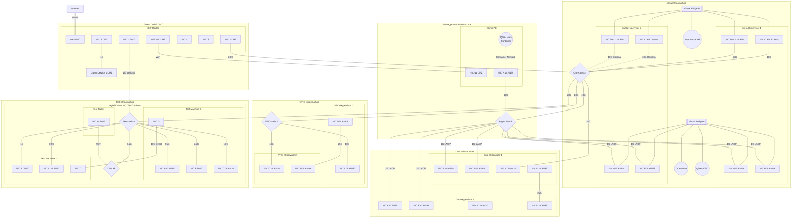

```mermaid
graph TD
    INT[Internet] --- |WAN| ISPRWAN[ISP Router WAN]
    
    subgraph GuestZone [Guest / Wi-Fi DMZ]
        subgraph ISPR [ISP Router]
            ISPRWAN[WAN NIC]
            ISPRNIC1[NIC 1 DMZ]
            ISPRNIC2[NIC 2 DMZ]
            ISPRNIC3[NIC 3 DMZ]
            ISPRNIC4[NIC 4]
            ISPRNIC5[NIC 5]
            ISPRWIFI[WiFi NIC DMZ]
        end
        GD[Guest Device 1 DMZ]
    end
    
    ISPRNIC1 ---|"2.5G"| CS{Core Switch}
    ISPRNIC2 ---|"1G"| GD
    ISPRNIC3 -.-|"1G optional"| TS
    ISPRWIFI ---|"WiFi"| APNICW
    CS ---|"10G"| MS{Mgmt Switch}
    CS ---|"10G"| VS{VFIO Switch}
    CS ---|"10G"| TS{Test Switch}
    
    subgraph MetaInfrastructure [Meta Infrastructure]
        CS
        subgraph MH1[Meta Hypervisor 1]
            MH1NICA[NIC A VLAN99]
            MH1NICB[NIC B VLAN99]
            MH1NICC[NIC C ALL VLANs]
            MH1NICD[NIC D ALL VLANs]
        end
        subgraph MH2[Meta Hypervisor 2]
            MH2NICA[NIC A VLAN99]
            MH2NICB[NIC B VLAN99]
            MH2NICC[NIC C ALL VLANs]
            MH2NICD[NIC D ALL VLANs]
        end
        VBA[[Virtual Bridge A]]
        VBB[[Virtual Bridge B]]
        OPN((OpenSense VM))
        QDD((QDev Data))
        QDV((QDev VFIO))
        
        VBA --- MH1NICB
        VBA --- MH2NICB
        VBA --- MH1NICA
        VBA --- MH2NICA
        VBA --- QDD
        VBA --- QDV
        VBB --- OPN
        VBB --- MH1NICC
        VBB --- MH2NICC
        VBB --- MH1NICD
        VBB --- MH2NICD
    end
    
    subgraph DataInfrastructure [Data Infrastructure]
        subgraph DH1[Data Hypervisor 1]
            DH1NICA[NIC A VLAN99]
            DH1NICB[NIC B VLAN99]
            DH1NICC[NIC C VLAN20]
            DH1NICD[NIC D VLAN99]
        end
        subgraph DH2[Data Hypervisor 2]
            DH2NICA[NIC A VLAN99]
            DH2NICB[NIC B VLAN99]
            DH2NICC[NIC C VLAN20]
            DH2NICD[NIC D VLAN99]
        end
    end
    
    subgraph ManagementInfrastructure [Management Infrastructure]
        MS
        MH1NICB
        MH2NICB
        subgraph AP[Admin PC]
            APNICA[NIC A VLAN99]
            APNICW[NIC W DMZ]
            QDM((QDev Meta<br>Container))
        end
    end
    
    MH1NICC ---|"10G"| CS
    MH1NICD ---|"10G"| CS
    MH2NICC -.-|"10G Optional"| CS
    MH2NICD -.-|"10G Optional"| CS
    MS ---|"1G LACP"| MH1NICA
    MS ---|"1G LACP"| MH1NICB
    MS ---|"1G LACP"| MH2NICA
    MS ---|"1G LACP"| MH2NICB
    MS ---|"1G LACP"| DH1NICA
    MS ---|"1G LACP"| DH1NICB
    MS ---|"1G LACP"| DH2NICA
    MS ---|"1G LACP"| DH2NICB
    APNICA ---|"10G"| MS
    QDM -.->|"Container Network"| APNICA

    subgraph VFIOInfrastructure [VFIO Infrastructure]
        VS
        subgraph VH1[VFIO Hypervisor 1]
            VH1NICC[NIC C VLAN30]
            VH1NICD[NIC D VLAN99]
        end
        subgraph VH2[VFIO Hypervisor 2]
            VH2NICC[NIC C VLAN30]
            VH2NICD[NIC D VLAN99]
        end
    end
    
    subgraph TestInfrastructure [Test Infrastructure]
        subgraph HybridNetwork [Hybrid VLAN 10 / DMZ Subnet]
            TS
            subgraph TM1[Test Machine 1]
                THNICA[NIC A VLAN99]
                THNICB[NIC B DMZ]
                THNICC[NIC C VLAN10]
                THNICD[NIC D]
            end
            subgraph TM2[Test Machine 2]
                TMNICA[NIC A DMZ]
                TMNICC[NIC C VLAN10]
                TMNICD[NIC D]
            end
            TAP{2.5G AP}
            subgraph TT[Test Tablet]
                TTNICW[NIC W DMZ]
            end
        end
        TS ---|"2.5G"| THNICA
        TS ---|"2.5G"| THNICB
        TS ---|"10G"| THNICC
        TS ---|"1G"| TMNICA
        TS ---|"2.5G"| TMNICC
        THNICD ---|"10G Direct"| TMNICD
        TS ---|"2.5G"| TAP
        TTNICW -.-|"WiFi"| TAP
    end

    %% Detailed connections
    CS ---|"10G"| DH1NICC
    DH1NICD ---|"25G"| DH2NICD
    VS ---|"10G"| VH1NICC
    VS ---|"10G"| VH2NICC
    VH1NICD ---|"25G"| VH2NICD   
```
