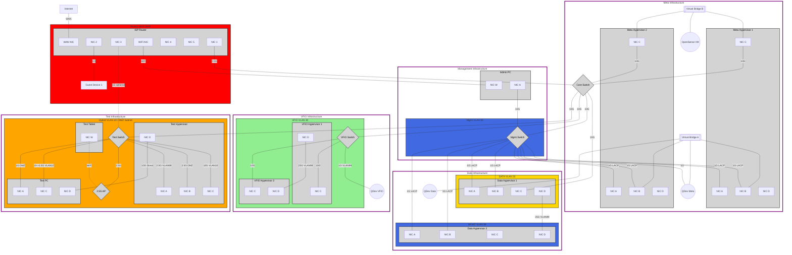

```mermaid
graph TD
    INT[Internet] --- |WAN| ISPRWAN[ISP Router WAN]
    
    subgraph Guest [Guest / Wi-Fi DMZ]
        subgraph ISPR [ISP Router]
            ISPRWAN[WAN NIC]
            ISPRNIC1[NIC 1]
            ISPRNIC2[NIC 2]
            ISPRNIC3[NIC 3]
            ISPRNIC4[NIC 4]
            ISPRNIC5[NIC 5]
            ISPRWIFI[WiFi NIC]
        end
        GD[Guest Device 1]
    end
    
    ISPRNIC1 ---|"2.5G"| CS{Core Switch}
    ISPRNIC2 ---|"1G"| GD
    ISPRNIC3 -.-|"1G optional"| TS
    ISPRWIFI ---|"WiFi"| APNICW
    CS ---|"10G"| MS{Mgmt Switch}
    CS ---|"10G"| VS{VFIO Switch}
    CS ---|"10G"| TS{Test Switch}
    
    subgraph MetaInfrastructure [Meta Infrastructure]
        CS
        subgraph MH1[Meta Hypervisor 1]
            MH1NICA[NIC A]
            MH1NICB[NIC B]
            MH1NICC[NIC C]
            MH1NICD[NIC D]
        end
        subgraph MH2[Meta Hypervisor 2]
            MH2NICA[NIC A]
            MH2NICB[NIC B]
            MH2NICC[NIC C]
            MH2NICD[NIC D]
        end
        VBA[[Virtual Bridge A]]
        VBB[[Virtual Bridge B]]
        OPN((OpenSense VM))
        QDM((QDev Meta))
        
        VBA --- QDM
        VBA --- MH1NICB
        VBA --- MH2NICB
        VBB --- OPN
        VBB --- MH1NICC
        VBB --- MH2NICC
    end
    
    subgraph DataInfrastructure [Data Infrastructure]
        subgraph VLAN20 [DATA VLAN 20]
            subgraph DH1[Data Hypervisor 1]
                DH1NICA[NIC A]
                DH1NICB[NIC B]
                DH1NICC[NIC C]
                DH1NICD[NIC D]
            end
        end
        subgraph VLAN99Data [MGMT VLAN 99]
            subgraph DH2[Data Hypervisor 2]
                DH2NICA[NIC A]
                DH2NICB[NIC B]
                DH2NICC[NIC C]
                DH2NICD[NIC D]
            end
        end
        QDD((QDev Data))
    end
    
    subgraph ManagementInfrastructure [Management Infrastructure]
        subgraph VLAN99 [Mgmt VLAN 99]
            MS
            MH1NICB
            MH2NICB
        end
        subgraph AP[Admin PC]
            APNICA[NIC A]
            APNICW[NIC W]
        end
    end
    
    MH1NICC ---|"10G"| CS
    MH2NICC ---|"10G"| CS
    MS ---|"1G LACP"| MH1NICA
    MS ---|"1G LACP"| MH1NICB
    MS ---|"1G LACP"| MH2NICA
    MS ---|"1G LACP"| MH2NICB
    MS ---|"1G LACP"| DH1NICA
    MS ---|"1G LACP"| DH1NICB
    MS ---|"1G LACP"| DH2NICA
    MS ---|"1G LACP"| DH2NICB
    APNICA ---|"10G"| MS

    subgraph VFIOInfrastructure [VFIO Infrastructure]
        subgraph VLAN30 [VFIO VLAN 30]
            VS
            subgraph VH1[VFIO Hypervisor 1]
                VH1NICC[NIC C]
                VH1NICD[NIC D]
            end
            subgraph VH2[VFIO Hypervisor 2]
                VH2NICC[NIC C]
                VH2NICD[NIC D]
            end
        end
        QDV((QDev VFIO))
    end
    
    subgraph TestInfrastructure [Test Infrastructure]
        subgraph HybridNetwork [Hybrid VLAN 10 / DMZ Subnet]
            TS
            subgraph TH[Test Hypervisor]
                THNICA[NIC A]
                THNICB[NIC B]
                THNICC[NIC C]
                THNICD[NIC D]
            end
            subgraph TM[Test PC]
                TMNICA[NIC A]
                TMNICC[NIC C]
                TMNICD[NIC D]
            end
            TAP{2.5G AP}
            subgraph TT[Test Tablet]
                TTNICW[NIC W]
            end
        end
        TS ---|"2.5G VLAN99"| THNICA
        TS ---|"2.5G DMZ"| THNICB
        TS ---|"10G VLAN10"| THNICC
        TS ---|"1G DMZ"| TMNICA
        TS ---|"10->2.5G VLAN10"| TMNICC
        THNICD ---|"10G Direct"| TMNICD
        TS ---|"2.5G"| TAP
        TTNICW -.-|"WiFi"| TAP
    end

    MS ---|"1G"| QDM
    VS ---|"1G VLAN99"| QDV
    VBA --- QDD

    %% Detailed connections
    CS ---|"10G"| DH1NICC
    DH1NICD ---|"25G VLAN99"| DH2NICD
    VS ---|"10G"| VH1NICC
    VS ---|"10G"| VH2NICC
    VH1NICD ---|"25G VLAN99"| VH2NICD
    
    classDef vlan20 fill:#ffd700,stroke:#333,stroke-width:2px;
    class VLAN20 vlan20;
    classDef vlan99 fill:#4169E1,stroke:#333,stroke-width:2px;
    class VLAN99,VLAN99Data vlan99;
    classDef vlan30 fill:#90EE90,stroke:#333,stroke-width:2px;
    class VLAN30 vlan30;
    classDef hybridtestnet fill:#ffa500,stroke:#333,stroke-width:2px;
    class HybridNetwork hybridtestnet;
    classDef devices fill:#d3d3d3,stroke:#333,stroke-width:2px,color:#000;
    class MH1,MH2,DH1,DH2,VH1,VH2,TH,AP,TM,TT,ISPR,CS,MS,VS,TS,TAP devices;
    classDef optional stroke-dasharray: 5 5;
    class TTNICW optional;
    classDef dmz fill:#ff0000,stroke:#333,stroke-width:2px;
    class Guest dmz;
    classDef infrastructure fill:none,stroke:#800080,stroke-width:4px;
    class MetaInfrastructure,DataInfrastructure,VFIOInfrastructure,TestInfrastructure,ManagementInfrastructure infrastructure;
```
