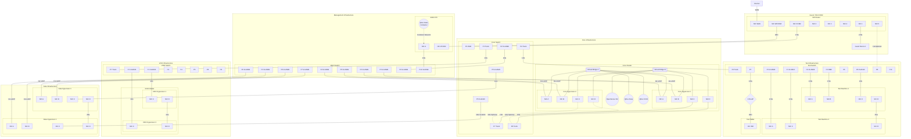

```mermaid
graph TD
    INT[Internet] --- |WAN| ISPRWAN[NIC WAN]
    
    subgraph GuestZone [Guest / Wi-Fi DMZ]
        subgraph ISPR [ISP Router]
            ISPRWAN[NIC WAN]
            ISPRNIC0[NIC 0 DMZ]
            ISPRNIC1[NIC 1]
            ISPRNIC2[NIC 2]
            ISPRNIC3[NIC 3]
            ISPRNIC4[NIC 4]
            ISPRNIC5[NIC 5]
            ISPRWIFI[NIC Wifi DMZ]
        end
        GD[Guest Device 1]
    end
    
    subgraph CoreInfrastructure [Core Infrastructure]
        subgraph CS [Core Switch]
            CSP1[P1 DMZ]
            CSP2[P2 VLAN99]
            CSP3[P3 Trunk]
            CSP4[P4 Trunk]
            CSP5[P5 VLAN20]
            CSP6[P6 VLAN20]
            CSP7[P7 Trunk]
            CSP8[P8 Trunk]
        end
        subgraph CoreCluster [Core Cluster]
            subgraph CH1[Core Hypervisor 1]
                CH1NICA[NIC A]
                CH1NICB[NIC B]
                CH1NICC[NIC C]
                CH1NICD[NIC D]
            end
            subgraph CH2[Core Hypervisor 2]
                CH2NICA[NIC A]
                CH2NICB[NIC B]
                CH2NICC[NIC C]
                CH2NICD[NIC D]
            end
            VBA[[Virtual Bridge A]]
            VBB[[Virtual Bridge B]]
            OPN((OpenSense VM))
            QDD((QDev Data))
            QDV((QDev VFIO))
            
            VBA --- CH1NICB
            VBA --- CH2NICB
            VBA --- CH1NICA
            VBA --- CH2NICA
            VBA --- QDD
            VBA --- QDV
            VBB --- OPN
            VBB --- CH1NICC
            VBB --- CH2NICC
            VBB --- CH1NICD
            VBB --- CH2NICD
        end
    end

    subgraph ManagementInfrastructure [Management Infrastructure]
        subgraph MS [Mgmt Switch]
            MSP1[P1 VLAN99]
            MSP2[P2 VLAN99]
            MSP3[P3 VLAN99]
            MSP4[P4 VLAN99]
            MSP5[P5 VLAN99]
            MSP6[P6 VLAN99]
            MSP7[P7 VLAN99]
            MSP8[P8 VLAN99]
            MSP9[P9 VLAN99]
            MSP10[P10 VLAN99]
        end
        subgraph AP[Admin PC]
            APNICA[NIC A]
            APNICW[NIC W DMZ]
            QDM((QDev Meta<br>Container))
        end
    end

    ISPRNIC0 ---|"2.5G"| CSP1
    CSP2 ---|"10G"| MSP9
    CSP3 ---|"10G"| VSP7
    CSP4 ---|"10G"| TSP9
    
    subgraph DataInfrastructure [Data Infrastructure]
        subgraph DH1[Data Hypervisor 1]
            DH1NICA[NIC A]
            DH1NICB[NIC B]
            DH1NICC[NIC C]
            DH1NICD[NIC D]
        end
        subgraph DH2[Data Hypervisor 2]
            DH2NICA[NIC A]
            DH2NICB[NIC B]
            DH2NICC[NIC C]
            DH2NICD[NIC D]
        end
    end
    
    CH1NICC ---|"10G"| CSP7
    CH1NICD ---|"10G"| CSP8
    CH2NICC -.-|"10G Optional"| CSP7
    CH2NICD -.-|"10G Optional"| CSP8
    MSP2 ---|"1G LACP"| CH1NICA
    MSP3 ---|"1G LACP"| CH1NICB
    MSP4 ---|"1G LACP"| CH2NICA
    MSP5 ---|"1G LACP"| CH2NICB
    MSP6 ---|"1G LACP"| DH1NICA
    MSP7 ---|"1G LACP"| DH1NICB
    MSP8 ---|"1G LACP"| DH2NICA
    MSP1 ---|"1G LACP"| DH2NICB
    APNICA ---|"10G"| MSP10
    QDM -.->|"Container Network"| APNICA
    ISPRWIFI ---|"WiFi"| APNICW

    subgraph VFIOInfrastructure [VFIO Infrastructure]
        subgraph VS [VFIO Switch]
            VSP1[P1 VLAN30]
            VSP2[P2 VLAN30]
            VSP3[P3]
            VSP4[P4]
            VSP5[P5]
            VSP6[P6]
            VSP7[P7 Trunk]
            VSP8[P8]
        end
        subgraph VFIOCluster [VFIO Cluster]
            subgraph VH1[VFIO Hypervisor 1]
                VH1NICC[NIC C]
                VH1NICD[NIC D]
            end
            subgraph VH2[VFIO Hypervisor 2]
                VH2NICC[NIC C]
                VH2NICD[NIC D]
            end
        end
    end
    
    subgraph TestInfrastructure [Test Infrastructure]
        subgraph TS [Test Switch]
            TSP1[P1 VLAN10]
            TSP2[P2 DMZ]
            TSP3[P3 VLAN10]
            TSP4[P4 VLAN99]
            TSP5[P5 VLAN99]
            TSP6[P6]
            TSP7[P7]
            TSP8[P8]
            TSP9[P9 Trunk]
            TSP10[P10]
        end
        subgraph TM1[Test Machine 1]
            THNICA[NIC A]
            THNICB[NIC B]
            THNICC[NIC C]
            THNICD[NIC D]
        end
        subgraph TM2[Test Machine 2]
            TMNICA[NIC A]
            TMNICC[NIC C]
            TMNICD[NIC D]
        end
        TAP{2.5G AP}
        subgraph TT[Test Tablet]
            TTNICW[NIC Wifi]
        end
    end

    CSP5 ---|"10G"| DH1NICC
    CSP6 ---|"10G VLAN20"| DH2NICC
    DH1NICD ---|"25G"| DH2NICD
    VSP1 ---|"10G"| VH1NICC
    VSP2 ---|"10G"| VH2NICC
    VH1NICD ---|"10G"| VH2NICD
    TSP4 ---|"2.5G"| THNICA
    TSP2 ---|"2.5G"| THNICB
    TSP3 ---|"10G"| THNICC
    TSP5 ---|"2.5G"| TMNICA
    TSP1 ---|"2.5G"| TMNICC
    TSP7 ---|"2.5G"| TAP
    TAP ---|"WiFi"| TTNICW
    THNICD ---|"25G"| TMNICD
    ISPRNIC1 ---|"2.5G"| GD
    ISPRNIC5 -.-|"1G Optional"| TSP8
```
