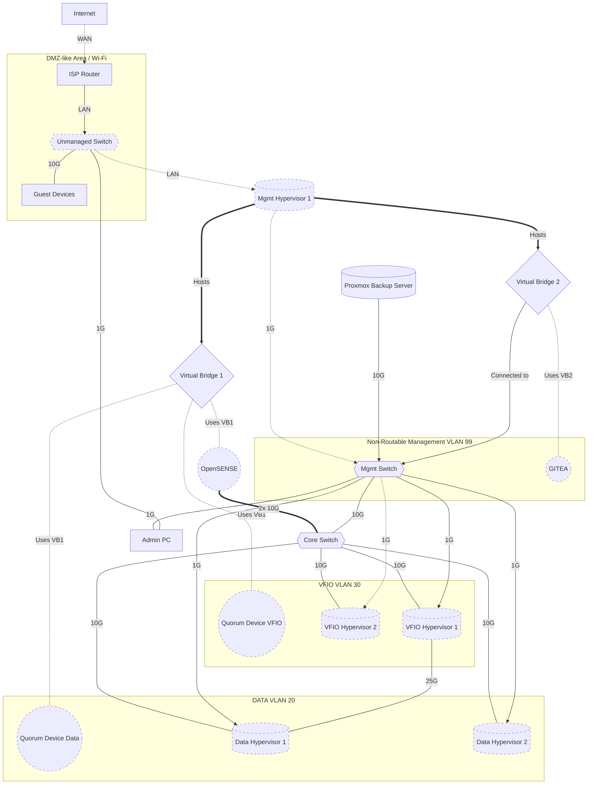

# Network Topology Graph

```mermaid
graph TD
 INT[Internet] -.-> |WAN| ISPR[ISP Router]
    ISPR ---> |LAN| US
    US{{Unmanaged Switch}} -.-> |LAN| MH1
    VB1{Virtual Bridge 1} -.- |"Uses VB1"| QDV((Quorum Device VFIO))
    VB1 -.- |"Uses VB1"| QDD((Quorum Device Data))
    VB1 -.- |"Uses VB1"| OPN((OpenSENSE))
    OPN ===|"2x 10G"| CS{{Core Switch}}
    MH1[(Mgmt Hypervisor 1)] -.-> |"1G"| MS{{Mgmt Switch}}
    PBS[(Proxmox Backup Server)] ---> |"10G"| MS
    MS --- |"10G"| CS
    MS ---|"1G"| APC[Admin PC]
    APC ---|"1G"| US
    MH1 ==>|"Hosts"| VB1
    MH1 ==>|"Hosts"| VB2{Virtual Bridge 2}
    VB2 -.- |"Uses VB2"| GIT((GITEA))
    VB2 ---> |"Connected to"| MS
    CS ---|"10G"| VH2[(VFIO Hypervisor 2)]
    MS -.->|"1G"| VH2
    US ---|"10G"| GD[Guest Devices]
    CS ---|"10G"| VH1[(VFIO Hypervisor 1)]
    MS --->|"1G"| VH1
    CS ---|"10G"| DH1[(Data Hypervisor 1)]
    MS --->|"1G"| DH1
    CS ---|"10G"| DH2[(Data Hypervisor 2)]
    MS --->|"1G"| DH2
    VH1 ---|"25G"| DH1
    subgraph VLAN20 [DATA VLAN 20]
        DH1
        DH2
        QDD
    end
    subgraph VLAN30 [VFIO VLAN 30]
        VH1
        VH2
        QDV
    end
    subgraph VLAN99 [Non-Routable Management VLAN 99]
        MS
        GIT
    end
    subgraph DMZ [DMZ-like Area / Wi-Fi]
        ISPR
        GD
        US
    end

    classDef punctuated stroke-dasharray: 5 5;
    class US,MH1,VH1,VH2,DH1,DH2,GIT,QDV,QDD,OPN punctuated;
```
