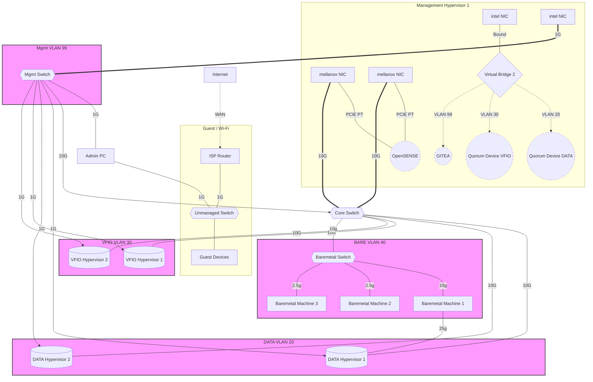

# Network Topology Graph

```mermaid
graph TD
    subgraph MH1[Management Hypervisor 1]
        MH1NIC1[intel NIC]
        MH1NIC2[intel NIC]
        MH1NIC3[mellanox NIC]
        MH1NIC4[mellanox NIC]
        MH1NIC3 ---|"PCIE PT"| OPN
        MH1NIC4 ---|"PCIE PT"| OPN
        VB2{Virtual Bridge 2}
        MH1NIC1 ---|"Bound"| VB2
        OPN((OpenSENSE))
        QDV((Quorum Device VFIO))
        QDD((Quorum Device DATA))
        GIT((GITEA))
    end

    INT[Internet] -.-> |WAN| ISPR[ISP Router]
    ISPR --- |"1G"| US{{Unmanaged Switch}}
    US --- GD[Guest Devices]

    MS{{Mgmt Switch}} ---|"1G"| APC[Admin PC]
    APC ---|"1G"| US

    MH1NIC2 ===|"1G"| MS
    MH1NIC3 ===|"10G"| CS{{Core Switch}}
    MH1NIC4 ===|"10G"| CS{{Core Switch}}

    MS --->|"10G"| CS
    MS --->|"1G"| DH1
    MS --->|"1G"| DH2
    MS --->|"1G"| VH1
    MS --->|"1G"| VH2

    CS ---|"10G"| DH1[(DATA Hypervisor 1)]
    CS ---|"10G"| DH2[(DATA Hypervisor 2)]
    CS ---|"10G"| VH1[(VFIO Hypervisor 1)]
    CS ---|"10G"| VH2[(VFIO Hypervisor 2)]

    CS ---|"10g"| BMS{{Baremetal Switch}}
    BMS ---|"10g"| BM1[Baremetal Machine 1]
    BM1 ---|"25g"| DH1
    BMS ---|"2.5g"| BM2[Baremetal Machine 2]
    BMS ---|"2.5g"| BM3[Baremetal Machine 3]

    subgraph VLAN20 [DATA VLAN 20]
        DH1
        DH2
    end
    subgraph VLAN30 [VFIO VLAN 30]
        VH1
        VH2
    end
    subgraph VLAN40 [BARE VLAN 40]
        BMS
        BM1 
        BM2 
        BM3 
    end
    subgraph VLAN99 [Mgmt VLAN 99]
        MS
    end
    subgraph Guest [Guest / Wi-Fi]
        ISPR
        GD
        US
    end

    VB2 -.->|VLAN 20| QDD
    VB2 -.->|VLAN 30| QDV
    VB2 -.->|VLAN 99| GIT

    classDef punctuated stroke-dasharray: 5 5;
    class GIT,QDV,QDD,OPN punctuated;
    classDef vlan fill:#f9f,stroke:#333,stroke-width:2px;
    class VLAN20,VLAN30,VLAN40,VLAN99 vlan;
```
