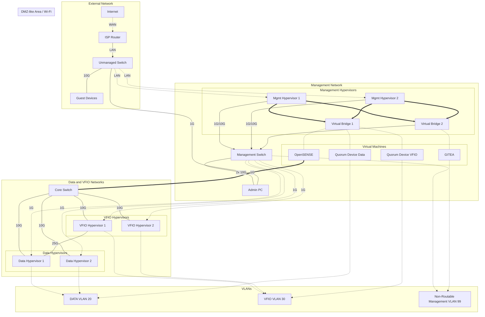

# Network Topology Graph

```mermaid
graph TD
    %% External Network
    subgraph EXT [External Network]
        INT[Internet]
        ISPR[ISP Router]
        US[Unmanaged Switch]
        GD[Guest Devices]
    end
    INT -.-> |WAN| ISPR
    ISPR --> |LAN| US
    US ---|10G| GD

    %% Management Network
    subgraph MGT [Management Network]
        MS[Management Switch]:::network
        APC[Admin PC]
        
        subgraph MH [Management Hypervisors]
            MH1[Mgmt Hypervisor 1]:::hypervisor
            MH2[Mgmt Hypervisor 2]:::hypervisor
            VB1[Virtual Bridge 1]:::network
            VB2[Virtual Bridge 2]:::network
        end

        subgraph VMS [Virtual Machines]
            QDV[Quorum Device VFIO]:::vm
            QDD[Quorum Device Data]:::vm
            OPN[OpenSENSE]:::vm
            GIT[GITEA]:::vm
        end
    end
    US -.-> |LAN| MH1 & MH2
    MH1 & MH2 --> |1G/10G| MS
    MS ---|1G| APC
    APC ---|1G| US
    MH1 & MH2 ==> VB1 & VB2
    VB1 -.- QDV & QDD & OPN
    VB2 -.- GIT
    VB2 --> MS
    OPN ===|2x 10G| CS[Core Switch]:::network

    %% Data and VFIO Networks
    subgraph DN [Data and VFIO Networks]
        CS

        subgraph DH [Data Hypervisors]
            DH1[Data Hypervisor 1]:::hypervisor
            DH2[Data Hypervisor 2]:::hypervisor
        end

        subgraph VH [VFIO Hypervisors]
            VH1[VFIO Hypervisor 1]:::hypervisor
            VH2[VFIO Hypervisor 2]:::hypervisor
        end
    end
    CS ---|10G| DH1 & DH2 & VH1 & VH2
    MS -.->|1G| DH1 & DH2 & VH1 & VH2
    VH1 ---|25G| DH1

    %% VLANs
    subgraph VL [VLANs]
        VLAN20[DATA VLAN 20]:::vlan
        VLAN30[VFIO VLAN 30]:::vlan
        VLAN99[Non-Routable Management VLAN 99]:::vlan
    end
    DH1 & DH2 & QDD -.-> VLAN20
    VH1 & VH2 & QDV -.-> VLAN30
    MS & GIT -.-> VLAN99

    %% DMZ
    subgraph DMZ [DMZ-like Area / Wi-Fi]
        ISPR
        GD
        US
    end
```
