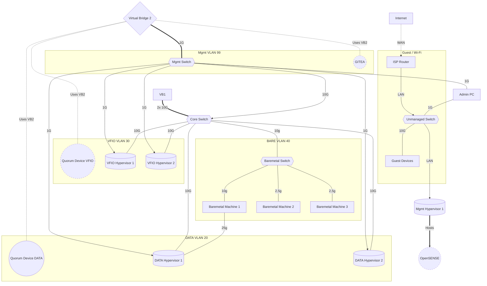

# Network Topology Graph

```mermaid
graph TD
    INT[Internet] -.-> |WAN| ISPR[ISP Router]
    ISPR ---> |LAN| US
    US{{Unmanaged Switch}} ---> |LAN| MH1[(Mgmt Hypervisor 1)]
    US ---|"10G"| GD[Guest Devices]

    MS{{Mgmt Switch}} ---|"1G"| APC[Admin PC]
    APC ---|"1G"| US

    MH1 ==>|"Hosts"| OPN((OpenSENSE))
    VB2{Virtual Bridge 2} -.- |"Uses VB2"| QDV((Quorum Device VFIO))
    VB2{Virtual Bridge 2} -.- |"Uses VB2"| QDD((Quorum Device DATA))
    VB1 ===|"2x 10G"| CS{{Core Switch}}
    VB2 ===|"1G"| MS
    VB2 -.- |"Uses VB2"| GIT((GITEA))

    MS --->|"10G"| CS
    MS --->|"1G"| DH1
    MS --->|"1G"| DH2
    MS --->|"1G"| VH1
    MS --->|"1G"| VH2

    CS ---|"10G"| DH1[(DATA Hypervisor 1)]
    CS ---|"10G"| DH2[(DATA Hypervisor 2)]
    CS ---|"10G"| VH1[(VFIO Hypervisor 1)]
    CS ---|"10G"| VH2[(VFIO Hypervisor 2)]

    CS ---|"10g"| BMS{{Baremetal Switch}}
    BMS ---|"10g"| BM1[Baremetal Machine 1]
    BM1 ---|"25g"| DH1
    BMS ---|"2,5g"| BM2[Baremetal Machine 2]
    BMS ---|"2,5g"| BM3[Baremetal Machine 3]

    subgraph VLAN20 [DATA VLAN 20]
        DH1
        DH2
        QDD
    end
    subgraph VLAN30 [VFIO VLAN 30]
        VH1
        VH2
        QDV
    end
    subgraph VLAN40 [BARE VLAN 40]
       BMS
       BM1 
       BM2 
       BM3 
    end

    subgraph VLAN99 [Mgmt VLAN 99]
        MS
        GIT
    end
    subgraph Guest [Guest / Wi-Fi]
        ISPR
        GD
        US
    end
    classDef punctuated stroke-dasharray: 5 5;
    class GIT,QDV,OPN punctuated;
```
