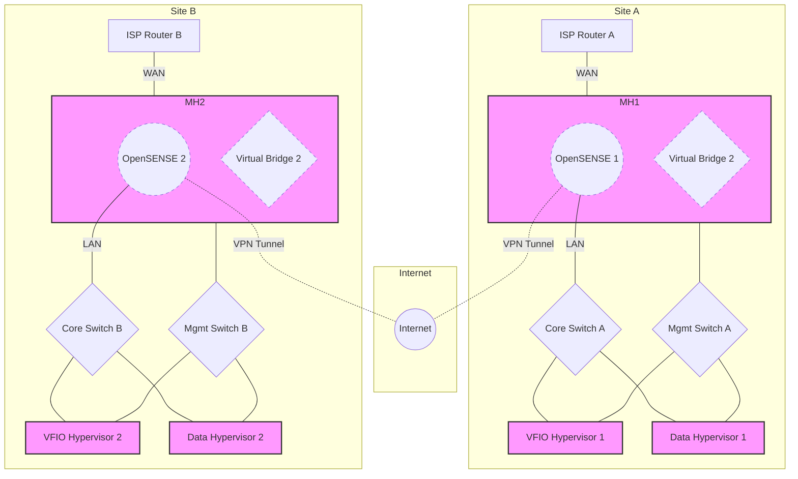

# Network Topology Graph

```mermaid
graph TD
    subgraph Internet
        INT((Internet))
    end

    subgraph "Site A"
        ISPA[ISP Router A]
        MH1[Management Hypervisor 1]
        VH1[VFIO Hypervisor 1]
        DH1[Data Hypervisor 1]
        CSA{Core Switch A}
        MSA{Mgmt Switch A}

        subgraph MH1
            OPN1((OpenSENSE 1))
            VB2_1{Virtual Bridge 2}
        end

        ISPA ---|WAN| MH1
        OPN1 ---|LAN| CSA
        MH1 --- MSA
        CSA --- VH1
        CSA --- DH1
        MSA --- VH1
        MSA --- DH1
    end

    subgraph "Site B"
        ISPB[ISP Router B]
        MH2[Management Hypervisor 2]
        VH2[VFIO Hypervisor 2]
        DH2[Data Hypervisor 2]
        CSB{Core Switch B}
        MSB{Mgmt Switch B}

        subgraph MH2
            OPN2((OpenSENSE 2))
            VB2_2{Virtual Bridge 2}
        end

        ISPB ---|WAN| MH2
        OPN2 ---|LAN| CSB
        MH2 --- MSB
        CSB --- VH2
        CSB --- DH2
        MSB --- VH2
        MSB --- DH2
    end

    OPN1 -.-|VPN Tunnel| INT
    OPN2 -.-|VPN Tunnel| INT

    classDef hypervisor fill:#f9f,stroke:#333,stroke-width:2px;
    class MH1,MH2,VH1,VH2,DH1,DH2 hypervisor;
    classDef virtual stroke-dasharray: 5 5;
    class OPN1,OPN2,VB2_1,VB2_2 virtual;
```
