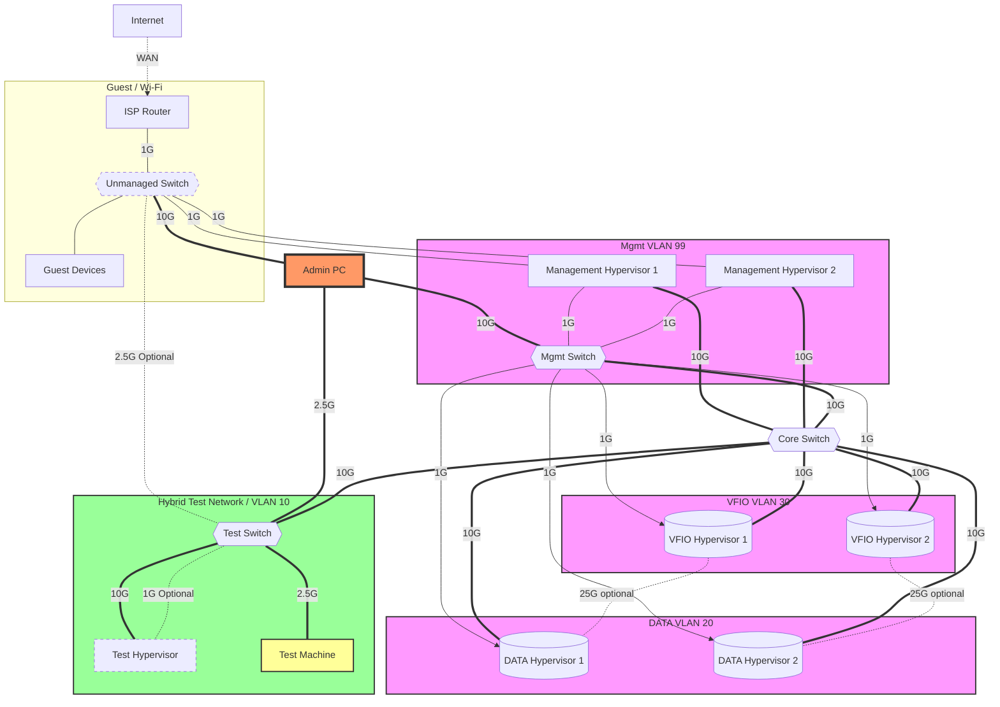

# Network Topology Graph

```mermaid
graph TD
    INT[Internet] -.-> |WAN| ISPR[ISP Router]
    ISPR --- |"1G"| US{{Unmanaged Switch}}
    US --- GD[Guest Devices]
    US ---|1G| MH1[Management Hypervisor 1]
    US ---|1G| MH2[Management Hypervisor 2]
    US -.-|"2.5G Optional"| TS{{Test Switch}}

    US ===|"10G"| AP[Admin PC]
    AP ===|"2.5G"| TS
    AP ===|"10G"| MS{{Mgmt Switch}}

    MH1 ---|"1G"| MS
    MH2 ---|"1G"| MS
    MH1 ===|"10G"| CS{{Core Switch}}
    MH2 ===|"10G"| CS

    MS ===|"10G"| CS
    MS --->|"1G"| DH1
    MS --->|"1G"| DH2
    MS --->|"1G"| VH1
    MS --->|"1G"| VH2

    CS ===|"10G"| DH1[(DATA Hypervisor 1)]
    CS ===|"10G"| DH2[(DATA Hypervisor 2)]
    CS ===|"10G"| VH1[(VFIO Hypervisor 1)]
    CS ===|"10G"| VH2[(VFIO Hypervisor 2)]

    VH1 -.-|"25G optional"| DH1
    VH2 -.-|"25G optional"| DH2

    CS ===|"10G"| TS
    TS ===|"10G"| TH[Test Hypervisor]
    TS -.-|"1G Optional"| TH
    TS ===|"2.5G"| TM[Test Machine]

    subgraph VLAN20 [DATA VLAN 20]
        DH1
        DH2
    end
    subgraph VLAN30 [VFIO VLAN 30]
        VH1
        VH2
    end
    subgraph HybridTestNet [Hybrid Test Network / VLAN 10]
        TS
        TH
        TM
    end
    subgraph VLAN99 [Mgmt VLAN 99]
        MH1
        MH2
        MS
    end
    subgraph Guest [Guest / Wi-Fi]
        ISPR
        GD
        US
    end

    classDef vlan fill:#f9f,stroke:#333,stroke-width:2px;
    class VLAN20,VLAN30,VLAN99 vlan;
    classDef hybridtestnet fill:#9f9,stroke:#333,stroke-width:2px;
    class HybridTestNet hybridtestnet;
    classDef optional stroke-dasharray: 5 5;
    class US,TH optional;
    classDef adminpc fill:#f96,stroke:#333,stroke-width:4px;
    class AP adminpc;
    classDef testmachine fill:#ff9,stroke:#333,stroke-width:2px;
    class TM testmachine;
```
