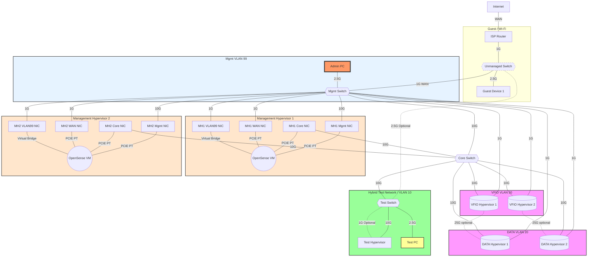

# Network Topology Graph

```mermaid
graph TD
    INT[Internet] --- |WAN| ISPR[ISP Router]
    ISPR --- |"1G"| US{{Unmanaged Switch}}
    US ---|"2.5G"| GD[Guest Device 1]
    US ---|1G WAN| MS{{Mgmt Switch}}
    US -.-|"2.5G Optional"| TS{{Test Switch}}

    AP ---|"2.5G"| MS
    MS ---|"10G"| MH1NIC1[MH1 Mgmt NIC]
    MS ---|"10G"| MH2NIC1[MH2 Mgmt NIC]
    MS ---|"1G"| MH1NIC3[MH1 WAN NIC]
    MS ---|"1G"| MH2NIC3[MH2 WAN NIC]
    MS ---|"1G"| MH1NIC4[MH1 VLAN99 NIC]
    MS ---|"1G"| MH2NIC4[MH2 VLAN99 NIC]

    MH1NIC2[MH1 Core NIC] ---|"10G"| CS{{Core Switch}}
    MH2NIC2[MH2 Core NIC] ---|"10G"| CS
    MS ---|"10G"| CS
    MS ---|"1G"| DH1
    MS ---|"1G"| DH2
    MS ---|"1G"| VH1
    MS ---|"1G"| VH2
    CS ---|"10G"| DH1[(DATA Hypervisor 1)]
    CS ---|"10G"| DH2[(DATA Hypervisor 2)]
    CS ---|"10G"| VH1[(VFIO Hypervisor 1)]
    CS ---|"10G"| VH2[(VFIO Hypervisor 2)]
    VH1 -.-|"25G optional"| DH1
    VH2 -.-|"25G optional"| DH2
    CS ---|"10G"| TS
    TS ---|"10G"| TH[Test Hypervisor]
    TS -.-|"1G Optional"| TH
    TS ---|"2.5G"| TM[Test PC]

    subgraph MH1[Management Hypervisor 1]
        MH1NIC1 & MH1NIC2 & MH1NIC3 ---|"PCIE PT"| OPN1((OpenSense VM))
        MH1NIC4 ---|"Virtual Bridge"| OPN1
    end

    subgraph MH2[Management Hypervisor 2]
        MH2NIC1 & MH2NIC2 & MH2NIC3 ---|"PCIE PT"| OPN2((OpenSense VM))
        MH2NIC4 ---|"Virtual Bridge"| OPN2
    end

    subgraph VLAN20 [DATA VLAN 20]
        DH1
        DH2
    end
    subgraph VLAN30 [VFIO VLAN 30]
        VH1
        VH2
    end
    subgraph VLAN10 [Hybrid Test Network / VLAN 10]
        TS
        TH
        TM
    end
    subgraph VLAN99 [Mgmt VLAN 99]
        MS
        AP[Admin PC]
        MH1NIC4
        MH2NIC4
    end
    subgraph Guest [Guest / Wi-Fi]
        ISPR
        GD
        US
    end

    classDef vlan fill:#f9f,stroke:#333,stroke-width:2px;
    class VLAN20,VLAN30 vlan;
    classDef vlan99 fill:#e6f3ff,stroke:#333,stroke-width:2px;
    class VLAN99 vlan99;
    classDef hybridtestnet fill:#9f9,stroke:#333,stroke-width:2px;
    class VLAN10 hybridtestnet;
    classDef mghypervisor fill:#ffe6cc,stroke:#333,stroke-width:2px;
    class MH1,MH2 mghypervisor;
    classDef optional stroke-dasharray: 5 5;
    class US optional;
    classDef adminpc fill:#f96,stroke:#333,stroke-width:4px;
    class AP adminpc;
    classDef testmachine fill:#ff9,stroke:#333,stroke-width:2px;
    class TM testmachine;
```
