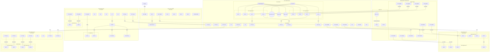

```mermaid
graph TD
    INT[Internet] --- |WAN| ISPRWAN[NIC WAN]
    
    subgraph GuestZone [Guest / Wi-Fi DMZ]
        subgraph ISPR [ISP Router]
            ISPRWAN[NIC WAN]
            ISPRNIC0[NIC 0 DMZ]
            ISPRNIC1[NIC 1]
            ISPRNIC2[NIC 2]
            ISPRNIC3[NIC 3]
            ISPRNIC4[NIC 4]
            ISPRNIC5[NIC 5]
            ISPRWIFI[NIC Wifi DMZ]
        end
        GD[Guest Device 1]
    end
    
    subgraph CoreInfrastructure [Core Infrastructure]
        subgraph CS [Core Switch]
            CSP1[P1 Trunk]
            CSP2[P2 Trunk]
            CSP3[P3 VLAN20]
            CSP4[P4]
            CSP5[P5 VLAN20]
            CSP6[P6]
            CSP7[P7 Trunk]
            CSP8[P8 Trunk]
            CSP9[P9 Trunk]
            CSP10[P10 Trunk]
            CSP11[P11 Trunk]
            CSP12[P12 Trunk]
            CSP13[P13 VLAN99]
            CSP14[P14]
            CSP15[P15 DMZ]
            CSP16[P16]
        end
        subgraph CoreCluster [Core Cluster]
            subgraph CH1[Core Hypervisor 1]
                CH1NICA[NIC A]
                CH1NICB[NIC B]
                CH1NICC[NIC C]
                CH1NICD[NIC D]
            end
            subgraph CH2[Core Hypervisor 2]
                CH2NICA[NIC A]
                CH2NICB[NIC B]
                CH2NICC[NIC C]
                CH2NICD[NIC D]
            end
            PCIEPT[[PCI-E PT]]
            VBB[[Virtual Bridge B]]
            OPN((OpenSense VM))
            QDD((QDev Data))
            QDV((QDev VFIO))
        end
    end

    subgraph ManagementInfrastructure [Management Infrastructure]
        subgraph MS [Mgmt Switch]
            MSP1[P1 VLAN99]
            MSP2[P2 VLAN99]
            MSP3[P3 VLAN99]
            MSP4[P4 VLAN99]
            MSP5[P5 VLAN99]
            MSP6[P6 VLAN99]
            MSP7[P7 VLAN99]
            MSP8[P8 VLAN99]
            MSP9[P9 VLAN99]
            MSP10[P10 VLAN99]
        end
        subgraph AP[Admin PC]
            APNICA[NIC A]
            APNICW[NIC W]
            QDC((QDev Core))
        end
    end
    
    subgraph DataInfrastructure [Data Infrastructure]
        subgraph DataCluster [Data Cluster]
            subgraph DH1[Data Hypervisor 1]
                DH1NICA[NIC A]
                DH1NICB[NIC B]
                DH1NICC[NIC C]
                DH1NICD[NIC D]
            end
            subgraph DH2[Data Hypervisor 2]
                DH2NICA[NIC A]
                DH2NICB[NIC B]
                DH2NICC[NIC C]
                DH2NICD[NIC D]
            end
        end
    end
    
    subgraph TestInfrastructure [Test Infrastructure]
        subgraph TS [Test Switch]
            TSP1[P1 VLAN10]
            TSP2[P2 VLAN10]
            TSP3[P3 VLAN10]
            TSP4[P4]
            TSP5[P5]
            TSP6[P6]
            TSP7[P7]
            TSP8[P8]
            TSP9[P9 Trunk]
            TSP10[P10 Trunk]
        end
        subgraph TM1[Test Machine 1]
            TM1NICA[NIC A]
            TM1NICB[NIC B]
        end
        subgraph TM2[Test Machine 2]
            TM2NICA[NIC A]
            TM2NICW[NIC W]
        end
        TAP[Test AP]
        TT[Test Tablet]
        TP[Test Phone]
    end

    subgraph VFIOInfrastructure [VFIO Infrastructure]
        subgraph VS [VFIO Switch]
            VSP1[P1 Trunk]
            VSP2[P2 Trunk]
            VSP3[P3 Trunk]
            VSP4[P4 Trunk]
            VSP5[P5]
            VSP6[P6]
            VSP7[P7 Trunk]
            VSP8[P8 Trunk]
        end
        subgraph VFIOCluster [VFIO Cluster]
            subgraph VH1[VFIO Hypervisor 1]
                VH1NICC[NIC C]
                VH1NICD[NIC D]
            end
            subgraph VH2[VFIO Hypervisor 2]
                VH2NICC[NIC C]
                VH2NICD[NIC D]
            end
        end
    end

    %% Connections
    ISPRNIC0 ---|"2.5G"| CSP15
    CSP13 ---|"10G"| MSP9
    CSP11 ---|"10G"| VSP7
    CSP12 ---|"10G"| VSP8
    CSP3 ---|"10G"| DH1NICC
    CSP5 ---|"10G"| DH2NICC
    CH1NICC ---|"10G"| CSP7
    CH1NICD ---|"10G"| CSP9
    CH2NICC ---|"10G"| CSP8
    CH2NICD ---|"10G"| CSP10
    TSP9 ---|"10G"| CSP1
    TSP10 ---|"10G"| CSP2
    MSP2 ---|"1G LACP"| CH1NICA
    MSP3 ---|"1G LACP"| CH1NICB
    MSP4 ---|"1G LACP"| CH2NICA
    MSP5 ---|"1G LACP"| CH2NICB
    MSP6 ---|"1G LACP"| DH1NICA
    MSP7 ---|"1G LACP"| DH1NICB
    MSP8 ---|"1G LACP"| DH2NICA
    MSP1 ---|"1G LACP"| DH2NICB
    APNICA ---|"10G"| MSP10
    QDC -.->|"Container Network"| APNICA
    DH1NICD ---|"25G"| DH2NICD
    VSP1 ---|"10G LACP"| VH1NICC
    VSP2 ---|"10G LACP"| VH1NICD
    VSP3 ---|"10G LACP"| VH2NICC
    VSP4 ---|"10G LACP"| VH2NICD
    TSP1 ---|"2.5G LACP"| TM1NICA
    TSP2 ---|"2.5G LACP"| TM1NICB
    TSP3 ---|"2.5G"| TM2NICA
    TSP7 ---|"2.5G"| TAP
    TAP ---|"WiFi"| TT
    TAP ---|"WiFi"| TP
    TAP ---|"WiFi"| TM2NICW
    ISPRNIC1 ---|"2.5G"| GD
    
    %% PCI-E PT and Virtual Bridge Connections
    PCIEPT --- CH1NICC
    PCIEPT --- CH1NICD
    PCIEPT --- CH2NICC
    PCIEPT --- CH2NICD
    PCIEPT --- OPN
    VBB --- CH1NICA
    VBB --- CH1NICB
    VBB --- CH2NICA
    VBB --- CH2NICB
    VBB --- QDD
    VBB --- QDV
```
