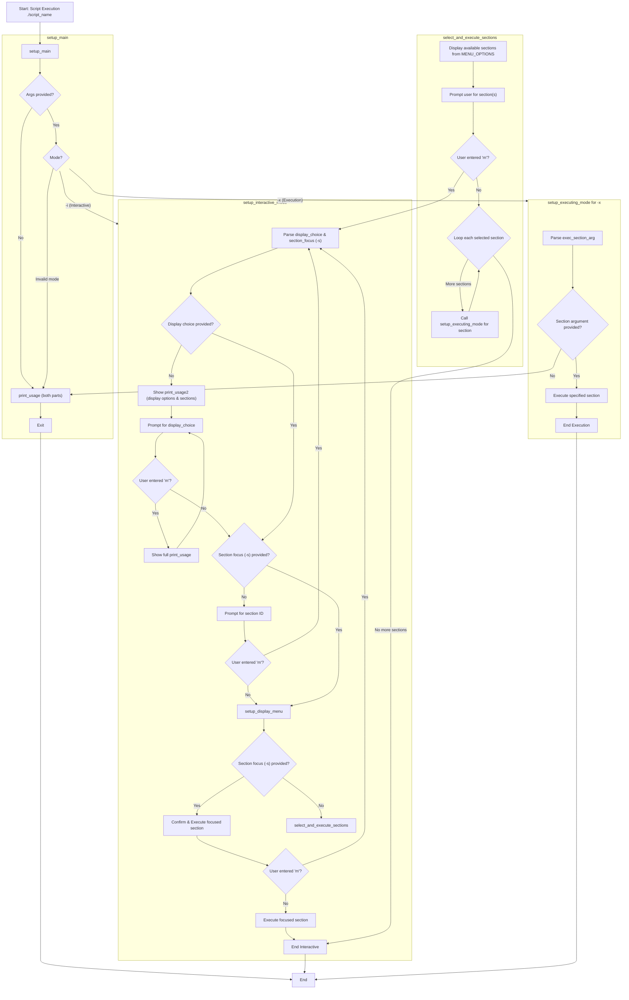

<!-- filepath: /home/es/lab/doc/flo/aux_src_menu_architecture.md -->
<!--
#######################################################################
# Auxiliary Source Menu Architecture - Flow Documentation
#######################################################################
# File: /home/es/lab/doc/flo/aux_src_menu_architecture.md
# Description: Detailed flowchart documentation of the auxiliary source
#              menu system architecture showing execution flow, decision
#              points, and interactive menu processing logic.
#
# Document Purpose:
#   Provides visual flow documentation for understanding the auxiliary
#   source menu system architecture, execution paths, and interactive
#   decision-making processes within the deployment framework.
#
# Technical Scope:
#   - Script execution flow patterns
#   - Interactive menu system architecture
#   - Decision tree mapping and logic flow
#   - Argument processing and validation
#
# Target Audience:
#   Software architects, system developers, and technical analysts
#   requiring detailed understanding of menu system flow logic
#   for maintenance, debugging, and enhancement purposes.
#
# Dependencies:
#   - Mermaid flowchart rendering support
#   - Auxiliary source framework (src/aux/set)
#   - Interactive menu system components
#######################################################################
-->

