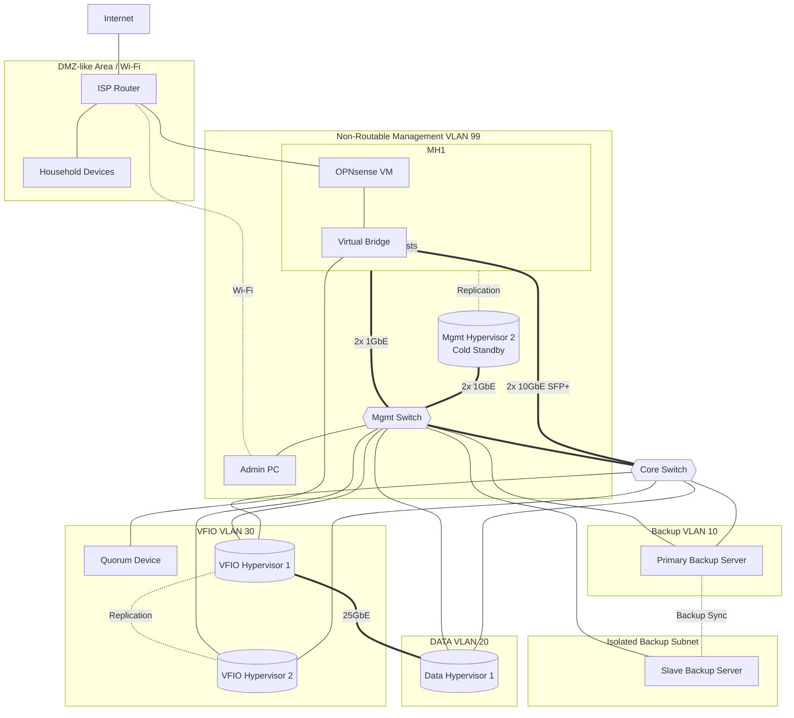

# Network Topology Graph

```mermaid
graph TD
    INT[Internet] --- ISPR[ISP Router]
    ISPR --- OPNSENSE[OPNsense VM]
    OPNSENSE --- VB[Virtual Bridge]
    VB --- QD[Quorum Device]
    VB ===|2x 10GbE SFP+| CS{{Core Switch}}
    MH1[(Mgmt Hypervisor 1)] ===|2x 1GbE| MS{{Mgmt Switch}}
    MH2[(Mgmt Hypervisor 2<br>Cold Standby)] ===|2x 1GbE| MS
    MH1 -.-|Replication| MH2
    MS === CS
    MS --- APC[Admin PC]
    APC -.-|Wi-Fi| ISPR
    MH1 -.->|Hosts| VB
    CS --- VH2[(VFIO Hypervisor 2)]
    MS --- VH2
    ISPR --- HD[Household Devices]
    CS --- VH1[(VFIO Hypervisor 1)]
    MS --- VH1
    CS --- DH1[(Data Hypervisor 1)]
    MS --- DH1
    CS --- PBS[Primary Backup Server]
    MS --- PBS
    PBS -.-|Backup Sync| SBS[Slave Backup Server]
    MS --- SBS
    VH1 -.-|Replication| VH2
    VH1 ===|25GbE| DH1
    subgraph MH1
        VB
        OPNSENSE
    end
    subgraph VLAN20 [DATA VLAN 20]
        DH1
    end
    subgraph VLAN30 [VFIO VLAN 30]
        VH1
        VH2
        QD
    end
    subgraph VLAN99 [Non-Routable Management VLAN 99]
        MS
        APC
        MH1
        MH2
    end
    subgraph VLAN10 [Backup VLAN 10]
        PBS
    end
    subgraph IsolatedBackup [Isolated Backup Subnet]
        PBS
        SBS
    end
    subgraph DMZ [DMZ-like Area / Wi-Fi]
        ISPR
        HD
    end
```

