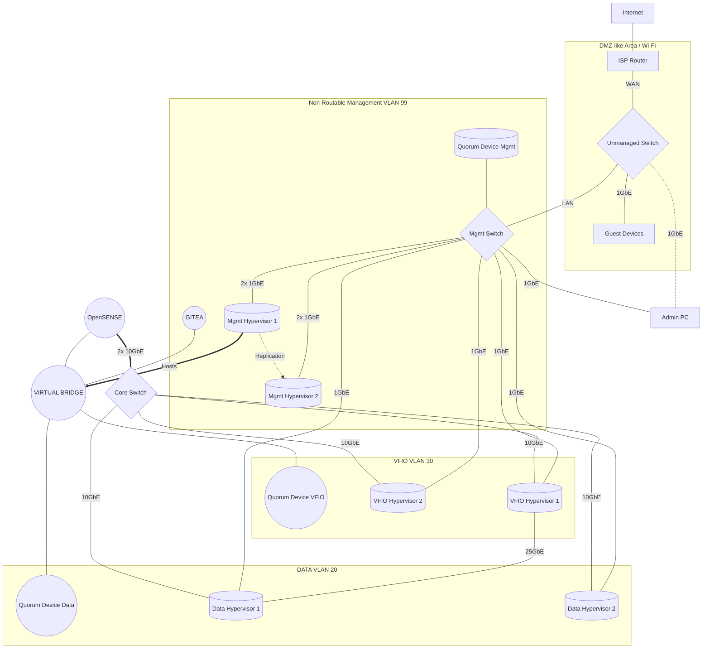

# Network Topology Graph

```mermaid
graph TD
    INT[Internet] --- ISPR[ISP Router]
    ISPR ---|WAN| US{Unmanaged Switch}
    US ---|LAN| MS{Mgmt Switch}
    MS ---|2x 1GbE| MH1[(Mgmt Hypervisor 1)]
    MH1 -.->|Replication| MH2[(Mgmt Hypervisor 2)]
    MS ---|2x 1GbE| MH2
    OPN((OpenSENSE)) --- VB((VIRTUAL BRIDGE))
    GIT((GITEA)) --- VB
    VB --- QDV((Quorum Device VFIO))
    VB --- QDD((Quorum Device Data))
    OPN ===|2x 10GbE| CS{Core Switch}
    QDM[(Quorum Device Mgmt)] --- MS
    MS ---|1GbE| APC[Admin PC]
    APC -.-|1GbE| US
    MH1 ==>|Hosts| VB
    CS ---|10GbE| VH2[(VFIO Hypervisor 2)]
    MS ---|1GbE| VH2
    US ---|1GbE| GD[Guest Devices]
    CS ---|10GbE| VH1[(VFIO Hypervisor 1)]
    MS ---|1GbE| VH1
    CS ---|10GbE| DH1[(Data Hypervisor 1)]
    MS ---|1GbE| DH1
    CS ---|10GbE| DH2[(Data Hypervisor 2)]
    MS ---|1GbE| DH2
    VH1 ---|25GbE| DH1
    subgraph VLAN20 [DATA VLAN 20]
        DH1
        DH2
        QDD
    end
    subgraph VLAN30 [VFIO VLAN 30]
        VH1
        VH2
        QDV
    end
    subgraph VLAN99 [Non-Routable Management VLAN 99]
        MS
        MH1
        MH2
        GIT
        QDM
    end
    subgraph DMZ [DMZ-like Area / Wi-Fi]
        ISPR
        GD
        US
    end

```
