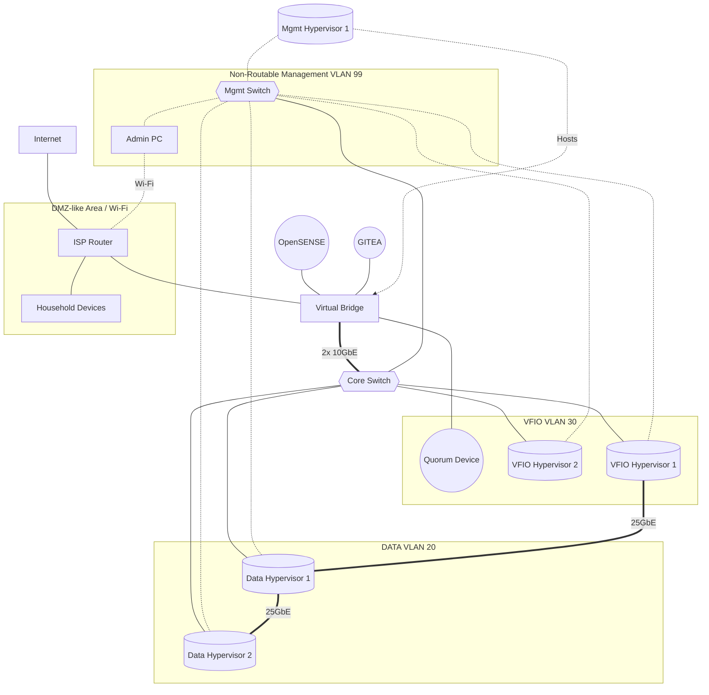

# Network Topology Graph

```mermaid
graph TD
    INT[Internet] --- ISPR[ISP Router]
    ISPR --- VB[Virtual Bridge]
    OPNS((OpenSENSE)) --- VB
    GIT((GITEA)) --- VB
    VB --- QD((Quorum Device))
    VB ===|2x 10GbE| CS{{Core Switch}}
    MH1[(Mgmt Hypervisor 1)] -.-  MS{{Mgmt Switch}}
    MS --- CS
    MS -.- APC[Admin PC]
    APC -.-|Wi-Fi| ISPR
    MH1 -.->|Hosts| VB
    CS --- VH2[(VFIO Hypervisor 2)]
    MS -.- VH2
    ISPR --- HD[Household Devices]
    CS --- VH1[(VFIO Hypervisor 1)]
    MS -.- VH1
    CS --- DH1[(Data Hypervisor 1)]
    MS -.- DH1
    CS --- DH2[(Data Hypervisor 2)]
    MS -.- DH2
    VH1 ===|25GbE| DH1
    DH1 ===|25GbE| DH2
    subgraph VLAN20 [DATA VLAN 20]
        DH1
        DH2
    end
    subgraph VLAN30 [VFIO VLAN 30]
        VH1
        VH2
        QD
    end
    subgraph VLAN99 [Non-Routable Management VLAN 99]
        MS
        APC
    end
    subgraph DMZ [DMZ-like Area / Wi-Fi]
        ISPR
        HD
    end
```

