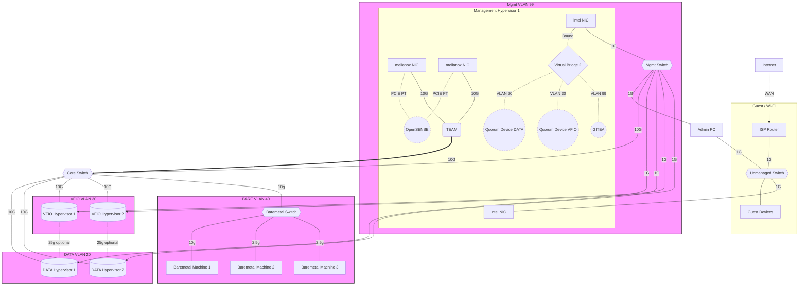
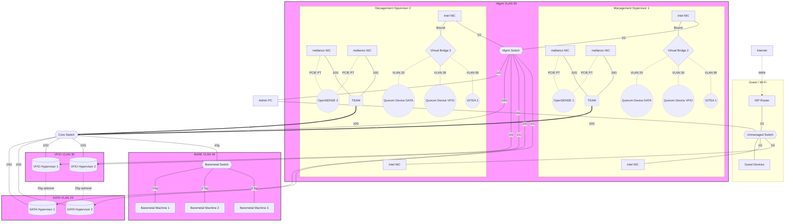

# Network Topology Graph

```mermaid
graph TD
    subgraph MH1[Management Hypervisor 1]
        MH1NIC1[intel NIC]
        MH1NIC2[intel NIC]
        MH1NIC3[mellanox NIC]
        MH1NIC4[mellanox NIC]
        MH1NIC3 -.-|"PCIE PT"| OPN
        MH1NIC4 -.-|"PCIE PT"| OPN
        VB2{Virtual Bridge 2}
        MH1NIC2 ---|"Bound"| VB2
        OPN((OpenSENSE))
        QDV((Quorum Device VFIO))
        QDD((Quorum Device DATA))
        GIT((GITEA))
        MH1TEAM(TEAM)
    end

    INT[Internet] -.-> |WAN| ISPR[ISP Router]
    ISPR --- |"1G"| US{{Unmanaged Switch}}
    US --- GD[Guest Devices]
    US ---|1G| MH1NIC1

    MS{{Mgmt Switch}} ---|"1G"| APC[Admin PC]
    APC ---|"1G"| US

    MH1NIC2 ---|"1G"| MS
    MH1NIC3 ---|"10G"| MH1TEAM
    MH1NIC4 ---|"10G"| MH1TEAM
    MH1TEAM ===|"10G"| CS{{Core Switch}}

    MS --->|"10G"| CS
    MS --->|"1G"| DH1
    MS --->|"1G"| DH2
    MS --->|"1G"| VH1
    MS --->|"1G"| VH2

    CS ---|"10G"| DH1[(DATA Hypervisor 1)]
    CS ---|"10G"| DH2[(DATA Hypervisor 2)]
    CS ---|"10G"| VH1[(VFIO Hypervisor 1)]
    CS ---|"10G"| VH2[(VFIO Hypervisor 2)]

    VH1 -.-|"25g optional"| DH1
    VH2 -.-|"25g optional"| DH2

    CS ---|"10g"| BMS{{Baremetal Switch}}
    BMS ---|"10g"| BM1[Baremetal Machine 1]
    BMS ---|"2.5g"| BM2[Baremetal Machine 2]
    BMS ---|"2.5g"| BM3[Baremetal Machine 3]

    subgraph VLAN20 [DATA VLAN 20]
        DH1
        DH2
    end
    subgraph VLAN30 [VFIO VLAN 30]
        VH1
        VH2
    end
    subgraph VLAN40 [BARE VLAN 40]
        BMS
        BM1 
        BM2 
        BM3 
    end
    subgraph VLAN99 [Mgmt VLAN 99]
        MH1
        MS
    end
    subgraph Guest [Guest / Wi-Fi]
        ISPR
        GD
        US
    end

    VB2 -.-|VLAN 20| QDD
    VB2 -.-|VLAN 30| QDV
    VB2 -.-|VLAN 99| GIT

    classDef punctuated stroke-dasharray: 5 5;
    class TEAM,GIT,QDV,QDD,OPN punctuated;
    classDef vlan fill:#f9f,stroke:#333,stroke-width:2px;
    class VLAN20,VLAN30,VLAN40,VLAN99 vlan;
```

```mermaid
graph TD
    subgraph MH1[Management Hypervisor 1]
        MH1NIC1[intel NIC]
        MH1NIC2[intel NIC]
        MH1NIC3[mellanox NIC]
        MH1NIC4[mellanox NIC]
        MH1NIC3 -.-|"PCIE PT"| OPN1
        MH1NIC4 -.-|"PCIE PT"| OPN1
        VB2_1{Virtual Bridge 2}
        MH1NIC2 ---|"Bound"| VB2_1
        OPN1((OpenSENSE 1))
        QDV1((Quorum Device VFIO))
        QDD1((Quorum Device DATA))
        GIT1((GITEA 1))
        MH1TEAM(TEAM)
    end

    subgraph MH2[Management Hypervisor 2]
        MH2NIC1[intel NIC]
        MH2NIC2[intel NIC]
        MH2NIC3[mellanox NIC]
        MH2NIC4[mellanox NIC]
        MH2NIC3 -.-|"PCIE PT"| OPN2
        MH2NIC4 -.-|"PCIE PT"| OPN2
        VB2_2{Virtual Bridge 2}
        MH2NIC2 ---|"Bound"| VB2_2
        OPN2((OpenSENSE 2))
        QDV2((Quorum Device VFIO))
        QDD2((Quorum Device DATA))
        GIT2((GITEA 2))
        MH2TEAM(TEAM)
    end

    INT[Internet] -.-> |WAN| ISPR[ISP Router]
    ISPR --- |"1G"| US{{Unmanaged Switch}}
    US --- GD[Guest Devices]
    US ---|1G| MH1NIC1
    US ---|1G| MH2NIC1
    MS{{Mgmt Switch}} ---|"1G"| APC[Admin PC]
    APC ---|"1G"| US
    MH1NIC2 ---|"1G"| MS
    MH2NIC2 ---|"1G"| MS
    MH1NIC3 ---|"10G"| MH1TEAM
    MH1NIC4 ---|"10G"| MH1TEAM
    MH2NIC3 ---|"10G"| MH2TEAM
    MH2NIC4 ---|"10G"| MH2TEAM
    MH1TEAM ===|"10G"| CS{{Core Switch}}
    MH2TEAM ===|"10G"| CS
    MS --->|"10G"| CS
    MS --->|"1G"| DH1
    MS --->|"1G"| DH2
    MS --->|"1G"| VH1
    MS --->|"1G"| VH2
    CS ---|"10G"| DH1[(DATA Hypervisor 1)]
    CS ---|"10G"| DH2[(DATA Hypervisor 2)]
    CS ---|"10G"| VH1[(VFIO Hypervisor 1)]
    CS ---|"10G"| VH2[(VFIO Hypervisor 2)]
    VH1 -.-|"25g optional"| DH1
    VH2 -.-|"25g optional"| DH2
    CS ---|"10g"| BMS{{Baremetal Switch}}
    BMS ---|"10g"| BM1[Baremetal Machine 1]
    BMS ---|"2.5g"| BM2[Baremetal Machine 2]
    BMS ---|"2.5g"| BM3[Baremetal Machine 3]

    subgraph VLAN20 [DATA VLAN 20]
        DH1
        DH2
    end
    subgraph VLAN30 [VFIO VLAN 30]
        VH1
        VH2
    end
    subgraph VLAN40 [BARE VLAN 40]
        BMS
        BM1
        BM2
        BM3
    end
    subgraph VLAN99 [Mgmt VLAN 99]
        MH1
        MH2
        MS
    end
    subgraph Guest [Guest / Wi-Fi]
        ISPR
        GD
        US
    end

    VB2_1 -.-|VLAN 20| QDD1
    VB2_1 -.-|VLAN 30| QDV1
    VB2_1 -.-|VLAN 99| GIT1
    VB2_2 -.-|VLAN 20| QDD2
    VB2_2 -.-|VLAN 30| QDV2
    VB2_2 -.-|VLAN 99| GIT2

    classDef punctuated stroke-dasharray: 5 5;
    class MH1TEAM,MH2TEAM,GIT1,QDV1,QDD1,OPN1,GIT2,QDV2,QDD2,OPN2 punctuated;
    classDef vlan fill:#f9f,stroke:#333,stroke-width:2px;
    class VLAN20,VLAN30,VLAN40,VLAN99 vlan;
```
