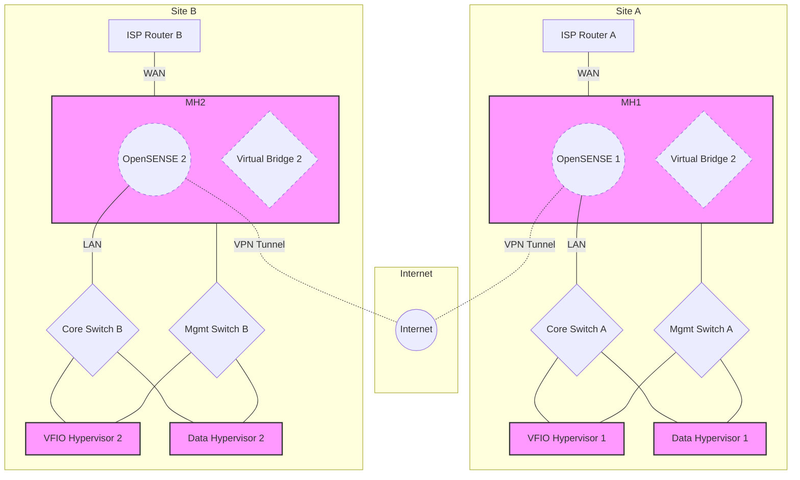
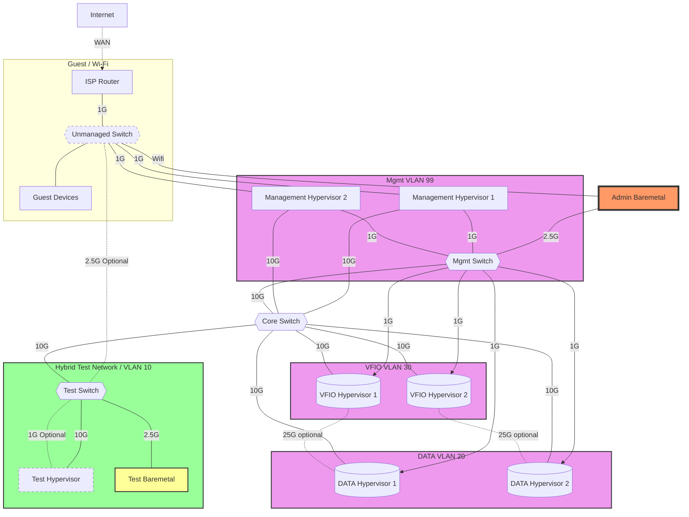
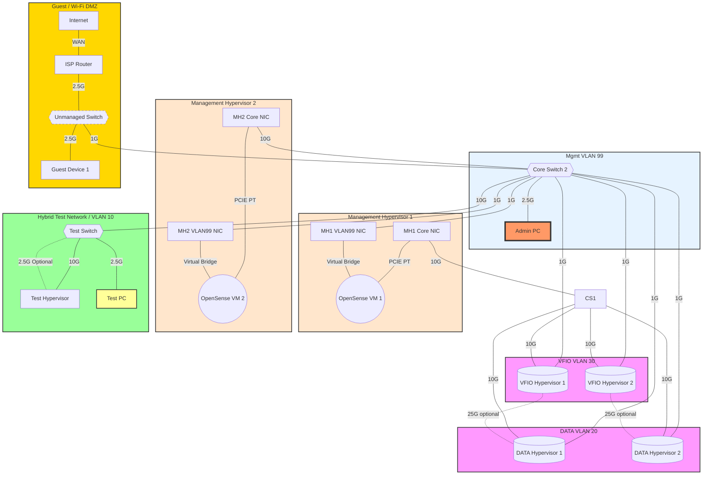
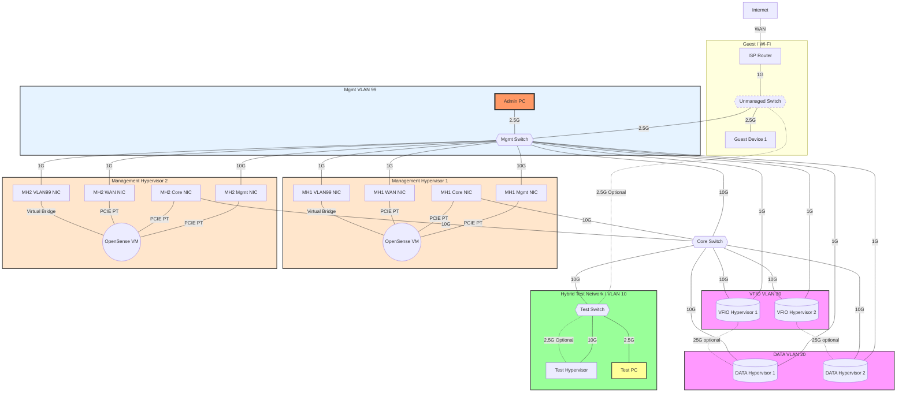

# Network Topology Graphs








```mermaid
graph TD
    INT[Internet] --- |WAN| ISPR[ISP Router]
    ISPR --- |"1G"| CS{{Core Switch}}
    ISPR ---|"2.5G"| US{{Unmanaged Switch}}
    US ---|"2.5G"| GD[Guest Device 1]
    CS ---|"10G"| MS{{Mgmt Switch}}
    AP[Admin PC] ---|"2.5G"| MS
    MS ---|"1G"| MH1NIC3[MH1 VLAN99 NIC]
    MS ---|"1G"| MH2NIC3[MH2 VLAN99 NIC]
    MS ---|"1G"| DH1
    MS ---|"1G"| DH2
    MS ---|"1G"| VH1
    MS ---|"1G"| VH2
    MH1NIC2[MH1 Core NIC] ---|"10G"| CS
    MH2NIC2[MH2 Core NIC] ---|"10G"| CS
    CS ---|"10G"| DH1[(DATA Hypervisor 1)]
    DH1 ---|"25G"| DH2[(DATA Hypervisor 2)]
    CS ---|"10G"| VH1[(VFIO Hypervisor 1)]
    CS ---|"10G"| VH2[(VFIO Hypervisor 2)]
    VH1 -.-|"25G optional"| DH1
    VH2 -.-|"25G optional"| DH2
    CS ---|"10G"| TS{{Test Switch}}
    TS ---|"10G"| TH[Test Hypervisor]
    TS -.-|"2.5G Optional"| TH
    TS ---|"2.5G"| TM[Test PC]
    subgraph MH1[Management Hypervisor 1]
        MH1NIC2 ---|"PCIE PT"| OPN1((OpenSense VM))
        MH1NIC3 ---|"Virtual Bridge"| OPN1
    end
    subgraph MH2[Management Hypervisor 2]
        MH2NIC2 ---|"PCIE PT"| OPN2((OpenSense VM))
        MH2NIC3 ---|"Virtual Bridge"| OPN2
    end
    subgraph VLAN20 [DATA VLAN 20]
        DH1
        DH2
    end
    subgraph VLAN30 [VFIO VLAN 30]
        VH1
        VH2
    end
    subgraph VLAN10 [Hybrid Test Network / VLAN 10]
        TS
        TH
        TM
    end
    subgraph VLAN99 [Mgmt VLAN 99]
        MS
        AP
        MH1NIC3
        MH2NIC3
    end
    subgraph Guest [Guest / Wi-Fi DMZ]
        US
        GD
        ISPR
    end
    classDef vlan fill:#f9f,stroke:#333,stroke-width:2px;
    class VLAN20,VLAN30 vlan;
    classDef vlan99 fill:#e6f3ff,stroke:#333,stroke-width:2px;
    class VLAN99 vlan99;
    classDef hybridtestnet fill:#9f9,stroke:#333,stroke-width:2px;
    class VLAN10 hybridtestnet;
    classDef mghypervisor fill:#ffe6cc,stroke:#333,stroke-width:2px;
    class MH1,MH2 mghypervisor;
    classDef optional stroke-dasharray: 5 5;
    class US optional;
    classDef adminpc fill:#f96,stroke:#333,stroke-width:4px;
    class AP adminpc;
    classDef testmachine fill:#ff9,stroke:#333,stroke-width:2px;
    class TM testmachine;
    classDef dmz fill:#ffd700,stroke:#333,stroke-width:2px;
    class Guest dmz;
 ```
```mermaid
graph TD
    INT[Internet] --- |WAN| ISPR[ISP Router]
    US --- |"2.5G"| CS{{Core Switch}}
    ISPR ---|"2.5G"| US{{Unmanaged Switch}}
    US ---|"2.5G"| GD[Guest Device 1]
    CS ---|"10G"| MS{{Mgmt Switch}}
    AP[Admin PC] ---|"2.5G"| MS
    MS ---|"1G"| MH1NIC3[MH1 VLAN99 NIC]
    MS ---|"1G"| MH2NIC3[MH2 VLAN99 NIC]
    MS ---|"1G"| DH1
    MS ---|"1G"| DH2
    MS ---|"1G"| VH1
    MS ---|"1G"| VH2
    MH1NIC2[MH1 Core NIC] ---|"10G"| CS
    MH2NIC2[MH2 Core NIC] ---|"10G"| CS
    CS ---|"10G"| DH1[(DATA Hypervisor 1)]
    DH1 ---|"25G"| DH2[(DATA Hypervisor 2<br>Cold Standby)]
    DH2 ---|"10G"| MS
    CS ---|"10G"| VH1[(VFIO Hypervisor 1)]
    CS ---|"10G"| VH2[(VFIO Hypervisor 2)]
    CS ---|"10G"| TS{{Test Switch}}
    TS ---|"10G"| TH[Test Hypervisor]
    TS -.-|"2.5G Optional"| TH
    TS ---|"2.5G"| TM[Test PC]
    VBA{Virtual Bridge A} -..- QDD((QDev Data))
    VBA{Virtual Bridge A} -..- QDV((QDev VFIO))

    subgraph MH1[Meta Hypervisor 1]
        MH1NIC2 ---|"PCIE PT"| OPN1((OpenSense VM 1))
        MH1NIC3
    end
        MH1NIC3 --- VBA

    subgraph MH2[Meta Hypervisor 2]
        MH2NIC2 ---|"PCIE PT"| OPN2((OpenSense VM 2))
        MH2NIC3
    end
        MH2NIC3 --- VBA

    subgraph VLAN20 [DATA VLAN 20]
        DH1
    end

    subgraph VLAN30 [VFIO VLAN 30]
        VH1
        VH2
    end

    subgraph VLAN10 [Hybrid Test Network / VLAN 10]
        TS
        TH
        TM
    end

    subgraph VLAN99 [Mgmt VLAN 99]
        MS
        AP
        MH1NIC3
        MH2NIC3
        DH2
        QDD
        QDV
    end

    subgraph Guest [Guest / Wi-Fi DMZ]
        US
        GD
        ISPR
    end
    classDef vlan fill:#f9f,stroke:#333,stroke-width:2px;
    class VLAN20,VLAN30 vlan;

    classDef vlan99 fill:#e6f3ff,stroke:#333,stroke-width:2px;
    class VLAN99 vlan99;

    classDef hybridtestnet fill:#9f9,stroke:#333,stroke-width:2px;
    class VLAN10 hybridtestnet;

    classDef metahypervisor fill:#ffe6cc,stroke:#333,stroke-width:2px;
    class MH1,MH2,VBA metahypervisor;

    classDef optional stroke-dasharray: 5 5;
    class US optional;

    classDef adminpc fill:#f96,stroke:#333,stroke-width:4px;
    class AP adminpc;

    classDef testmachine fill:#ff9,stroke:#333,stroke-width:2px;
    class TM testmachine;

    classDef dmz fill:#ffd700,stroke:#333,stroke-width:2px;
    class Guest dmz;

    classDef quorum fill:#ff7f50,stroke:#333,stroke-width:2px;
    class QDD quorum;

    classDef coldstandby fill:#c0c0c0,stroke:#333,stroke-width:2px;
    class DH2 coldstandby;
 ```
```mermaid
graph TD
    INT[Internet] --- |WAN| ISPR[ISP Router]
    ISPR ---|"2.5G"| CS{Core Switch}
    CS ---|"10G"| MS{Mgmt Switch}
    CS ---|"10G"| VS
    CS ---|"10G"| TS

    subgraph MetaInfrastructure [Meta Infrastructure]
        CS
        subgraph MH1[Meta Hypervisor 1]
            MH1NICA[MH1 NIC A]
            MH1NICB[MH1 NIC B]
            MH1NICC[MH1 NIC C]
            MH1NICD[MH1 NIC D]
        end
        subgraph MH2[Meta Hypervisor 2]
            MH2NICA[MH2 NIC A]
            MH2NICB[MH2 NIC B]
            MH2NICC[MH2 NIC C]
            MH2NICD[MH2 NIC D]
        end
        VBA[[Virtual Bridge A]]
        VBB[[Virtual Bridge B]]
        OPN((OpenSense VM))
        QDD((QDev Data))
        QDV((QDev VFIO))

        VBA --- QDD
        VBA --- QDV
        VBA --- MH1NICB
        VBA --- MH2NICB
        VBB --- OPN
        VBB --- MH1NICC
        VBB --- MH2NICC
    end

    subgraph DataInfrastructure [Data Infrastructure]
        subgraph VLAN20 [DATA VLAN 20]
            subgraph DH1[Data Hypervisor 1]
                DH1NICA[DH1 NIC A]
                DH1NICB[DH1 NIC B]
                DH1NICC[DH1 NIC C]
                DH1NICD[DH1 NIC D]
            end
        end
        subgraph VLAN99Data [MGMT VLAN 99]
            subgraph DH2[Data Hypervisor 2]
                DH2NICA[DH2 NIC A]
                DH2NICB[DH2 NIC B]
                DH2NICC[DH2 NIC C]
                DH2NICD[DH2 NIC D]
            end
        end
    end

    subgraph ManagementInfrastructure [Management Infrastructure]
        subgraph VLAN99 [Mgmt VLAN 99]
            MS
            MH1NICB
            MH2NICB
            QDD
            QDM((QDev Meta))
        end
        subgraph AP[Admin PC]
            APNICA[NIC A]
            APNICW[NIC W]
        end
    end

    MH1NICC ---|"10G"| CS
    MH2NICC ---|"10G"| CS
    MS ---|"1G"| MH1NICA
    MS ---|"1G"| MH1NICB
    MS ---|"1G"| MH2NICA
    MS ---|"1G"| MH2NICB
    MS ---|"1G"| DH1NICA
    MS ---|"1G"| DH2NICA
    MS ---|"10G"| DH2NICC
    APNICA ---|"1G"| MS
    APNICW -.-|"WiFi"| ISPR

    subgraph VFIOInfrastructure [VFIO Infrastructure]
        subgraph VLAN30 [VFIO VLAN 30]
            VS{"VFIO Switch<br>(Managed, VLAN Trunk)"}
            subgraph VH1[VFIO Hypervisor 1]
                VH1NICA[VH1 NIC A]
                VH1NICC[VH1 NIC C]
                VH1NICD[VH1 NIC D]
            end
            subgraph VH2[VFIO Hypervisor 2]
                VH2NICA[VH2 NIC A]
                VH2NICC[VH2 NIC C]
                VH2NICD[VH2 NIC D]
            end
        end
    end

    subgraph TestInfrastructure [Test Infrastructure]
        subgraph HybridNetwork [Hybrid VLAN 10 / DMZ Subnet]
            TS{Test Switch}
            subgraph TH[Test Hypervisor]
                THNICA[TH NIC A]
                THNICB[TH NIC B]
            end
            subgraph TM[Test PC]
                TMNICA[NIC A]
            end
            TAP([2.5G AP])
            subgraph TT[Test Tablet]
                TTNICW[NIC W]
            end
        end
        TS ---|"2.5G VLAN10"| THNICA
        TS ---|"2.5G DMZ"| THNICB
        TS ---|"2.5G"| TMNICA
        TS ---|"2.5G"| TAP
        TTNICW -.-|"WiFi"| TAP
    end

    subgraph Guest [Guest / Wi-Fi DMZ]
        ISPR
        GD[Guest Device 1]
    end

    ISPR ---|"1G"| GD
    MS ---|"1G"| QDM
    TS -.-|"1G optional"| ISPR

    %% Detailed connections
    CS ---|"10G"| DH1NICC
    DH1NICD ---|"25G VLAN99"| DH2NICD
    VS ---|"10G (VLAN30, VLAN99)"| VH1NICC
    VS ---|"10G (VLAN30, VLAN99)"| VH2NICC
    VH1NICD ---|"25G VLAN99"| VH2NICD

    classDef vlan20 fill:#ffd700,stroke:#333,stroke-width:2px;
    class VLAN20 vlan20;
    classDef vlan99 fill:#e0b0ff,stroke:#333,stroke-width:2px;
    class VLAN99,VLAN99Data vlan99;
    classDef vlan30 fill:#90EE90,stroke:#333,stroke-width:2px;
    class VLAN30 vlan30;
    classDef hybridtestnet fill:#ffa500,stroke:#333,stroke-width:2px;
    class HybridNetwork hybridtestnet;
    classDef hypervisor fill:#ffe6cc,stroke:#333,stroke-width:2px;
    class MH1,MH2,DH1,DH2,VH1,VH2,TH hypervisor;
    classDef baremetal fill:#d3d3d3,stroke:#333,stroke-width:2px;
    class AP,TM,TT baremetal;
    classDef baremetalText fill:#d3d3d3,stroke:#333,stroke-width:2px,color:#000;
    class AP,TM,TT,APNICA,APNICW,TMNICA,TTNICW baremetalText;
    classDef optional stroke-dasharray: 5 5;
    class APNICW,TTNICW optional;
    classDef dmz fill:#ff0000,stroke:#333,stroke-width:2px;
    class Guest dmz;
    classDef infrastructure fill:#e6e6fa,stroke:#333,stroke-width:2px;
    class MetaInfrastructure,DataInfrastructure,VFIOInfrastructure,TestInfrastructure,ManagementInfrastructure infrastructure;
     ```

