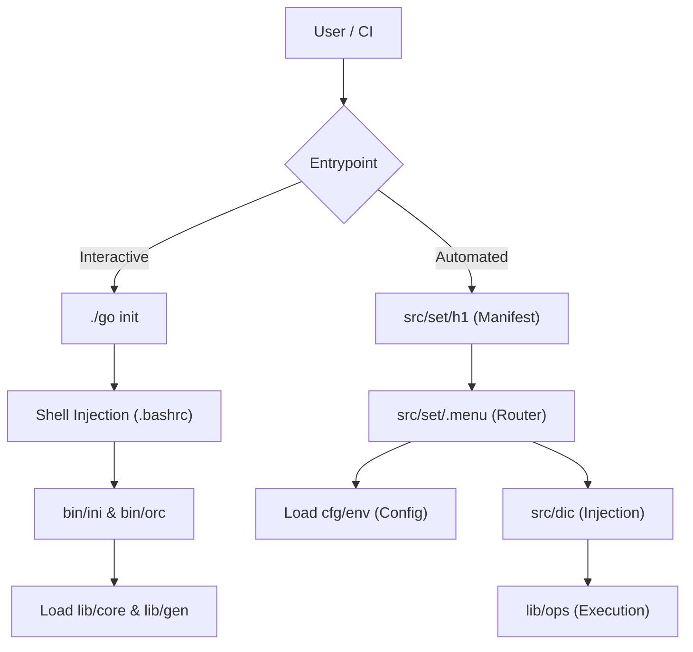

# 00 - Architecture Overview

This document provides a high-level overview of the Lab Environment Management System's architecture.

## System Paradigm
The repository implements a **Bash-native, modular infrastructure automation framework**. Unlike traditional compiled binaries (Go, Rust) or standalone Python/Ansible applications, this system functions by injecting modular library functions directly into the user's interactive shell. 

It is designed around several core principles:
1. **No Compilation Step:** Pure Bash execution ensuring maximum portability across Unix systems.
2. **Modular Boundaries:** Strict separation between initialization, core primitives, general utilities, operational functions, and configuration.
3. **Pure Function Design:** Operational modules are completely stateless and rely on explicit parameterization.
4. **Dependency Injection:** A purpose-built Dependency Injection Container (DIC) maps environment configurations to pure function arguments.
5. **Idempotency & Safety:** All destructive actions require explicit confirmation, use atomic file operations, and perform extensive pre-flight checks.

## Directory Architecture

The repository is structured into distinct functional domains:

| Directory | Purpose | Key Responsibilities |
| --- | --- | --- |
| `bin/` | Orchestration | Bootstrapping (`ini`), component loading (`orc`), and shell integration. |
| `cfg/` | Configuration | Hierarchical environment definitions and core constants. |
| `lib/core/` | Primitives | Foundational tools: error handling (`err`), logging (`lo1`), timing (`tme`), verification (`ver`). |
| `lib/gen/` | Utilities | Cross-cutting concerns: security (`sec`), auxiliary helpers (`aux`), infrastructure definitions (`inf`). |
| `lib/ops/` | Operations | Pure Bash functions for system operations (e.g., networking, virtualization, package management). |
| `src/dic/` | Dependency Injection | Resolving hierarchical variables and adapting `cfg` to `lib/ops`. |
| `src/set/` | Deployment | Executable task manifests mapped to hostnames, orchestrated by `.menu`. |
| `val/` | Validation & Testing | BDD-style testing framework for unit, integration, and performance tests. |
| `doc/` | Documentation | Architecture, developer guides, and operations manuals. |

## High-Level Execution Flow

## Three-Layer Deployment Architecture

When executing infrastructure changes, the system relies on a three-layer pattern:

1. **Deployment Manifests (`src/set/*`)**: Hostname-specific scripts grouping tasks into menus.
2. **Dependency Injection Container (`src/dic/ops`)**: Translates global environment states into function-specific arguments.
3. **Pure Functions (`lib/ops/*`)**: Executes the specific logic with idempotency and safety guarantees.

This separation ensures that operational logic remains highly testable and decoupled from the environment it runs in.