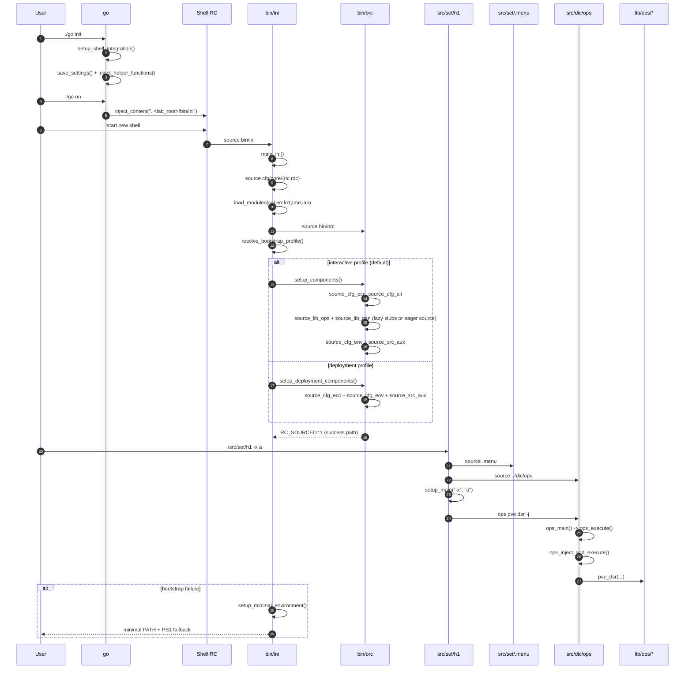
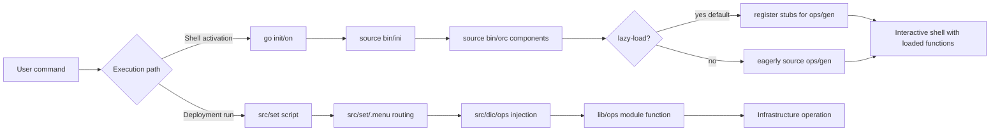

# 00 - Architecture Overview (Current State)

This repository is a Bash-native infrastructure automation system with two primary runtime paths: (1) interactive shell bootstrap via `go` -> `bin/ini` -> `bin/orc`, and (2) deployment script execution via `src/set/*` -> `src/dic/ops` -> `lib/ops/*`. This overview maps those boundaries and call flows; module-level internals are covered in `01` through `07`.

## 1. Responsibilities and Boundaries

| Area | Primary files | Responsibility boundary |
| --- | --- | --- |
| Shell integration entrypoint | `go` | Manages shell RC managed blocks, stores init settings, and dispatches `init/on/off/purge/status/validate`. |
| Bootstrap controller | `bin/ini` | Sources core constants/modules, initializes shared foundation, selects bootstrap profile (`interactive` or `deployment`), and finalizes `RC_SOURCED`. |
| Component orchestrator | `bin/orc` | Executes profile-specific component loading (`setup_components` or `setup_deployment_components`) with timers and centralized error routing. |
| Runtime constants/config | `cfg/core/ric`, `cfg/core/rdc`, `cfg/env/*` | Defines global paths, runtime variables, and site/env/node layered configuration files. |
| Dependency injection engine | `src/dic/ops`, `src/dic/lib/*` | Resolves operation arguments and dispatches module functions (`module_function`). |
| Deployment manifests | `src/set/*`, `src/set/.menu` | Defines task sections (`*_xall`) and calls DIC through `ops ...` commands. |
| Operations libraries | `lib/ops/*` | Implements infrastructure actions invoked by DIC or sourced runtime environment. |
| Verification suite | `val/run_all_tests.sh`, `val/lib/run_all_tests.sh`, `val/**/*_test.sh`, plus legacy scripts under `val/` | Validates behavior by category (`core`, `lib`, `integration`, `src`, `dic`, `legacy`). |

## 2. Runtime/Load Sequence

### Actual call/load order

1. User runs `./go init` once to persist helper functions and save `.tmp/go_settings` (`setup_shell_integration`, `save_settings`, `inject_helper_functions`).
2. User enables startup loading with `./go on` (`handle_on_command` -> `inject_content`), which writes `. <lab_root>/bin/ini` into the selected shell RC file.
3. New shell sources `bin/ini`; `main_ini` runs and loads `cfg/core/ric`, `cfg/core/rdc`, `lib/core/ver`, then core modules `col`, `err`, `lo1`, `tme`, `lab`. Boot-phase toggles (`LOG_DEBUG_ENABLED=0`, `LAB_BOOTSTRAP_MODE=1`, `PERFORMANCE_MODE=1`) are active during this phase to reduce overhead.
4. `bin/ini` sources `bin/orc`, resolves bootstrap profile (`LAB_BOOTSTRAP_PROFILE`, default `interactive`), and routes component setup to `setup_components` (interactive) or `setup_deployment_components` (deployment). Interactive profile loads aliases plus lazy/eager `lib/ops/*` and `lib/gen/*`; deployment profile loads only `cfg/core/ecc`, `cfg/env` (site required, env/node optional), and `source_src_aux`.
5. A deployment script (for example `src/set/h1`) sources `src/set/.menu` and `src/dic/ops`, then routes `-i` or `-x` through `setup_main`.
6. Selected `*_xall` sections invoke `ops module function ...`; DIC resolves/injects arguments (`ops_main` -> `ops_execute` -> `ops_inject_and_execute`) and calls target `module_function` symbols from sourced files in `lib/ops/*`.

### End-to-end sequence

### Conceptual flow (quick view)

## 3. State and Side Effects

- `go` writes managed blocks into user shell config (`.bashrc` or `.zshrc`), creates backups on mutation, and stores runtime settings in `.tmp/go_settings`.
- First successful `./go init` creates `${HOME}/.lab_initialized`; `status` and `validate` behavior depends on this marker.
- `bin/ini` exports/updates runtime globals from `cfg/core/ric` (`LAB_DIR`, `LIB_OPS_DIR`, `SITE_CONFIG_FILE`, log/temp paths, verbosity toggles).
- `bin/ini` sets transient bootstrap-phase toggles (`LOG_DEBUG_ENABLED=0`, `LAB_BOOTSTRAP_MODE=1`, `PERFORMANCE_MODE=1`) that are restored/cleared after boot completes.
- `bin/ini` exports lazy-load control variables (`LAB_OPS_LAZY_LOAD`, `LAB_GEN_LAZY_LOAD`, `LAB_OPS_LAZY_MODULES`, `LAB_GEN_LAZY_MODULES`) that persist and can be inspected at runtime.
- `bin/ini` exports `main_ini`, `main_ini_interactive`, and `main_ini_deployment`; bootstrap state (`RC_SOURCED`) remains visible in the caller shell by design.
- `bin/orc` installs `trap cleanup EXIT INT TERM` when sourced; this changes trap behavior of the caller shell/session.
- `src/set/.menu` defaults to eager auto-sourcing for `cfg/env`, `lib/ops`, and sibling `src/set/*` files, but this can be disabled with `LAB_MENU_AUTO_SOURCE=0` for validation/non-side-effect contexts.
- `src/dic/ops` sources `src/dic/lib/{injector,introspector,resolver}` and attempts to source `cfg/env/site1` during load.

## 4. Failure and Fallback Behavior

- `go on/off/purge` require `.tmp/go_settings`; if missing, commands fail and instruct to run `./go init`.
- If `bin/ini` cannot complete `main_ini`, it executes `setup_minimal_environment` and exits non-zero.
- In `bin/orc`, component setup is profile-driven (`interactive` or `deployment`) and executed by a shared component-set loop.
- `source_cfg_env` treats base site file as required and env/node overrides as optional.
- `source_src_aux` returns non-zero when `SRC_AUX_DIR` is missing or unreadable, but current orchestrator settings treat this as optional and continue.
- `src/set/.menu` is permissive for many sourcing failures (logs warnings, often continues), while argument routing (`setup_main`) returns `1` on invalid mode/args.
- DIC (`src/dic/ops`) validates module/function existence and returns `1` on missing modules/functions/required context.

## 5. Constraints and Refactor Notes

- Most runtime code under `bin/` and `lib/` is extensionless; tooling or refactors that assume `*.sh` will miss core behavior.
- Bootstrap and orchestrator rely on global variable contracts established by `cfg/core/ric`; order changes can silently break downstream sourcing.
- Deployment scripts in `src/set/*` are tightly coupled to DIC command semantics (`ops module function -j`), not direct function calls.
- `src/set/.menu` and `bin/orc` both perform broad sourcing, so duplicate-loading and side-effect ordering are key regression risks.
- Sourcing `bin/orc` into an existing shell modifies shell trap and error semantics; treat as a behavioral boundary, not a pure library import.

## 6. Arc Document Map

- `doc/arc/01-bootstrap-and-orchestration.md`: `go`, `bin/ini`, `bin/orc` bootstrap internals.
- `doc/arc/02-core-and-gen.md`: `lib/core/*` and `lib/gen/*` primitives/utilities.
- `doc/arc/03-operational-modules.md`: `lib/ops/*` contracts and module boundaries.
- `doc/arc/04-dependency-injection.md`: DIC flow in `src/dic/*` and mapping rules.
- `doc/arc/05-deployment-and-config.md`: `cfg/*` hierarchy and `src/set/*` execution context.
- `doc/arc/06-testing-and-validation.md`: `val/*` suite architecture.
- `doc/arc/07-logging-and-error-handling.md`: `err`, `lo1`, `tme`, and aux logging/error contracts.

## Maintenance Note

Update this file in the same PR when any of these change: primary entrypoints (`go`, `bin/ini`, `bin/orc`, `src/set/.menu`, `src/dic/ops`), cross-layer load order, top-level directory responsibilities, or shell/runtime side-effect contracts.
