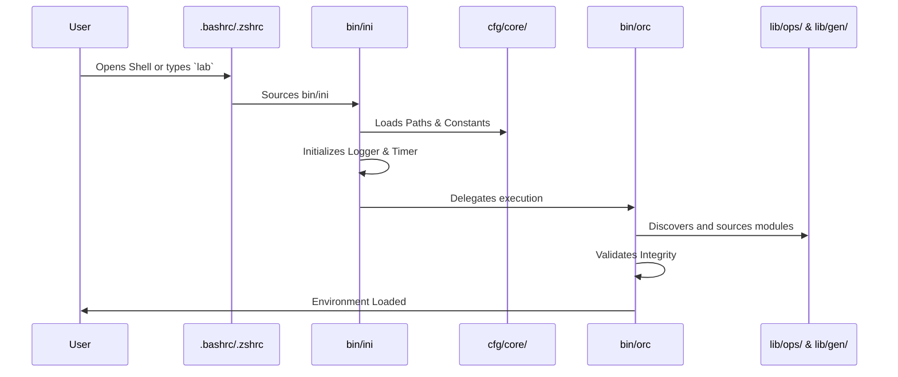

# 01 - Bootstrap and Orchestration

This document describes the core bootstrapping sequence and orchestration mechanisms that load the Lab Environment Management System into a user's interactive shell session.

## The `./go` Entrypoint

The primary system interaction begins with the `./go` script in the root repository. Unlike traditional applications, the system is designed to seamlessly integrate as shell helper functions.

The `./go` script supports several key operations:
*   `./go init` (or `setup`): Installs shell hooks (managed blocks) into the user's `.bashrc` or `.zshrc`.
*   `./go status`: Checks if the environment is initialized and hooks are present.
*   `./go validate`: Triggers the internal validation suite (tests) via `val/run_all_tests.sh`.
*   `./go on` / `off`: Toggles the automatic loading of the lab environment upon opening a new shell.
*   `./go purge`: Removes all managed helper functions from the shell RC file.

When initialized, three primary shell functions are provided to the user:
1.  `lab`: Activates the framework in the current shell only (without modifying RC permanently for auto-load). It does this by sourcing `bin/ini`.
2.  `lab-on`: Enables auto-load for all future shells.
3.  `lab-off`: Disables auto-load for all future shells.

## Initialization Sequence (`bin/ini`)

When `lab` is executed, the primary bootstrap script, `bin/ini`, assumes control. Its purpose is to safely and rapidly validate the environment before delegating to the orchestrator.

The initialization flow is as follows:
1.  **Start Timing:** Captures the wall-clock start time for profiling to ensure initialization remains highly performant.
2.  **Core Dependencies:** Sources foundational constants (paths, boundaries) from `cfg/core/`.
3.  **Module Validation:** Ensures critical core modules (`lib/core/err`, `lo1`, `tme`, etc.) are present and accessible.
4.  **Minimal Fallback Environment:** If an error occurs during early bootstrap, `bin/ini` sets up a fail-safe environment so the user can debug the loading sequence without completely breaking their shell.
5.  **Delegation:** Finally, it invokes the Component Orchestrator (`bin/orc`).

## The Component Orchestrator (`bin/orc`)

The `bin/orc` script is the dynamic module loader. It is responsible for safely sourcing all required files into the running shell.

Key responsibilities:
*   **Dependency Resolution:** Reads constants from `cfg/core/rdc` (Runtime Dependency Constants) and `mdc` (Module Dependency Constants) to determine the exact loading order.
*   **Secure Sourcing:** Utilizes functions in `lib/core/ver` to verify file integrity and existence before using the `source` command.
*   **Dynamic Discovery:** Iterates through optional and required directories (e.g., aliases, `lib/ops`, `lib/gen`) and safely injects their functions.
*   **Logging Output:** Emits debug logs directly to the master terminal via `lo1` (if verbosity allows) to track which components were successfully loaded.

## Bootstrapping Flow Diagram

