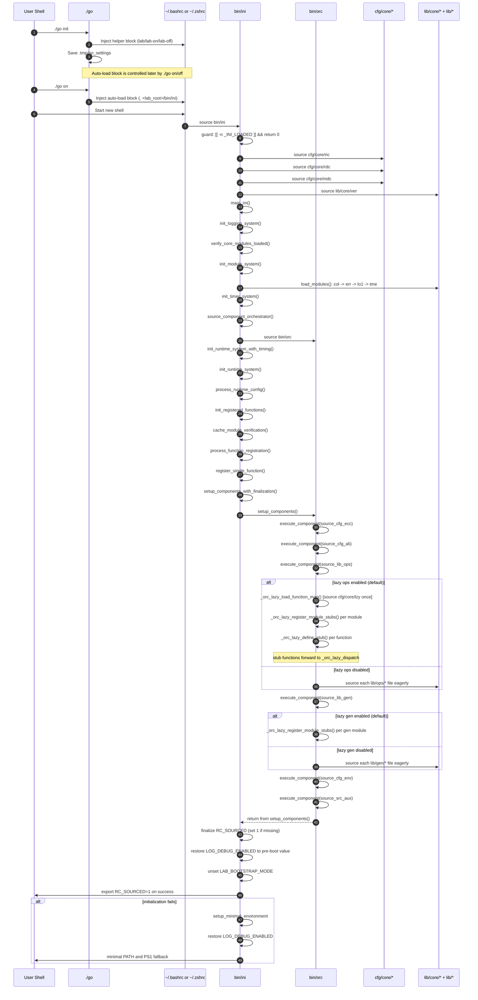
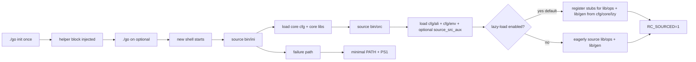

# 01 - Bootstrap and Orchestration Architecture (Current State)

This document describes how shell integration, bootstrap, and component orchestration currently work in the Lab Environment Management System.

## 1. `./go` Entrypoint (Shell Integration)

`./go` is the user-facing CLI entrypoint for shell integration lifecycle management. It does not bootstrap modules itself; it writes and removes managed blocks in a shell startup file, then `bin/ini` performs runtime loading when sourced.

### `init` / `setup` behavior
When a user runs `./go init` (or `./go setup`), the script:
1. Validates shell compatibility (Bash 4+ or Zsh 5+).
2. Resolves target user and home directory.
3. Chooses shell config file in this order:
   - first existing `~/.zshrc`
   - else existing `~/.bashrc`
   - else default `~/.bashrc` (created if needed)
4. Builds `INJECT_CONTENT` for auto-load: `. <lab_root>/bin/ini`.
5. Saves resolved settings to `.tmp/go_settings`.
6. Injects a persistent helper block (`lab`, `lab-on`, `lab-off`) under helper markers.

`lab` is the current-shell activation path (`source <lab_root>/bin/ini`).

### Runtime command semantics
- `./go on`: loads `.tmp/go_settings`, then injects the auto-load managed block.
- `./go off`: loads `.tmp/go_settings`, then removes only the auto-load managed block.
- `./go purge`: loads `.tmp/go_settings`, removes auto-load block (if present), then removes helper block.
- `./go status`: checks `~/.lab_initialized`, checks `.tmp/go_settings`, and reports whether shell integration appears active.

## 2. Initialization Controller (`bin/ini`)

`bin/ini` is the bootstrap controller sourced into the current shell. It uses a re-source guard (`_INI_LOADED`) and returns early on repeat loads in the same shell.

### End-to-end sequence



### Conceptual flow (quick view)



### Maintenance rule

If bootstrap call order, function names, or component order change in `go`, `bin/ini`, or `bin/orc`, update this document in the same PR.

### Bootstrap sequence (actual call order)
1. Captures start timestamp (`_INI_START_NS`).
2. Sources core config files:
   - `cfg/core/ric`
   - `cfg/core/rdc`
   - `cfg/core/mdc`
3. Sources verification module: `lib/core/ver`.
4. Runs `main_ini`, which performs:
   - `init_module_system` (essential checks, directory validation, core module loading)
   - timer system initialization (`tme_init_timer`, `tme_start_timer` when available)
   - `source_component_orchestrator` (sources `bin/orc`)
   - `init_runtime_system_with_timing` (runtime config processing + registered function loading)
   - `setup_components_with_finalization` (calls orchestrator `setup_components`, finalizes `RC_SOURCED`)

### Core module loading in `init_module_system`
Modules are loaded in this fixed order:
1. `lib/core/col`
2. `lib/core/err`
3. `lib/core/lo1`
4. `lib/core/tme`

### Failure behavior
If initialization fails, `bin/ini` runs `setup_minimal_environment`:
- appends a base fallback segment to `PATH`
- sets a minimal prompt (`PS1="(minimal)[\u@\h \W]\$ "`)
- ensures `${BASE_DIR}/.log` and `${BASE_DIR}/.tmp` exist

### Runtime/performance toggles
- `LOG_DEBUG_ENABLED=0` is forced at the start of `bin/ini` (original value saved and restored after orchestrator sourcing completes or on failure). This suppresses `lo1_log` stack-trace dumps during boot.
- `LAB_BOOTSTRAP_MODE=1` is exported before `main_ini` runs. During bootstrap mode, `ver_verify_module` skips deep verification checks for modules that were just sourced, and `ver_log` suppresses non-error log writes (avoiding timestamp generation and file I/O on the hot path). Cleared after bootstrap completes.
- `PERFORMANCE_MODE=1` during the early critical section of `main_ini`; suppresses detailed-priority `ini_log` messages. Reset to `0` before component setup.
- `LAB_OPS_LAZY_LOAD=1` and `LAB_GEN_LAZY_LOAD=1` default to enabled (set via `:=` so callers can override before sourcing `bin/ini`). `LAB_OPS_LAZY_MODULES` and `LAB_GEN_LAZY_MODULES` default to `all`. These control whether `lib/ops/*` and `lib/gen/*` modules are eagerly sourced or registered as lazy stubs during `setup_components`.
- Timing report is force-enabled at the end when timing functions are available.

## 3. Component Orchestrator (`bin/orc`)

`bin/orc` defines `setup_components` and component source helpers. It is sourced by `bin/ini` and does not auto-execute component setup on load.

### Shell behavior and trap handling
- In non-interactive contexts it enables `set -eo pipefail`; in interactive contexts it keeps `pipefail` only.
- It installs `trap cleanup EXIT INT TERM`.
- `cleanup` removes `TEMP_ERROR_FILE` if present.

### Execution wrapper
`execute_component` provides:
- function existence checks
- timer start/end wrapping
- error routing (`err_handler`)
- required vs optional behavior

Note: in the current `components` array, every component is configured as optional (`COMPONENT_OPTIONAL`).

### Component execution order in `setup_components`
1. `source_cfg_ecc` (`cfg/core/ecc`)
2. `source_cfg_ali` (`cfg/ali/*`)
3. `source_lib_ops` (`lib/ops/*`, filtered to skip doc/hidden files; lazy-loaded by default)
4. `source_lib_gen` (`lib/gen/*`, then optional password-init hook; lazy-loaded by default)
5. `source_cfg_env` (site required; env/node overrides optional)
6. `source_src_aux` (`SRC_AUX_DIR`, default `${LAB_DIR}/src/aux`, optional)

On success, `RC_SOURCED=1` is exported.

### Source helper (`source_helper`)
`source_helper` captures stderr from each `source` call to detect warnings or errors. Instead of writing to a temporary file (`mktemp`/`rm` per file), it uses a **coproc-based FD pair** (`coproc ORC_SOURCE_ERROR_CAPTURE { cat; }`): stderr is redirected to the write FD during sourcing, the write FD is closed, buffered lines are read from the read FD, and the coproc is cleaned up. This avoids two process forks and file I/O per sourced file.

### Directory sourcing (`source_directory`)
`source_directory` iterates files for a given directory and glob pattern. Instead of `find "$dir" -type f | sort` with an intermediate temp file, it uses **shell-native globbing** (`for file in "$dir"/$pattern`) with `nullglob` enabled. Hidden files are skipped via a `[[ "$file_name" == .* ]]` guard. `nullglob` state is saved and restored. This eliminates `find`, `sort`, and `mktemp` forks.

### Lazy-load infrastructure

When `LAB_OPS_LAZY_LOAD=1` or `LAB_GEN_LAZY_LOAD=1` (both default to `1`), `source_lib_ops` and `source_lib_gen` register lightweight stub functions instead of eagerly sourcing module files. The mechanism:

1. **Function map** (`cfg/core/lzy`): a static map of module name to CSV of function names, loaded once by `_orc_lazy_load_function_map` (guarded by `ORC_LAZY_MAP_LOADED`). If no map entry exists for a module, a fallback regex scanner (`_orc_lazy_discover_module_functions`) parses the module file for function definitions.
2. **Stub registration** (`_orc_lazy_register_module_stubs`): for each function in the map/discovered list, `_orc_lazy_define_stub` creates a shell function via `eval` that forwards to `_orc_lazy_dispatch`. Functions that already exist in the session are skipped. If stub registration fails entirely, the loader falls back to eager sourcing.
3. **First-call dispatch** (`_orc_lazy_dispatch`): on first invocation, sources the real module file via `source_helper`, marks it loaded in `ORC_LAZY_MODULE_LOADED`, verifies the function exists, and calls it with the original arguments. Because `source` redefines the real functions, all stubs for that module are replaced, so subsequent calls go directly to the real implementation.
4. **Module selection** (`_orc_lazy_module_selected`): `LAB_OPS_LAZY_MODULES` / `LAB_GEN_LAZY_MODULES` accept `all`, `*`, or a comma-separated list of module names. Modules not selected for lazy loading are eagerly sourced as before.

## 4. Managed Shell Blocks

`./go` writes two distinct managed blocks to the selected shell config file:

```bash
# helper block (persistent unless purge)
lab()     { source "<lab_root>/bin/ini"; }
lab-on()  { "<lab_root>/go" on; }
lab-off() { "<lab_root>/go" off; }

# auto-load block (toggled by on/off)
. <lab_root>/bin/ini
```

`off` removes the auto-load block only; `purge` removes both blocks.

## 5. State and Side Effects Relevant to Refactoring

- `main_ini` is exported with `export -f main_ini`, and many bootstrap symbols remain in the interactive shell after sourcing.
- Orchestrator and bootstrap flows are tightly coupled to globals seeded by `cfg/core/ric`.
- `bin/orc` changes shell error behavior depending on interactivity, which can affect callers that source it inside larger scripts.
- `TEMP_ERROR_FILE` is a transient global variable used for cleanup, not a stable exported runtime contract.
- Bootstrap-phase variables (`LAB_BOOTSTRAP_MODE`, `LOG_DEBUG_ENABLED`, `PERFORMANCE_MODE`) are transient toggles that are set during boot and restored/cleared afterward; they should not be relied on at runtime.
- Lazy-load control variables (`LAB_OPS_LAZY_LOAD`, `LAB_OPS_LAZY_MODULES`, `LAB_GEN_LAZY_LOAD`, `LAB_GEN_LAZY_MODULES`) remain exported after boot and can be inspected at runtime to determine loading mode.
- `ORC_LAZY_MODULE_LOADED` (associative array) tracks which modules have been lazy-loaded so far in the session; `ORC_LAZY_MAP_LOADED` guards one-time loading of `cfg/core/lzy`.
