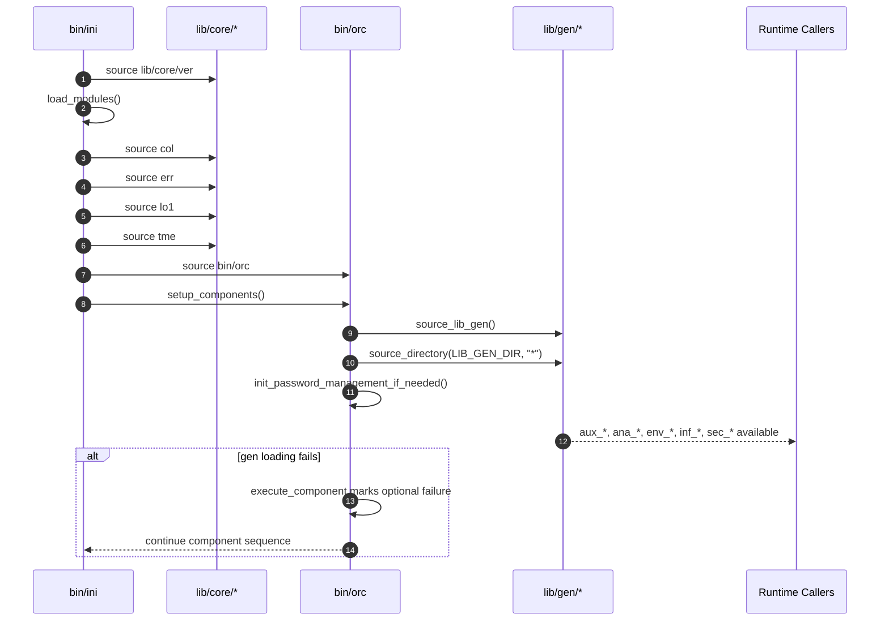
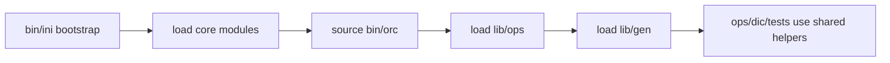

# 02 - Core and General Utility Architecture (Current State)

This area covers the runtime foundation loaded before or alongside operations: `lib/core/*` provides bootstrap-safe primitives (`col`, `ver`, `err`, `lo1`, `tme`), and `lib/gen/*` provides cross-cutting utilities (`ana`, `aux`, `env`, `inf`, `sec`) consumed by ops modules, DIC helpers, and documentation tooling.

## 1. Responsibilities and Boundaries

| Layer | Primary files | Responsibility boundary |
| --- | --- | --- |
| Core primitives | `lib/core/col`, `lib/core/ver`, `lib/core/err`, `lib/core/lo1`, `lib/core/tme` | Provide color, verification, error, logging, and timing capabilities used during bootstrap and runtime. |
| General utilities | `lib/gen/ana`, `lib/gen/aux`, `lib/gen/env`, `lib/gen/inf`, `lib/gen/sec` | Provide analysis, help/validation/log wrappers, env switching helpers, infra variable builders, and password management helpers. |
| Bootstrap loader contract | `bin/ini`, `bin/orc` | Defines when core and gen modules are sourced and how failures are handled. |

## 2. Runtime/Load Sequence

### Actual call/load order

1. `bin/ini` sources `cfg/core/ric`, `cfg/core/rdc`, `cfg/core/mdc`, then `lib/core/ver`.
2. `main_ini` -> `init_module_system` -> `load_modules` sources core modules in fixed order: `lib/core/col` -> `lib/core/err` -> `lib/core/lo1` -> `lib/core/tme`.
3. `main_ini` sources `bin/orc` and calls `setup_components`.
4. `setup_components` executes `source_lib_gen` (after `source_lib_ops` in current orchestrator order).
5. `source_lib_gen` -> `source_directory "$LIB_GEN_DIR" "*"` sources non-hidden files in sorted order (currently `ana`, `aux`, `env`, `inf`, `sec`).
6. `source_lib_gen` runs `init_password_management_if_needed`, which checks for `init_password_management_auto` and continues even when absent.

### End-to-end sequence

### Conceptual flow (quick view)

## 3. State and Side Effects

- `col` exports color constants and helpers (`col_apply`, `col_get_semantic`) used by downstream logging layers.
- `err` initializes global error maps/arrays (`ERROR_CODES`, `ERROR_ORDER`, etc.) and defines `command_not_found_handle` in the shell session.
- `lo1` initializes logger state files (`LOG_STATE_FILE`, depth cache), clears `LOG_FILE`, and installs aliases (`log`, `setlog`, etc.).
- `tme` initializes timing state (`TME_*` associative arrays), writes to `TME_LOG_FILE`, and controls report behavior through `TME_STATE_FILE` and `TME_LEVELS_FILE`.
- `aux` provides runtime logging and writes structured outputs (`aux.log`, `aux.json`, `aux.csv`) in `LOG_DIR` depending on `AUX_LOG_FORMAT`.
- `env` mutates `cfg/core/ecc` via `update_ecc` (`sed -i` plus timestamped backup) when switching site/env/node.
- `inf` and `sec` create/export runtime variables and files (`CT_*`, `VM_*`, password files), including permission changes (`chmod 700/600`) in password directories.

## 4. Failure and Fallback Behavior

- Core module sourcing in `bin/ini` is fail-sensitive during bootstrap; a critical failure can end in `setup_minimal_environment`.
- `load_modules` returns success if at least one module loads (`module_loaded > 0`), so partial core load is possible and must be considered.
- `source_lib_gen` failure is non-fatal in current orchestrator flow because all components are currently marked optional in `bin/orc`.
- `aux_cmd` returns `127` for missing commands and preserves command exit codes for runtime failures.
- `env_validate` reports missing base config as error but treats env/node override files as optional.
- `sec_get_password_directory` falls back across multiple locations and eventually to `$HOME/.lab_passwords`.

## 5. Constraints and Refactor Notes

- `lib/core/err`, `lib/core/lo1`, and `lib/core/tme` call `ver_verify_module` at source time, so `lib/core/ver` must be available first.
- Bootstrap order in `bin/ini` (`col` -> `err` -> `lo1` -> `tme`) is an implicit contract for color/log/error integration.
- `lib/gen` is sourced after `lib/ops` in orchestrator order, so ops modules must not rely on immediate execution of gen helpers during source-time unless already available in session.
- Some utility modules are stateful (for example `env` editing `cfg/core/ecc`, `inf` exporting large variable sets), so they are not pure read-only helpers.
- DIC runtime (`src/dic/ops`) additionally sources `lib/gen/ana` and `lib/gen/aux`; duplication of sourcing paths is expected and should stay idempotent.

## Maintenance Note

Update this document in the same PR when any of these change: core module load order in `bin/ini`, `lib/gen` loading semantics in `bin/orc`, exported contracts in `lib/core/*` or `lib/gen/*`, or side-effect behavior (log files, state files, environment mutation, credential storage).
