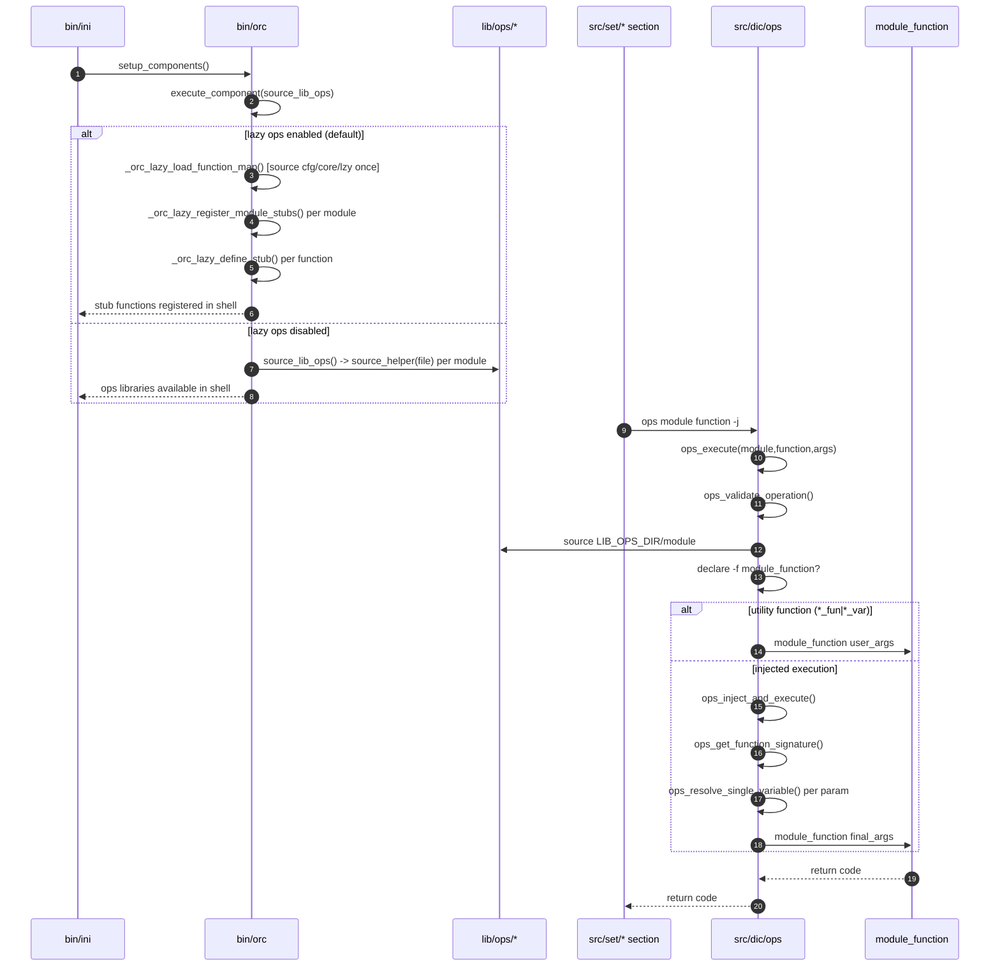
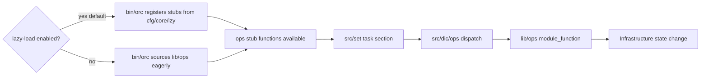

# 03 - Operational Modules (`lib/ops`) (Current State)

`lib/ops/*` is the infrastructure action layer. These modules expose callable Bash functions (for example `pve_*`, `gpu_*`, `net_*`, `sys_*`) that are sourced into the runtime shell and then executed either directly or through DIC dispatch (`src/dic/ops`). The boundary is: `lib/ops` performs operations; configuration lookup and argument injection happen outside this layer.

## 1. Responsibilities and Boundaries

| Area | Primary files | Responsibility boundary |
| --- | --- | --- |
| Operational function modules | `lib/ops/*` (extensionless) | Implements concrete infrastructure actions (VM, GPU, network, storage, users, services). |
| Loader path | `bin/orc` (`source_lib_ops`) | Sources ops modules in sorted order, excluding docs/hidden files. |
| Invocation path | `src/dic/ops` (`ops_execute`) | Resolves `module/function` and calls `module_function` in sourced ops file. |
| Contract baseline | `lib/.spec`, `lib/ops/.spec` | Defines naming, validation, logging, return code expectations. |

## 2. Runtime/Load Sequence

### Actual call/load order

1. `bin/ini` calls `setup_components` in `bin/orc`.
2. `setup_components` runs `source_lib_ops` (currently optional component in the orchestrator table).
3. When `LAB_OPS_LAZY_LOAD=1` (the default), `source_lib_ops` iterates `LIB_OPS_DIR` via shell glob (excluding docs and hidden files) and registers lightweight stub functions for each module from `cfg/core/lzy` (a static function map). If no map entry exists, a fallback regex scanner discovers function definitions from the module file. Stubs forward to `_orc_lazy_dispatch`, which sources the real module on first call. When `LAB_OPS_LAZY_LOAD=0`, `source_lib_ops` eagerly sources each file via `source_helper` as before.
4. A caller triggers an operation, most commonly via DIC command shape `ops <module> <function> ...` from `src/set/*` sections.
5. If the module was lazy-loaded, the first call to any function in that module triggers `_orc_lazy_dispatch`, which sources the full module file (replacing all stubs with real definitions) and then executes the requested function.
6. `src/dic/ops` runs `ops_execute`:
   - validates module path (`LIB_OPS_DIR/<module>`),
   - sources that module file,
   - validates function existence (`<module>_<function>`),
   - executes directly (utility `*_fun|*_var`) or through injection (`ops_inject_and_execute`).
7. The target `module_function` in sourced `lib/ops/*` files performs checks and side effects (system/service/config changes) and returns status.

### End-to-end sequence

### Conceptual flow (quick view)

## 3. State and Side Effects

- When lazy-loaded (default), `lib/ops/*` module files are not parsed at boot time. Lightweight stub functions are defined in the shell; the real module is sourced on first call via `_orc_lazy_dispatch`. `ORC_LAZY_MODULE_LOADED` (associative array) tracks which modules have been loaded so far.
- Once a module is sourced (either eagerly or via lazy dispatch), all function names become globally callable. Source-time side effects in modules run at that point.
- Operational functions are the layer most likely to mutate real systems (packages, services, network config, VM/CT state, storage).
- DIC path re-sources module files on execution (`ops_execute`), so idempotent source blocks are important.

## 4. Failure and Fallback Behavior

- In bootstrap, ops loading is wrapper-managed by `execute_component`; current orchestrator marks the component optional.
- In DIC execution, missing `LIB_OPS_DIR`, missing module file, or missing target function returns `1` from `ops_execute`.
- If signature analysis fails in `ops_inject_and_execute`, DIC falls back to passing user args directly.
- Unresolved injected parameters become empty values unless the target function validates and rejects them.
- Function-level return semantics are module-defined, but project specs target: `0` success, `1` usage/validation, `2` runtime failure, `127` missing dependency.

## 5. Constraints and Refactor Notes

- Most ops modules are extensionless files; tooling that assumes `*.sh` will miss this layer.
- DIC dispatch requires stable module/function naming (`module` file + `module_function` symbol).
- `bin/orc` sources `lib/ops` before `lib/gen` in orchestrator order. When lazy loading is active (default), neither is eagerly sourced at boot; both are stub-loaded. When lazy loading is disabled, source-time hard dependencies on gen helpers can be brittle unless explicitly sourced.
- `lib/ops/.spec` requires structured logging via `aux_*`, explicit validation/check patterns, and `-x` execution flag for action-only functions.
- Deployment manifests are coupled to DIC command semantics (`ops module function -j`) rather than direct function signatures.
- `cfg/core/lzy` contains the static function map used for lazy stub registration. When adding or removing public functions from an ops module, update the corresponding `ORC_LAZY_OPS_FUNCTIONS` entry in `cfg/core/lzy`.

## Maintenance Note

Update this document in the same PR when any of these change: `source_lib_ops` filtering/loading behavior, `ops_execute` dispatch rules, module naming contracts, or ops return-code/validation/logging expectations enforced by specs.
