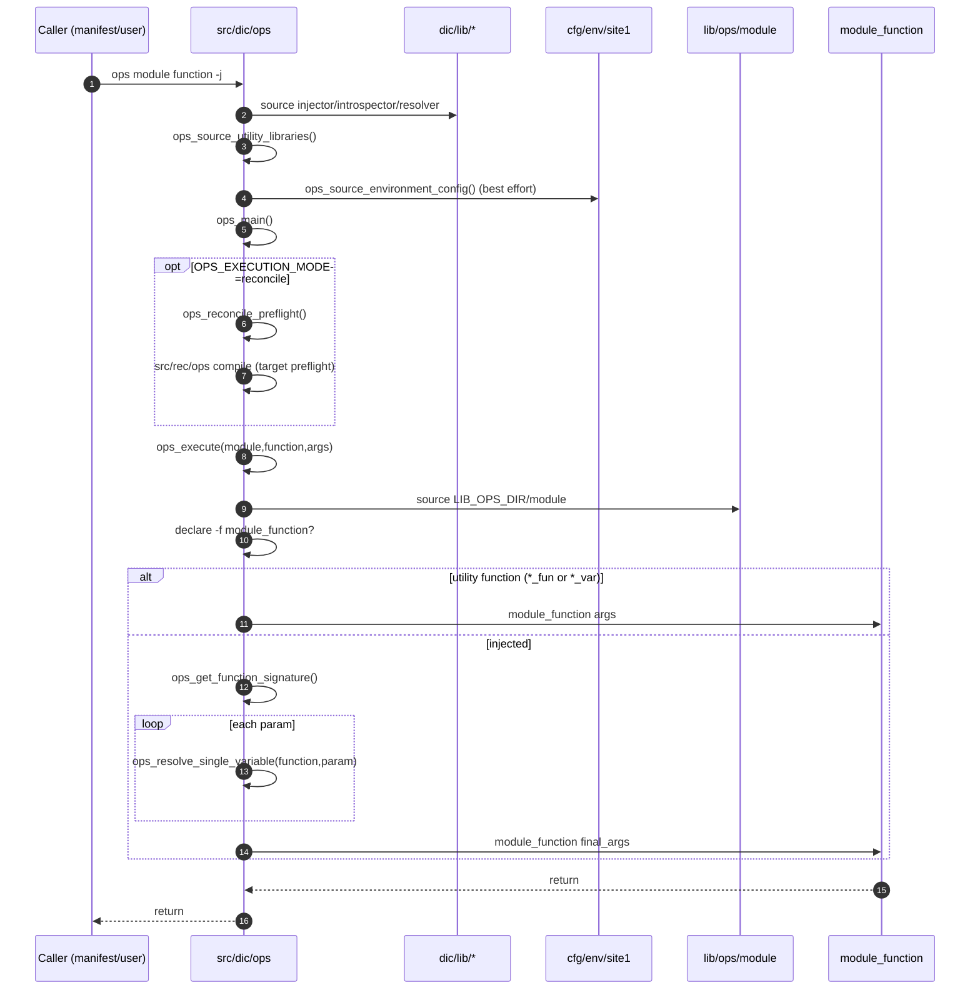
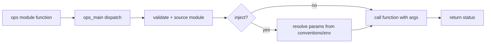

# 04 - Dependency Injection Architecture (`src/dic`) (Current State)

`src/dic/ops` is the runtime dispatch and argument-injection layer between
`ops module function ...` calls and operational functions in `lib/ops/*`.
In current migration flow, it is reached either directly from operator CLI
usage or from `src/set/*` section functions after `src/run/dispatch` hands off
to compatibility runbooks. It does not own infrastructure actions; it validates
targets, resolves arguments, and calls the final `module_function`.

## 1. Responsibilities and Boundaries

| Area | Primary files | Responsibility boundary |
| --- | --- | --- |
| DIC entrypoint/dispatcher | `src/dic/ops` | Parses CLI shape, validates module/function, chooses direct vs injected execution. |
| Migration bridge | `src/dic/run` | Compiles reconcile artifacts and dispatches plan-aware execution via `src/run/dispatch` (opt-in path). |
| Signature/introspection helpers | `src/dic/lib/introspector`, `src/dic/lib/injector`, `src/dic/lib/resolver` | Provide analysis and resolver utilities sourced by the entrypoint. |
| Mapping/config data | `src/dic/config/*.conf` | Supplemental conventions/mappings for injection behavior. |
| Execution target | `lib/ops/*` | Receives final argument array; performs real operation. |

## 2. Runtime/Load Sequence

### Actual call/load order

1. `src/dic/ops` initializes defaults (`OPS_DEBUG`, `OPS_VALIDATE`, `OPS_CACHE`, `OPS_METHOD`, `OPS_EXECUTION_MODE`).
2. It sources DIC helper libs: `src/dic/lib/injector`, `src/dic/lib/introspector`, `src/dic/lib/resolver`.
3. It attempts to source utility libraries `lib/gen/ana` and `lib/gen/aux` (`ops_source_utility_libraries`).
4. It attempts to source base environment file `cfg/env/site1` (`ops_source_environment_config`).
5. It initializes caches (`FUNCTION_SIGNATURE_CACHE`, `VARIABLE_RESOLUTION_CACHE`).
6. `ops_main` first parses command-scoped runtime flags (`--reconcile`, `--direct`, `--rec-target`) and then dispatches command modes:
   - `--help`, `--list`, `--debug`, module/function help/list,
   - no-arg call to function shows injection preview,
   - `-j` and default execution both route to `ops_execute`.
7. If execution mode resolves to `reconcile` (from env or runtime flags), `ops_execute` runs a reconcile preflight (`src/rec/ops compile`) and validates target membership before operation execution.
8. `ops_execute` validates module existence, sources `LIB_OPS_DIR/<module>`, verifies `<module>_<function>`, then executes direct or injected path.
9. Injected path (`ops_inject_and_execute`) obtains function signature and resolves each missing parameter via `ops_resolve_single_variable`.

### End-to-end sequence

### Conceptual flow (quick view)

## 3. State and Side Effects

- Sourcing `src/dic/ops` loads helper libraries and may also source `cfg/env/site1` if present.
- `ops_execute` sources target module files at runtime before checking function symbol existence.
- DIC keeps in-memory associative caches for signatures and variable resolutions in the current shell process.
- Debug output uses `aux_dbg` when available, otherwise timestamped stderr lines.

## 4. Failure and Fallback Behavior

- Missing module/function arguments in `ops_main` returns `1` and prints usage.
- Missing `LIB_OPS_DIR`, missing module file, or missing function symbol returns `1` from `ops_execute`.
- If signature analysis fails, DIC falls back to direct execution with user args.
- If parameter resolution yields no value, empty strings are passed unless target function rejects them.
- `--help`/`--list` and module/function help/list paths return `0` by design.

## 5. Constraints and Refactor Notes

- `src/dic/ops` does not define a shell function named `ops`; call sites rely on invoking this script/alias as the `ops` command symbol.
- DIC execution depends on runtime globals like `LIB_OPS_DIR` set by bootstrap (`cfg/core/ric` / `bin/ini`).
- Resolution logic in `ops_resolve_single_variable` is convention-heavy (hardcoded parameter-name cases plus uppercase fallback); renaming parameters can silently change injection behavior.
- Reconcile preflight (`OPS_EXECUTION_MODE=reconcile`) is currently optional and target-based; full reconcile-first execution is not yet the default runtime path.
- DIC helper libs/config files exist, but the hot execution path is still anchored in `src/dic/ops` dispatcher/resolver logic.

## 6. WS-01 Render-Path Interface Notes (`lib/ops/dev`)

- `dev_osv` now uses an explicit render-path seam in `lib/ops/dev`:
  `_dev_osv_collect_rows_tsv` (data extraction), `_dev_osv_render_table_from_tsv`
  (presentation), and `_dev_osv_render` (mode orchestration).
- The row contract between extraction and rendering is TSV with header:
  `suffix,id,project_root,directory,title,updated_local,first_prompt_local,user,src,conf,model,input,output`.
- Downstream workstreams should treat that header as the stable boundary and
  avoid coupling table rendering changes to attribution/query logic.

## Maintenance Note

Update this document in the same PR when command dispatch behavior in `src/dic/ops`, parameter resolution precedence/mappings, or helper-lib wiring (`src/dic/lib/*`, `src/dic/config/*`) changes.
