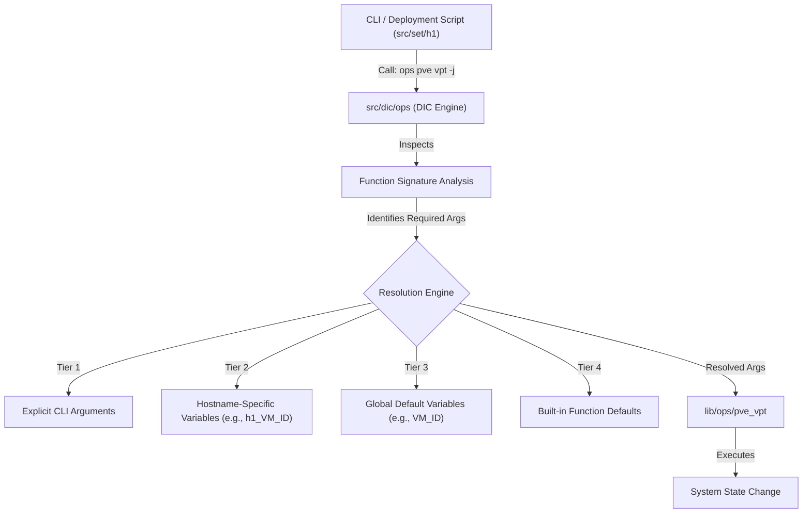

# 04 - Dependency Injection Container (`src/dic`)

The Dependency Injection Container (DIC) is an intelligent parameter resolution engine bridging the gap between environment-specific configurations (`cfg/env/`) and parameter-driven operational functions in `lib/ops/`.

Located in `src/dic/ops`, it is primarily used to orchestrate complex deployment manifests by dynamically injecting arguments into operational functions, dramatically reducing boilerplate code.

## The Problem It Solves

Functions in `lib/ops/` expose explicit parameter contracts (e.g., `pve_vpt "100" "on" "0000:01:00.0" "0000:01:00.1" "8" "4" "usb-a usb-b" "/etc/pve/qemu-server"`).

In a complex infrastructure, defining these parameters directly in a deployment script (`src/set/h1`) would hardcode the script to a specific environment, breaking modularity. The DIC automates this by looking up the required variables based on the current hostname and environment.

## Architecture and Workflow

### 1. Signature Analysis Engine
When the DIC is called, it parses the target function's code (documentation blocks and local variable declarations) on-the-fly to discover which parameters are required. To maintain high performance, these results are cached.

### 2. Hierarchical Parameter Resolution
The DIC resolves missing parameters through a strict four-tier fallback system:
1.  **User Arguments:** Arguments passed directly via the CLI (e.g., `ops pve vpt 100 on`).
2.  **Hostname-Specific Variables:** It checks the environment configuration for variables prefixed with the current hostname (e.g., `${hostname}_NODE_PCI0` or `h1_VM_ID`).
3.  **Global Variables:** If no hostname-specific variable exists, it falls back to a global environment variable (e.g., `VM_ID`).
4.  **Function Defaults:** Finally, it uses any default values defined within the `lib/ops/` function itself.

### 3. Injection Strategies
The DIC relies heavily on convention-based naming (e.g., injecting the value of the environment variable `VM_ID` into the function argument named `vm_id`). However, it also supports explicit mapping overrides defined in `src/dic/config/mappings.conf` if the variable names do not strictly align.

### 4. Execution Modes
The DIC supports three primary execution flags:
*   **Hybrid (Default):** The user provides some arguments, and the DIC attempts to inject the rest.
*   **Full Injection (`-j`):** Zero-configuration mode. The DIC strictly resolves *all* required inputs from the environment. This is the standard mode used within `src/set/` deployment scripts.
*   **Explicit (`-x`):** Passes specific execution or validation flags directly to the underlying target function, bypassing standard injection logic for specialized administrative tasks.
