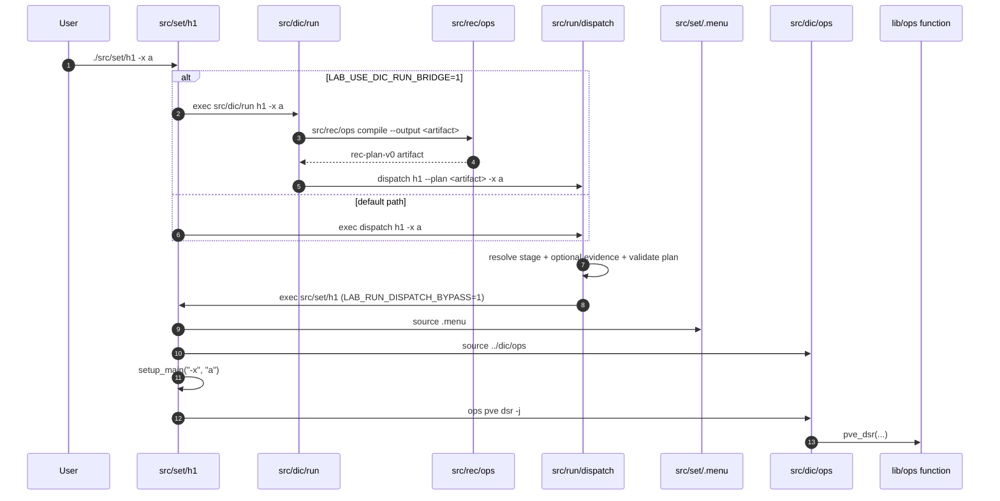
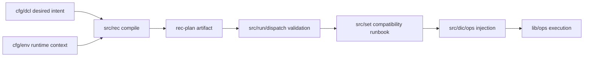

# 05 - Deployment and Configuration Architecture (Current State)

The deployment boundary now spans four layers: declarative intent in `cfg/dcl/*`,
runtime context in `cfg/env/*`, reconciliation in `src/rec/*`, and execution
dispatch in `src/run/*`. Legacy runbook surfaces in `src/set/*` remain active
as compatibility entrypoints.

## 1. Responsibilities and Boundaries

| Area | Primary files | Responsibility boundary |
| --- | --- | --- |
| Runtime config baseline | `cfg/core/ric`, `cfg/core/ecc` | Defines identity/path variables and site/env/node context selection. |
| Declarative desired state | `cfg/dcl/*` | Authoritative desired intent model; no imperative execution logic. |
| Environment context | `cfg/env/*` | Runtime/context values consumed by DIC and runbook helpers. |
| Reconciliation compiler | `src/rec/ops` | Validates `cfg/dcl` schema and compiles `rec-plan-v0` artifacts. |
| Plan-aware execution | `src/run/dispatch`, `src/run/gate-evidence` | Resolves enforcement stage, validates plan contracts, applies dependency/order/policy checks, then dispatches target runbook. |
| Migration bridge | `src/dic/run` | Compatibility shim that compiles plan artifacts and forwards to `src/run/dispatch`. |
| Legacy runbook surface | `src/set/*`, `src/set/.menu` | Host-scoped section manifests and menu/runtime setup retained during migration. |
| DIC operation execution | `src/dic/ops` | Resolves operation parameters and executes `lib/ops/*` functions. |

## 2. Runtime/Load Sequence

### Actual call/load order

1. Operator starts from a legacy entrypoint (`./src/set/<target> -i|-x ...`) or the migration shim (`src/dic/run <target> ...`).
2. `src/set/<target>` exports target identity and delegates to `src/run/dispatch` by default when available.
3. If `LAB_USE_DIC_RUN_BRIDGE=1`, `src/set/<target>` delegates to `src/dic/run`, which runs `src/rec/ops compile` and forwards to `src/run/dispatch --plan <artifact>`.
4. `src/run/dispatch` resolves enforcement stage from CLI/env/plan metadata, optionally loads gate evidence artifacts, and validates plan format/target/section contracts.
5. When plan enforcement is enabled (`guarded`/`strict` or explicit flags), dispatch validates dependency, order, and policy-gate contracts before execution.
6. Dispatch `exec`s `src/set/<target>` with `LAB_RUN_DISPATCH_BYPASS=1` so the runbook continues through legacy flow without recursive dispatch.
7. Runbook sources `src/set/.menu` and `src/dic/ops`, then runs `menu_runtime_setup` and `setup_main`.
8. Selected section (`*_xall`) executes `ops ... -j`; DIC resolves arguments and calls `lib/ops/*` actions.

### End-to-end sequence

### Conceptual flow (quick view)

## 3. State and Side Effects

- `cfg/dcl/*` is the desired-state authority; `cfg/env/*` remains runtime context and host/environment overlays.
- `src/rec/ops compile` emits deterministic plan metadata (`format=rec-plan-v0`, target sections, order/dependencies/policy-gates, enforcement stage fields).
- `src/run/dispatch` can enforce dependency/order/policy contracts only when `--plan` is provided; strict enforcement can consume `--gate-evidence` or `LAB_RUN_GATE_EVIDENCE_FILE`.
- Dispatch sets `LAB_RUN_DISPATCH_BYPASS=1` before re-executing legacy runbooks.
- `src/set/.menu` runtime setup sources environment layering (base -> environment -> node) and marks setup completion via `MENU_RUNTIME_SETUP_DONE`.
- `LAB_MENU_AUTO_SOURCE=0` disables menu runtime setup for that invocation path.

## 4. Failure and Fallback Behavior

- `src/set/<target>` falls back to direct legacy flow when `src/run/dispatch` is missing or not executable.
- `src/dic/run` fails with non-zero when `src/rec/ops` compile fails or dispatcher is unavailable.
- `src/rec/ops validate`/`compile` fail fast on invalid declarative contracts (missing required fields, invalid tokens, dependency cycles, strict-metadata gaps).
- `src/run/dispatch` rejects enforcement flags and gate-evidence inputs when no `--plan` is supplied.
- Invalid evidence artifacts (format mismatch, target mismatch, invalid gate tokens, empty approvals) fail before runbook execution.
- `src/set/.menu` logs many setup warnings and continues where possible; hard argument errors still return non-zero.

## 5. Constraints and Refactor Notes

- Desired behavior changes should originate in `cfg/dcl/*`; `cfg/env/*` should not become a second desired-state authority.
- `src/run/dispatch` currently relies on key-value plan artifacts from `src/rec/ops`; contract drift between producer/consumer is a regression hotspot.
- `src/set/*` remains coupled to section naming (`*_xall`) and DIC call semantics (`ops module function -j`).
- Migration is compatibility-first: `src/set/*` and `src/dic/ops` are still active, but execution defaults now route through `src/run/dispatch` when present.
- `src/dic/ops` still sources `cfg/env/site1` as a compatibility behavior; declarative-first defaults are not fully complete yet.

## Maintenance Note

Update this document in the same PR when delegation behavior in `src/set/*`, plan contracts in `src/rec/*` or `src/run/*`, or precedence boundaries across `cfg/dcl` and `cfg/env` change.
