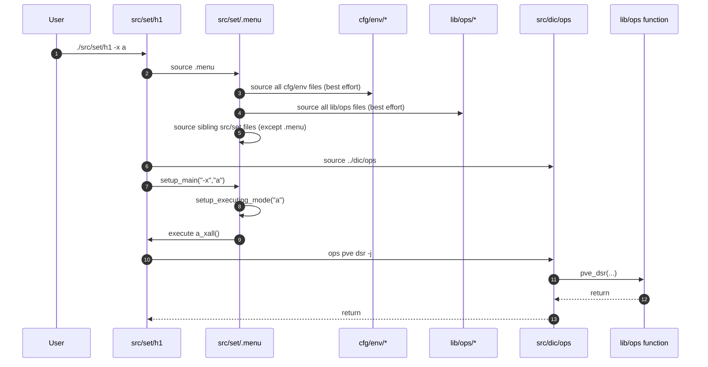

# 05 - Deployment and Configuration Architecture (Current State)

The deployment layer combines host-scoped task manifests (`src/set/*`), a shared execution framework (`src/set/.menu`), and environment/runtime configuration (`cfg/core/*`, `cfg/env/*`). Its boundary is orchestration and context selection; real infrastructure mutation still happens in `lib/ops/*` through DIC calls.

## 1. Responsibilities and Boundaries

| Area | Primary files | Responsibility boundary |
| --- | --- | --- |
| Runtime config baseline | `cfg/core/ric`, `cfg/core/ecc` | Defines site/env/node identity and path variables (`SITE_CONFIG_FILE`, `ENV_OVERRIDE_FILE`, `NODE_OVERRIDE_FILE`, `LIB_OPS_DIR`, etc.). |
| Environment inventory | `cfg/env/*` | Provides values/arrays consumed by DIC and ops functions. |
| Deployment framework | `src/set/.menu` | CLI routing (`-i`, `-x`), interactive display/execution, and broad source-time loading. |
| Host manifests | `src/set/h1`, `src/set/c1`, `src/set/c2`, `src/set/c3`, `src/set/t1`, `src/set/t2` | Defines `MENU_OPTIONS` and section functions (`*_xall`) that call `ops ...` actions. |

## 2. Runtime/Load Sequence

### Actual call/load order

1. A manifest script (for example `src/set/h1`) sets `DIR_SH`/`FILE_SH`, then sources `src/set/.menu`.
2. During `.menu` source-time initialization, it eagerly attempts to source:
   - all files under `cfg/env/*`,
   - all files under `lib/ops/*`,
   - all sibling files in `src/set/` except `.menu` itself.
3. Manifest then sources `src/dic/ops` and declares `MENU_OPTIONS` mapping (`section id -> *_xall function`).
4. Manifest entry routes arguments to `.menu` via `setup_main "$@"`.
5. `setup_main` parses:
   - `-i` interactive mode (`setup_interactive_mode`),
   - `-x <section>` direct mode (`setup_executing_mode`).
6. Selected section function runs one or more DIC calls (`ops module function -j`), which then execute ops functions.

### End-to-end sequence

### Conceptual flow (quick view)

## 3. State and Side Effects

- `.menu` emits extensive terminal UI output and warnings during sourcing and command routing.
- `.menu` source-time loading imports many symbols into the current shell and can execute source-time code from many files.
- `.menu` defines global formatting/state variables (`BOLD`, `RESET`, `base_indent`) and many helper functions.
- `setup_executing_mode` exits non-zero on invalid section (`exit 1`), while other paths primarily return status codes.
- `cfg/core/ric` establishes environment identity and path contracts used by both orchestrator and DIC.

## 4. Failure and Fallback Behavior

- `.menu` continues on many source failures with warning output (for cfg/env, lib/ops, local files), rather than hard-stop.
- `setup_main` returns `1` for invalid mode/argument combinations.
- `setup_executing_mode` runs selected section if present; invalid sections terminate with `exit 1`.
- In orchestrator-driven config loading (`bin/orc` -> `source_cfg_env`), base site config is required; env and node overrides are optional.
- `setup_source` contains an environment-aware base/env/node loading path with legacy fallback, but manifests primarily rely on `.menu` source-time loading plus DIC.

## 5. Constraints and Refactor Notes

- Section discovery/display conventions rely on `*_xall` naming and `MENU_OPTIONS` IDs; changing either breaks routing UX.
- `ops` command usage in manifests is a coupling point (alias/script availability must exist in the shell context).
- Broad source-time loading in `.menu` can cause duplicate definitions and ordering-sensitive behavior across manifests.
- `cfg/env` files are executable Bash (not static data), so config changes can alter runtime behavior beyond variable values.
- Because deployment scripts call DIC contracts rather than raw ops functions, DIC interface changes have immediate deployment impact.

## Maintenance Note

Update this document in the same PR when `.menu` routing/source behavior, manifest section conventions, or config precedence contracts (`site -> env -> node`) change.
