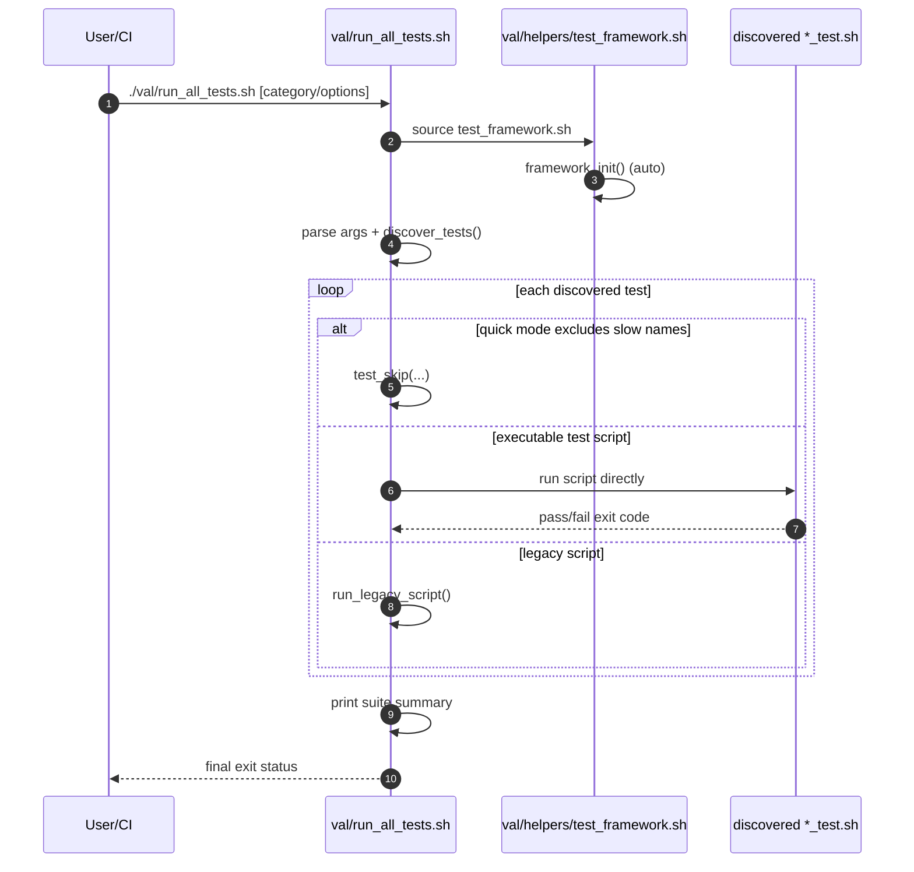
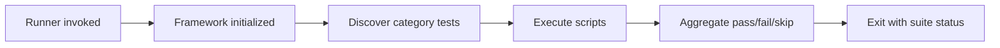

# 06 - Testing and Validation Architecture (Current State)

`val/` is the repository's Bash-native verification layer. It provides a reusable framework (`val/helpers/test_framework.sh`), a top-level category runner (`val/run_all_tests.sh`), focused library runner (`val/lib/run_all_tests.sh`), and many executable `*_test.sh` scripts across `core`, `lib`, `integration`, and `src` scopes.

## 1. Responsibilities and Boundaries

| Area | Primary files | Responsibility boundary |
| --- | --- | --- |
| Test framework | `val/helpers/test_framework.sh` | Common counters, assertions, reporting, perf helpers, temp test env helpers. |
| Master runner | `val/run_all_tests.sh` | Discovers and runs tests by category (`core`, `lib`, `integration`, `src`, `dic`, `legacy`). |
| Library suite runner | `val/lib/run_all_tests.sh` | Curated grouped suites for core/ops/gen/lib-integration tests. |
| Test suites | `val/**/*_test.sh` and legacy scripts in `val/` | Module- and scenario-level behavior validation. |

## 2. Runtime/Load Sequence

### Actual call/load order

1. A runner script sources `val/helpers/test_framework.sh`.
2. The framework auto-runs `framework_init` when sourced:
   - resolves/exports `LAB_ROOT` if missing,
   - defines color/status helpers and counters,
   - installs a mock `ver_verify_module` when absent (for direct core-module tests).
3. `val/run_all_tests.sh` parses CLI options (`--help`, `--list`, `--quick`, `--verbose`, category).
4. It discovers tests with category-specific `find` calls and executes each script:
   - executable `*_test.sh` via direct run,
   - legacy entries via dedicated `run_legacy_script`.
5. It emits final suite summary and exits non-zero when failures exist.

### End-to-end sequence

### Conceptual flow (quick view)

## 3. State and Side Effects

- Framework initialization mutates process globals (`LAB_ROOT`, counters, color constants) and exports helper functions.
- Framework can inject `ver_verify_module` mock into the shell process if not already defined.
- `val/run_all_tests.sh` changes working directory to `$TEST_LAB_DIR` (`$LAB_ROOT`) only in the legacy-script execution path (`run_legacy_script`).
- Temp test environments are created under `/tmp/val_test_*` by helper functions and deleted by cleanup helpers when called.

## 4. Failure and Fallback Behavior

- Unknown category/option causes usage output and exit `1` in the master runner.
- If no tests are discovered for a category, runner reports failure and exits non-zero.
- Non-executable test files are treated as warnings/fail path in `run_single_test`.
- `--quick` mode skips test names matching `(integration|complete)`.
- `test_framework.sh` handles missing initial `LAB_ROOT` by discovering root from repository structure and fallback path traversal.

## 5. Constraints and Refactor Notes

- Master discovery is filename-based (`*_test.sh`), so extensionless scripts are not auto-discovered.
- DIC tests are included via dedicated patterns (`val/src/dic/dic_*_test.sh`) to avoid duplication in `src` category.
- Many tests assume direct script executability; changing permissions impacts runner behavior.
- Assertions and summary counters are shared global state in a single shell process; tests should avoid clobbering framework globals.

## Maintenance Note

Update this document in the same PR when runner categories/discovery logic, framework initialization behavior, or test naming/execution contracts change.
