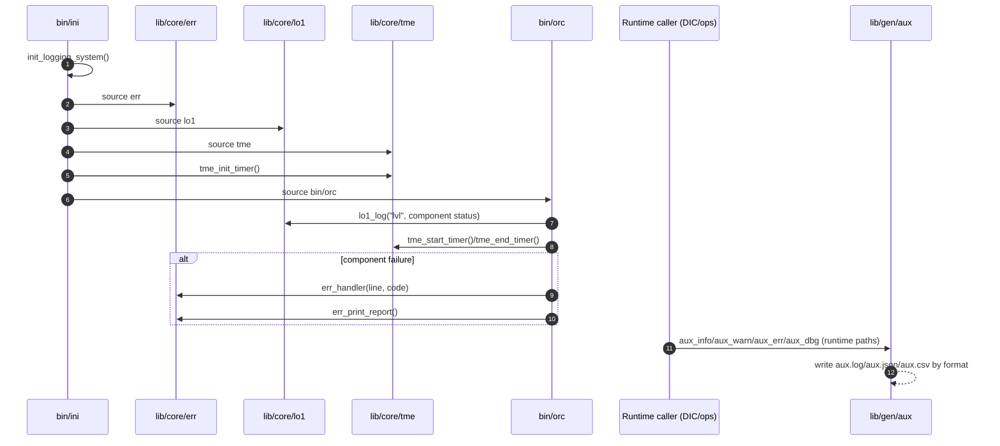
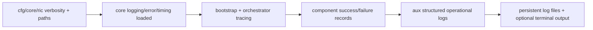

# 07 - Logging and Error Handling Architecture

Logging and error handling are split across core bootstrap modules and runtime utilities, but now share common file-write and terminal-rendering layers. `lib/core/log` provides shared logging primitives (`_log_write`, `_log_level_permits`, `_log_format_terminal`, `_log_report_header`, ANSI stripping, rotation checks). `lib/core/lo1` handles hierarchical bootstrap/runtime output, `lib/core/err` captures and reports error records, `lib/core/tme` tracks timing/performance events, and `lib/gen/aux` provides structured operational logs (`info/warn/error/audit/business/debug`) used by DIC and ops modules.

## 1. Responsibilities and Boundaries

| Area | Primary files | Responsibility boundary |
| --- | --- | --- |
| Shared writer and verbosity model | `lib/core/log` | Shared file writer, ANSI stripping, level gating, compact/verbose terminal formatting, report header framing. |
| Bootstrap/orchestrator logs | `lib/core/lo1`, `bin/ini`, `bin/orc` | Initialization and component-loading trace logs (`lo1.log`, `ini.log`). |
| Error capture/reporting | `lib/core/err` | Error codes/maps, error records, trap handler, error report output. |
| Timing/performance logs | `lib/core/tme` | Start/end timers, duration accounting, timing report (`tme.log`). |
| Operational structured logs | `lib/gen/aux` | Multi-format operational/debug logging (`aux.log`, `aux.json`, `aux.csv`). |
| Runbook menu/setup logs | `src/set/.menu`, `src/set/*` | Explicit runbook setup (`menu_runtime_setup`), interactive UI output, and structured diagnostic logging for setup/dispatch paths. |
| Global verbosity controls | `cfg/core/ric` | Unified `LAB_LOG_LEVEL` + `LAB_LOG_FORMAT` and optional subsystem overrides with legacy compatibility toggles. |

## 2. Runtime/Load Sequence

### Actual call/load order

1. `cfg/core/ric` defines core paths and unified runtime logging controls (`LAB_LOG_LEVEL`, `LAB_LOG_FORMAT`, optional `LAB_LOG_LEVEL_<SUBSYSTEM>` overrides, and legacy compatibility toggles).
2. `bin/ini` forces `LOG_DEBUG_ENABLED=0` at the start of bootstrap (saving the original value) and exports `LAB_BOOTSTRAP_MODE=1`. This suppresses `lo1_log` stack-trace dumps and `ver_log` non-error writes during boot, significantly reducing file I/O on the hot path. Both are restored/cleared after orchestrator sourcing completes or on failure.
3. `bin/ini` initializes log files (`INI_LOG_FILE`, `ERROR_LOG`) in `init_logging_system`.
4. `bin/ini` loads `lib/core/log`, `lib/core/err`, `lib/core/lo1`, and `lib/core/tme` via `load_modules`.
5. `tme_init_timer` initializes timing state and `tme.log`; `bin/ini` wraps major phases with timer calls. `tme` uses integer nanosecond arithmetic (`$(date +%s%N)` captured once, then `$(( ))` bash arithmetic) instead of `echo ... | bc` pipe forks for duration calculation.
6. `bin/orc` uses `lo1_log` for component progress and the shared component-set executor routes failures to `err_handler`.
7. After `lib/gen/aux` is sourced (either eagerly or on first lazy-load call), runtime callers (for example `src/dic/ops` and `lib/ops/*` functions) can emit structured logs via `aux_log`/`aux_dbg` and wrappers (`aux_info`, `aux_warn`, `aux_err`, `aux_audit`, `aux_business`).
8. `src/set` runbooks source `.menu` + `src/dic/ops`, then call `menu_runtime_setup` explicitly before dispatching `setup_main`; source-time setup is opt-in via `LAB_MENU_AUTO_SOURCE_ON_SOURCE=1`.

### End-to-end sequence

### Conceptual flow (quick view)

## 3. State and Side Effects

- `err` initializes global associative arrays (`ERROR_CODES`, `ERROR_*`) and writes to `ERROR_LOG`.
- `lo1` initializes/uses logger state files (`LOG_STATE_FILE`, depth cache in `TMP_DIR`) and appends to `LOG_FILE`. During bootstrap, `LOG_DEBUG_ENABLED=0` suppresses stack-trace dumps; timestamps use `printf '%(%T)T' -1` (Bash builtin) instead of `$(date ...)` forks. Direct file reads/writes replace `cat` usage on hot paths.
- `tme` initializes timer state maps/files and writes detailed entries to `TME_LOG_FILE`. Duration calculation uses integer nanosecond arithmetic (`$(( ))`) instead of `echo ... | bc` pipe forks. `LOG_STATE_FILE` toggling (previously `cat`/`echo` per timer event) has been removed from timing start/end/cleanup paths.
- `ver_log` short-circuits non-error log writes during `LAB_BOOTSTRAP_MODE=1`, skipping timestamp generation and file I/O. Uses cached `VER_LOG_DIR_READY` flag and parameter expansion instead of `dirname` subprocess calls.
- `aux_log`/`aux_dbg` choose output format by `AUX_LOG_FORMAT`; `aux.log` writes route through `_log_write`, while `aux.json`/`aux.csv` keep structured line contracts and apply rotation checks.
- `err_enable_trap` and orchestrator wrappers can install/trigger trap-based error handling behavior.

## 4. Failure and Fallback Behavior

- If `init_logging_system` cannot initialize required paths/files, `main_ini` fails early.
- `lo1` falls back to default logger state when state files are missing/empty and can run with reduced behavior.
- `tme_init_timer` attempts best-effort setup; missing optional state files emit warnings under verbosity gates.
- `err_handler` records command/file/line context and returns non-zero error code to caller path.
- `aux_dbg` terminal output is gated by `_log_level_permits` (`LAB_LOG_LEVEL` model) plus `AUX_DEBUG_ENABLED`; file logging remains available when `LOG_DIR` is writable.

## 5. Constraints and Refactor Notes

- Core modules are tightly coupled to path and verbosity globals from `cfg/core/ric`; changing names/defaults impacts all logging/error behavior.
- `bin/orc` component wrappers assume `err_handler`, `lo1_log`, and `tme_*` are available; load-order drift can break diagnostics.
- Verbosity is unified through `LAB_LOG_LEVEL` (`silent < error < normal < verbose < debug`) with optional subsystem overrides.
- Runtime visual density is controlled by `LAB_LOG_FORMAT` (`compact` default, `verbose` fallback).
- `aux` logging format changes (`human/json/csv/kv`) affect both terminal output and downstream log consumers/parsers.
- `src/set/.menu` intentionally keeps formatted interactive UI output, but setup/diagnostic messages should route through structured logging paths.
- Return-code semantics are defined in specs (`lib/.spec`, `lib/ops/.spec`), but enforcement is distributed per function/module.
- Boot-phase log suppression (`LOG_DEBUG_ENABLED=0`, `ver_log` gating via `LAB_BOOTSTRAP_MODE`) means boot diagnostics in `lo1.log` and `ver.log` are reduced compared to runtime. If boot debugging is needed, set `LOG_DEBUG_ENABLED=1` or `VER_BOOTSTRAP_LOGGING=1` before sourcing `bin/ini`.

## Maintenance Note

Update this document in the same PR when verbosity contracts in `cfg/core/ric`, logging/error APIs in `lib/core/{err,lo1,tme}`, or structured logging behavior in `lib/gen/aux` changes.

## 6. Runtime Visual Contract

The runtime terminal contract is shared across `lo1`, `ver`, and `aux` human mode through `lib/core/log::_log_format_terminal`.

### Level glyph and semantic mapping

| Level | Glyph | Semantic color |
| --- | --- | --- |
| `debug` | `·` | `dim` |
| `info` | `›` | `info` |
| `success` | `✓` | `success` |
| `warn` | `!` | `warn` |
| `error` | `✗` | `error` |
| `critical` | `✗` | `critical` |

### Line templates

- `LAB_LOG_FORMAT=compact`: `<glyph> <message>` (debug adds `[component]`)
- `LAB_LOG_FORMAT=verbose`: `[HH:MM:SS] <glyph> <message>` (lo1 adds depth prefix)

### Report framing

`err_print_report` and `tme_print_timing_report` use the shared framing contract:

- Header: `== <TITLE> ==`
- Section: `-- <SECTION> --`
- Footer: `== end <TITLE> ==`
