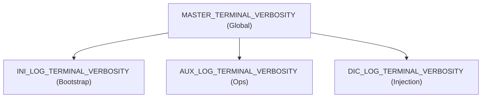

# 07 - Logging and Error Handling

The framework implements a strict, centralized approach to logging and error management. Designed for infrastructure automation, it prioritizes **Structured Logging**, **Hierarchical Verbosity**, and **Fail-Fast Semantics**.

## The Logging Architecture (`lo1` & `aux`)

Logging is divided into two phases to optimize performance during initialization while offering rich context during operational execution.

### Phase 1: Bootstrap Logging (`lo1`)
During the initial milliseconds of execution (`bin/ini` and `bin/orc`), the system uses `lib/core/lo1`. This is a lightweight, low-overhead logger designed purely to track module loading and catch critical early-stage initialization failures before the advanced `aux` framework is available.

### Phase 2: Operational Logging (`lib/gen/aux`)
Once initialization completes, the `aux` library takes over as the primary logging engine for `lib/ops/` and `src/set/`. 

It enforces a **Structured Logging** paradigm. Instead of arbitrary strings, logs are emitted as semantic levels containing contextual key-value pairs.

*   `aux_info "Provisioning started" "component=vm,id=100"`
*   `aux_warn "Retrying connection" "attempt=2,target=nfs"`
*   `aux_err "Execution failed" "code=1,reason=timeout"`
*   `aux_dbg "Variable expansion" "var=IP,val=192.168.1.10"`
*   `aux_audit "Privilege escalation" "user=root,action=chmod"`
*   `aux_business "Benchmark completed" "duration=45ms"`

## Hierarchical Master-Switch Pattern

The system employs a hierarchical master-switch pattern for terminal output verbosity, ensuring that standard execution remains quiet while debug modes provide full traceability.

Lower levels (e.g., `AUX_LOG_TERMINAL_VERBOSITY`) will only produce terminal output if the `MASTER_TERMINAL_VERBOSITY` switch above them is enabled. All logs, regardless of terminal verbosity, are written to permanent log files (e.g., `aux.log`, `aux.json`, `aux.csv`) in the `.log/` directory.

## Error Handling Semantics

Error management in `lib/ops/` strongly emphasizes failing fast and graceful degradation.

### Standardized Return Codes

The framework strictly adheres to predefined exit codes to communicate the nature of a failure:
*   `0`: **Success** - The operation completed as expected.
*   `1`: **Parameter / Usage Error** - A function received invalid arguments or was called incorrectly. Checked via `aux_val`.
*   `2`: **System / Execution Error** - An underlying command failed (e.g., network timeout, permission denied).
*   `127`: **Missing Dependency** - A required binary (e.g., `zfs`, `ip`) was not found on the system. Checked via `aux_chk`.

### Pre-Flight and Validation Checks

To prevent pipeline failures mid-execution, every user-facing function enforces two critical guards before taking action:
1.  **Input Validation:** `aux_val` verifies the type and format of every parameter.
2.  **Dependency Checking:** `aux_chk` asserts command availability and user privileges.

If either check fails, the function immediately returns the appropriate error code, aborting the operation safely.