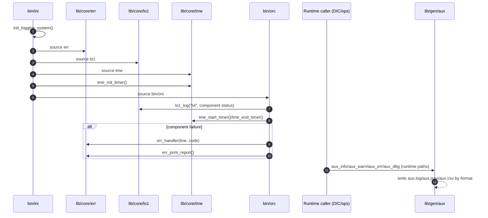
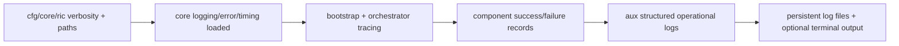

# 07 - Logging and Error Handling Architecture (Current State)

Logging and error handling are split across core bootstrap modules and runtime utilities: `lib/core/lo1` handles hierarchical bootstrap/runtime console/file logs, `lib/core/err` captures and reports error records, `lib/core/tme` tracks timing/performance events, and `lib/gen/aux` provides structured operational logs (`info/warn/error/audit/business/debug`) used by DIC and ops modules.

## 1. Responsibilities and Boundaries

| Area | Primary files | Responsibility boundary |
| --- | --- | --- |
| Bootstrap/orchestrator logs | `lib/core/lo1`, `bin/ini`, `bin/orc` | Initialization and component-loading trace logs (`lo1.log`, `ini.log`). |
| Error capture/reporting | `lib/core/err` | Error codes/maps, error records, trap handler, error report output. |
| Timing/performance logs | `lib/core/tme` | Start/end timers, duration accounting, timing report (`tme.log`). |
| Operational structured logs | `lib/gen/aux` | Multi-format operational/debug logging (`aux.log`, `aux.json`, `aux.csv`). |
| Global verbosity controls | `cfg/core/ric` | Master and module-level terminal output toggles. |

## 2. Runtime/Load Sequence

### Actual call/load order

1. `cfg/core/ric` defines core paths and verbosity switches (`MASTER_TERMINAL_VERBOSITY`, `LO1_LOG_TERMINAL_VERBOSITY`, `ERR_TERMINAL_VERBOSITY`, `TME_TERMINAL_VERBOSITY`, and nested TME toggles).
2. `bin/ini` initializes log files (`INI_LOG_FILE`, `ERROR_LOG`) in `init_logging_system`.
3. `bin/ini` loads `lib/core/err`, `lib/core/lo1`, and `lib/core/tme` via `load_modules`.
4. `tme_init_timer` initializes timing state and `tme.log`; `bin/ini` wraps major phases with timer calls.
5. `bin/orc` uses `lo1_log` for component progress and `execute_component` routes failures to `err_handler`.
6. After `lib/gen/aux` is sourced, runtime callers (for example `src/dic/ops` and `lib/ops/*` functions) can emit structured logs via `aux_log`/`aux_dbg` and wrappers (`aux_info`, `aux_warn`, `aux_err`, `aux_audit`, `aux_business`).

### End-to-end sequence

### Conceptual flow (quick view)

## 3. State and Side Effects

- `err` initializes global associative arrays (`ERROR_CODES`, `ERROR_*`) and writes to `ERROR_LOG`.
- `lo1` initializes/uses logger state files (`LOG_STATE_FILE`, depth cache in `TMP_DIR`) and appends to `LOG_FILE`.
- `tme` initializes timer state maps/files and writes detailed entries to `TME_LOG_FILE`.
- `aux_log`/`aux_dbg` choose output format by `AUX_LOG_FORMAT` and write to `LOG_DIR/aux.log|aux.json|aux.csv` when writable.
- `err_enable_trap` and orchestrator wrappers can install/trigger trap-based error handling behavior.

## 4. Failure and Fallback Behavior

- If `init_logging_system` cannot initialize required paths/files, `main_ini` fails early.
- `lo1` falls back to default logger state when state files are missing/empty and can run with reduced behavior.
- `tme_init_timer` attempts best-effort setup; missing optional state files emit warnings under verbosity gates.
- `err_handler` records command/file/line context and returns non-zero error code to caller path.
- `aux_dbg` only emits terminal debug output when both `AUX_DEBUG_ENABLED=1` and `MASTER_TERMINAL_VERBOSITY=on`; file logging remains available when `LOG_DIR` is writable.

## 5. Constraints and Refactor Notes

- Core modules are tightly coupled to path and verbosity globals from `cfg/core/ric`; changing names/defaults impacts all logging/error behavior.
- `bin/orc` component wrappers assume `err_handler`, `lo1_log`, and `tme_*` are available; load-order drift can break diagnostics.
- Verbosity is hierarchical in practice: `MASTER_TERMINAL_VERBOSITY` gates module-level terminal outputs.
- `aux` logging format changes (`human/json/csv/kv`) affect both terminal output and downstream log consumers/parsers.
- Return-code semantics are defined in specs (`lib/.spec`, `lib/ops/.spec`), but enforcement is distributed per function/module.

## Maintenance Note

Update this document in the same PR when verbosity contracts in `cfg/core/ric`, logging/error APIs in `lib/core/{err,lo1,tme}`, or structured logging behavior in `lib/gen/aux` changes.
