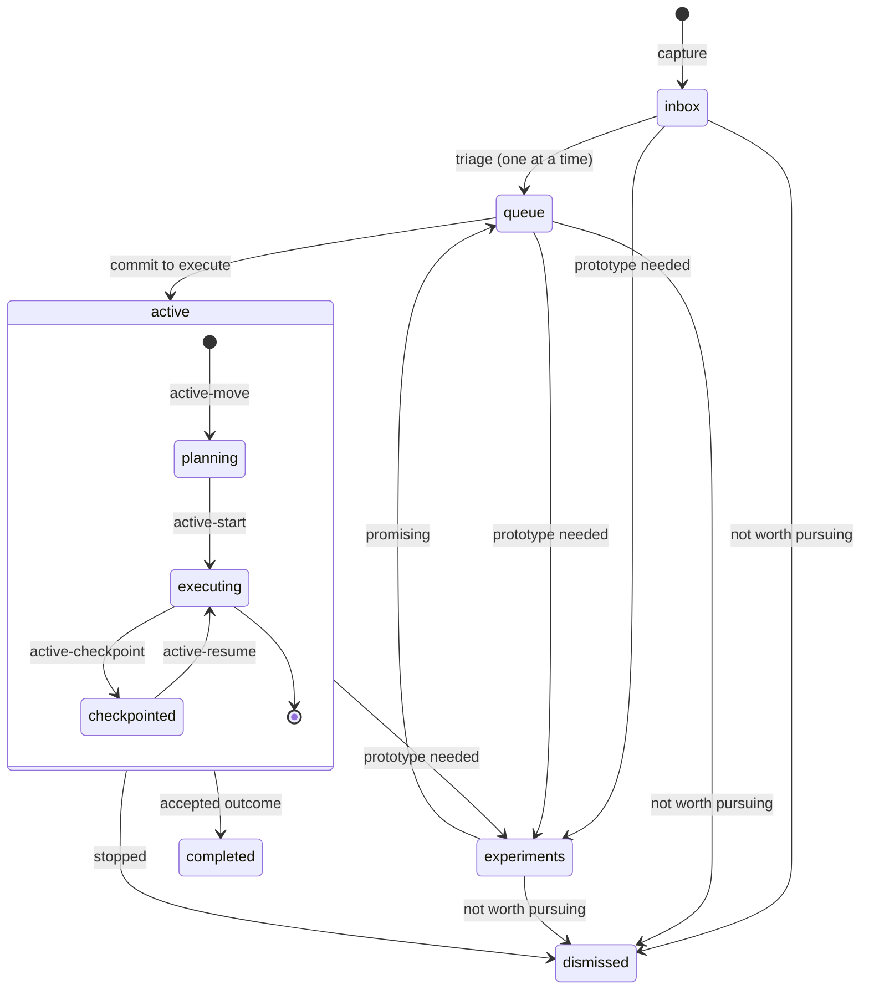
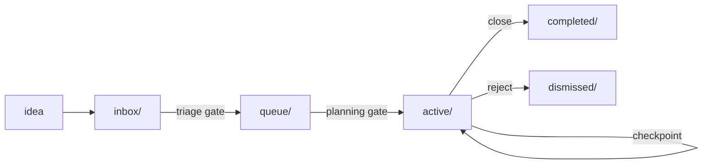

# 08 - Workflow Architecture (`doc/pro`)

`doc/pro/` is an agent workflow coordination system that uses the filesystem as a state machine to manage work items across stateless LLM context windows. It solves a specific architectural problem: how to plan, execute, and hand off multi-session infrastructure work when each session starts with no memory of the previous one. The folder structure (`inbox/` -> `queue/` -> `active/` -> `completed/`) is the shared state; task templates in `doc/pro/task/` are executable prompts that enforce transition rules; and the work item files themselves carry all accumulated context between sessions.

## 1. Responsibilities and Boundaries

| Area | Primary files | Responsibility boundary |
| --- | --- | --- |
| State machine definition | `doc/pro/README.md` | Folder semantics, transition rules, naming conventions, validation checklist. |
| Transition enforcement | `doc/pro/task/*` | Executable prompt templates; each template governs one state transition or operation. |
| Shared rules | `doc/pro/task/RULES.md` | Header fields, filename conventions, status values, validation step -- referenced by all templates. |
| Structural validation | `doc/pro/check-workflow.sh` | Enforces naming, headers, folder structure; run before and after transitions. |
| Work item state | `doc/pro/{inbox,queue,active,completed,dismissed,experiments}/*.md` | The files themselves; their folder location is their status, their content is accumulated context. |
| Policy exceptions | `doc/pro/active/waivers/` | Temporary waivers tied to active items; includes register and lifecycle rules. |

### What this system is not

- Not a task runner. It does not execute infrastructure code.
- Not a prompt library. The task templates are structural constraints, not creative writing aids.
- Not a project management tool for humans. It is designed for LLM agents that need explicit state handoff because they cannot remember previous sessions.

## 2. Coordination Model

### The core problem

Each LLM context window is stateless. When a session ends, everything the agent learned, decided, and planned disappears. The next session starts from zero. For work that spans multiple sessions -- which most non-trivial infrastructure changes do -- this creates three problems:

1. **Lost planning context.** Decisions made in session 1 are invisible to session 2.
2. **Stale assumptions.** Plans written before earlier work executes may reference code that no longer exists.
3. **Unbounded scope.** Without explicit gates, an agent may begin execution before understanding the nature of the work.

### How the filesystem solves it

The folder a file sits in *is* its status. No database, no external tracker, no metadata that can drift from reality. `ls doc/pro/active/` is the source of truth for what is in progress. This is inspectable by any agent, any tool, any human, at any time, with no API or state reconstruction.

The file content accumulates structured context across sessions:

| Section | Written by | Read by | Purpose |
| --- | --- | --- | --- |
| Goal, Context, Scope | `inbox-capture` | `queue-triage`, `queue-move` | Initial problem framing. |
| `## Triage Decision` | `queue-triage` or `queue-move` | `active-move` | Design classification that determines execution plan shape. |
| `## Execution Plan` | `active-move` | `active-start`, `active-resume` | Phased implementation steps with completion criteria. |
| `## Progress Checkpoint` | `active-checkpoint` | `active-resume` | Session handoff: done, in-flight, blockers, next steps, context. |
| `## Split` / `## Split From` | `active-split` | Any subsequent task | Traceability when work is decomposed. |

Each section is written by exactly one transition and read by the transitions that follow. This is an append-mostly protocol: later sessions add sections but rarely modify earlier ones, preserving the decision trail.

### State machine

### Transition sequence (typical lifecycle)

1. `inbox-capture` creates a file in `inbox/` with Goal, Context, Scope, Risks, Next Step.
2. `queue-triage` or `queue-move` moves the file to `queue/`, adding `## Triage Decision` with design classification.
3. `active-move` moves the file to `active/`, adding `## Execution Plan` with phased steps. Plan structure depends on design classification from step 2.
4. `active-start` begins execution. Agent reads the plan and proceeds immediately.
5. If the session must end before completion: `active-checkpoint` writes `## Progress Checkpoint`. File stays in `active/`.
6. New session: `active-resume` reads the checkpoint and continues where the previous session stopped.
7. `completed-close` moves the file to `completed/yyyymmdd-hhmm_<topic>/` with final summary. Follow-ups route to inbox by default; they may route directly to queue only when mandatory, clearly scoped, and priority-locked, with explicit routing rationale in the closeout note.

### Conceptual flow (quick view)

## 3. Design Principles

### Gates enforce separation of concerns

The workflow has three mandatory gates. Each gate forces the agent to produce a specific artifact before proceeding:

| Gate | Transition | Required artifact | What it prevents |
| --- | --- | --- | --- |
| Triage gate | inbox -> queue | `## Triage Decision` with design classification | Starting work without understanding what kind of work it is. |
| Planning gate | queue -> active | `## Execution Plan` with phased steps and criteria | Executing without a concrete plan against the current codebase. |
| Completion gate | active -> completed | Final summary: what changed, what was verified, what remains | Closing work without documenting the outcome for future sessions. |

Each gate is a different concern. Triage is *judgment* (what is this, how important is it, does it need design). Planning is *strategy* (what phases, what order, what criteria). Execution is *implementation*. A single context window could do all three, but separating them means each step gets full attention and the artifacts are independently reviewable.

### Just-in-time planning

The most consequential design choice in this system is that `active-move` (where the Execution Plan is written) happens in a context window that can observe the current codebase. This is not incidental -- it is the reason the queue -> active transition exists as a separate step.

Consider three related plans: an architectural restructure, a performance optimization, and a visual output redesign. If all three Execution Plans are written at the same time, plans 2 and 3 are planned against the pre-restructure codebase. After plan 1 completes, the module layout, sourcing paths, and function names may be different. The Execution Plans for the later work would reference structures that no longer exist.

By deferring `active-move` until the agent is ready to begin work, the planning step sees the real codebase as it exists after all prior work has landed. The Execution Plan is written against observed reality, not predicted state.

This has a concrete operational implication: **batch triage, sequential planning.** Multiple items can move from inbox to queue in a single session (triage is classification, not code-dependent). But items should move from queue to active one at a time, each after the preceding item completes, so the planning agent sees the actual post-implementation codebase.

### Checkpoints as handoff protocol

`active-checkpoint` and `active-resume` form a structured handoff between context windows. The checkpoint format is prescriptive:

- **Done**: what was completed (files changed, decisions made).
- **In-flight**: partially done or uncommitted work.
- **Blockers**: problems encountered, unresolved questions.
- **Next steps**: ordered list of unconditional actions (not decision forks).
- **Context**: non-obvious state (branch name, temp files, test status).

Two constraints on this format are deliberate:

1. **Next steps must be unconditional.** "Do X, then do Y" -- not "If closing, do X; if continuing, do Y." This prevents the next agent from facing a decision tree when it should be picking up concrete work. If a genuine decision is needed, it is written as a single step ("Decide X, options: A or B") followed by concrete next actions.

2. **Phase boundaries are not decision points.** When a phase's completion criterion is met, the next phase begins immediately. The resuming agent does not ask for confirmation to proceed. This prevents artificial pauses at transition points that waste context window capacity.

### Task templates as structural constraints

The files in `doc/pro/task/` are not prompts in the conventional sense. They are transition contracts: each one specifies preconditions (what must exist in the file), actions (what to do), and postconditions (what to produce). The agent executing a task template is bound by its constraints but free in its implementation.

The prompt ordering principle reinforces this: task template first (short instruction), then the work item file (large context). The agent uses the instruction as a lens to selectively attend to the document that follows. This is more effective than the reverse order because the model processes tokens sequentially and uses early tokens to prime attention over later ones.

## 4. State and Side Effects

- Folder location is canonical status. Moving a file between folders changes its workflow state. There is no separate status field that must be kept in sync -- the `- Status:` header in the file is a convenience mirror, enforced by the checker.
- Timestamp prefixes (`yyyymmdd-hhmm_`) are creation-time anchors. They never change after file creation, even when the file moves between folders. This preserves chronological traceability.
- `check-workflow.sh` is a read-only validator. It inspects naming, headers, and folder structure but does not modify files. It exits with a count of failures.
- Parallel orchestration transitions are explicit operations (`active-fanout`, `active-assign`, `active-sync`, `active-converge`) and run only when invoked by an operator/agent. There is no automatic fan-out based on file size or complexity.
- The `maintenance` task is the only cross-cutting operation that can fix structural issues autonomously, but it must not move files between workflow states without user approval.
- Completed items create a subfolder in `completed/` with a *completion* timestamp prefix on the folder and *creation* timestamp prefixes on files inside. This gives two independent timelines: `ls completed/` shows when work finished; `ls completed/<topic>/` shows how it evolved.

## 5. Failure and Fallback Behavior

- If `active-move` finds no `## Triage Decision` with a design classification, it halts and instructs the operator to triage first. This is a hard gate -- no plan is written without classification.
- If `active-start` or `active-resume` finds no `## Execution Plan`, it halts and instructs the operator to run `active-move` first.
- If `active-resume` finds no `## Progress Checkpoint`, it falls back to inferring state from the codebase and Execution Plan. It notes what could not be determined.
- `Strict mode` (appended to any task prompt) causes the agent to halt on any ambiguity rather than infer. This is the safe-by-default escape valve.
- The checker (`check-workflow.sh`) catches structural violations (naming, headers, folder organization) but does not enforce semantic quality of triage decisions, execution plans, or checkpoints. Those are governed by the task templates at transition time.

## 6. Constraints and Refactor Notes

- The system is filesystem-native. Any change to folder names or structure is a state machine change. Renaming `queue/` would break every task template that references it.
- Task templates are plain text files with no extension. They are not executable scripts -- they are consumed by LLM agents as prompt input. Tooling that indexes only `*.md` or `*.sh` files will miss them.
- Planned work follows `inbox/` -> `queue/` -> `active/`. Emergent work may enter `active/` directly via `active-capture`, but it must include inline triage and rationale so downstream transitions remain valid.
- Follow-up items from close/converge actions default to `inbox/`. Direct
  `queue/` routing is an explicit exception for mandatory, clearly scoped,
  priority-locked items and must be annotated in the parent closeout/convergence
  section.
- Waivers in `active/waivers/` are tied to active items. When the related work leaves active, waiver records must be archived. The waiver register template requires owner, expiry date, and removal criteria per entry.
- The `queue-triage` task moves exactly one item per invocation. There is no batch triage operation. `queue-move` allows targeting a specific item but still processes one file per call. Batching multiple `queue-move` calls in a single session is operationally valid.
- `active-split` sends new pieces to `inbox/`, not to `queue/` or `active/`. This forces each piece through the full triage gate, preventing scope creep through decomposition.
- The experiments track (`experiments/`) resolves only to `queue/` (promising) or `dismissed/` (not worth pursuing) -- never directly to `active/`. This enforces the triage gate even for validated prototypes.

## Maintenance Note

Update this document when workflow folder semantics, task template contracts, gate requirements, or the checker's enforcement scope change. The operational rules live in `doc/pro/README.md` and `doc/pro/task/RULES.md`; this document explains the architectural rationale behind those rules.
