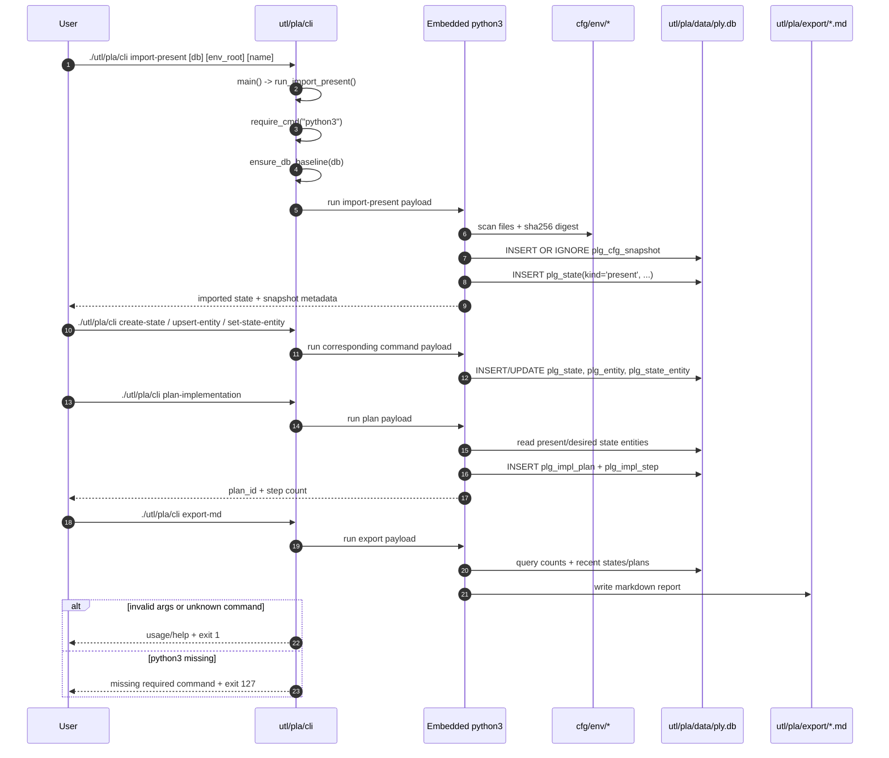
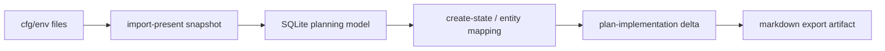

# 09 - Planning Subsystem Architecture (Current State)

`utl/pla` is a local-first planning subsystem that models inventory/state/plan data in SQLite and exports markdown artifacts for review. It is intentionally out-of-band from runtime infrastructure execution: it reads configuration inputs (for snapshotting) but does not call `lib/ops/*` functions or apply changes to hosts.

## 1. Responsibilities and Boundaries

| Area | Primary files | Responsibility boundary |
| --- | --- | --- |
| Planning CLI entrypoint | `utl/pla/cli` | Validates command selection/arguments, ensures database baseline, dispatches command handlers. |
| Schema and seed assets | `utl/pla/sql/001_init_schema.sql`, `utl/pla/sql/010_seed_reference.sql` | Defines normalized entity/relation/state/plan tables and idempotent reference types. |
| Runtime planning data | `utl/pla/data/ply.db` | Stores local planning state, snapshots, and generated implementation plans. |
| Human-readable outputs | `utl/pla/export/inventory-summary.md` | Stores export snapshots for git-readable review artifacts. |
| Input source snapshot | `cfg/env/*` (read by `import-present`) | Provides source files for digest/file inventory capture; no write path back into `cfg/env/`. |
| Future operation surface | `utl/pla/ops/README.md` | Reserved operation module boundary; currently documents planned commands, not executable modules. |

## 2. Runtime/Load Sequence

### Actual call/load order

1. Operator runs `./utl/pla/cli <command> [args...]` from repository root.
2. Script enters strict mode (`set -euo pipefail`) and resolves defaults (`DEFAULT_DB`, `DEFAULT_ENV_ROOT`, `DEFAULT_EXPORT`).
3. `main` dispatches command to `run_init_db`, `run_import_present`, `run_create_state`, `run_upsert_entity`, `run_set_state_entity`, `run_plan_implementation`, or `run_export_md`.
4. Handler validates required parameters (for commands with mandatory args) and exits `1` on invalid usage.
5. `require_cmd "python3"` enforces runtime dependency and exits `127` if missing.
6. `ensure_db_baseline` executes schema + seed SQL (idempotent `CREATE TABLE IF NOT EXISTS` and `INSERT OR IGNORE`).
7. Embedded Python (`sqlite3` stdlib) performs command-specific reads/writes and prints concise status.
8. For `export-md`, the handler writes markdown snapshot output to `utl/pla/export/` (or a caller-provided path).

### End-to-end sequence

### Conceptual flow (quick view)

## 3. State and Side Effects

- `init-db` and all mutating commands can create/update the local database file (`utl/pla/data/ply.db` by default).
- `import-present` recursively reads all files under the provided env root and stores a digest + raw file inventory JSON in `plg_cfg_snapshot`.
- `create-state`, `upsert-entity`, and `set-state-entity` mutate planning model records only; no runtime infrastructure side effects occur.
- `plan-implementation` creates draft plan rows in `plg_impl_plan` and ordered step rows in `plg_impl_step`.
- `export-md` writes a markdown summary file, typically `utl/pla/export/inventory-summary.md`, for diff-friendly review.
- CLI output is plain text status lines; no shell function injection, trap mutation, or RC-file edits occur.

## 4. Failure and Fallback Behavior

- Missing dependency (`python3`) is handled centrally by `require_cmd` and exits `127`.
- Unknown commands and invalid command parameters return usage/help and exit `1`.
- `import-present` fails fast when env root does not exist (`env root not found: ...`).
- Command handlers that write transactional records (`create-state`, `import-present`, `plan-implementation`) rollback on SQLite integrity failures before exiting.
- Baseline initialization is idempotent; rerunning commands safely re-applies schema/seed definitions without dropping existing planning data.
- There is no fallback path that executes `ops` or host-level actions; failures stay confined to local planning artifacts.

## 5. Constraints and Refactor Notes

- Command logic is embedded inline via Python heredocs in `utl/pla/cli`; refactors must preserve shell/Python argument ordering contracts.
- Planner v1 computes entity inclusion/exclusion deltas only; relation deltas and `override_json` semantics are not yet part of plan generation.
- Several state lookups are name-based with `ORDER BY state_id DESC LIMIT 1`; duplicate names across different `kind` values can make selection implicit.
- `import-present` snapshots file inventory and digest metadata; it does not currently populate normalized entity/relation bindings (`plg_cfg_binding`).
- `utl/pla/ops/` is a reserved boundary with planned operations but no concrete module implementation yet.
- No dedicated `val/*` test suite currently covers `utl/pla/cli`; behavioral confidence depends on direct command validation and artifact inspection.

## Maintenance Note

Update this document in the same PR when `utl/pla/cli` command contracts, schema/seed tables, plan-generation behavior, or default artifact paths change.
