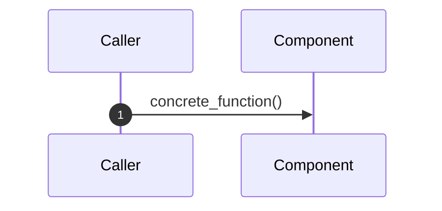
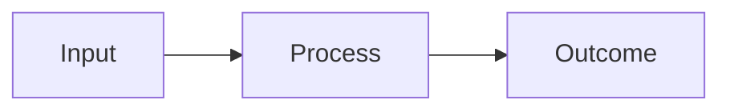

# Architecture Docs Guide (`doc/arc`)

This README defines the quality bar for architecture documents in `doc/arc/`.
Use it as the writing standard when updating existing docs or creating new ones.

## Purpose

Architecture docs in this folder should be:
- accurate to the current code (current-state first)
- traceable to concrete files/functions
- useful for both onboarding and refactoring

The model reference is `doc/arc/01-bootstrap-and-orchestration.md`, which now includes both:
- a detailed, function-level sequence diagram
- a conceptual quick-view flow diagram

## Canonical scope of this folder

- `00-architecture-overview.md`: high-level system paradigm and major boundaries
- `01-bootstrap-and-orchestration.md`: shell integration and runtime load chain
- `02-core-and-gen.md`: core primitives and general utilities
- `03-operational-modules.md`: operations layer architecture
- `04-dependency-injection.md`: DI contracts and flow
- `05-deployment-and-config.md`: deployment/config hierarchy
- `06-testing-and-validation.md`: test architecture and strategy
- `07-logging-and-error-handling.md`: log/error model and contracts
- `08-workflow-architecture.md`: agent workflow coordination system (`doc/pro`)
- `09-planning-subsystem.md`: local planning subsystem (`utl/pla`) architecture and data flow

## Quality standard (required)

Each architecture doc should include the following sections (or equivalent):

1. **What this area does**
   - One concise paragraph with explicit scope boundaries.

2. **Actual call/load order**
   - Ordered list of concrete runtime steps.
   - Use real function names where possible.

3. **Execution flow diagram(s)**
   - One detailed Mermaid diagram (traceable, function-level for complex flows).
   - One conceptual Mermaid diagram (quick onboarding view) when the flow is complex.

4. **State and side effects**
   - Environment variables, sourced symbols, traps, shell behavior changes.

5. **Failure and fallback behavior**
   - What happens on error, what is optional vs required, and what is recovered.

6. **Refactor-relevant constraints**
   - Tight couplings, implicit contracts, brittle assumptions.

## Writing style conventions

- Prefer current-state facts over aspirational design language.
- Name real files/functions (`bin/ini`, `setup_components`, etc.).
- Keep claims verifiable from source.
- Keep narrative concise; use structured sections for scanability.
- Avoid implementation trivia that does not affect architecture decisions.

## Diagram conventions

Use Mermaid for all architecture flow visuals.

- **Detailed diagram:** sequence-focused, includes concrete function names.
- **Conceptual diagram:** higher-level blocks and outcomes.
- Keep arrows directional and aligned to runtime order.
- Include failure path explicitly (alt/fallback branch).

Example heading pattern:
- `### End-to-end sequence`
- `### Conceptual flow (quick view)`

## Traceability checklist (before merge)

For each changed architecture doc, verify:

- [ ] Function names in diagrams exist in code.
- [ ] Call order matches current source flow.
- [ ] Required vs optional behavior is correctly documented.
- [ ] Failure path and fallback behavior are included.
- [ ] Any exported/global state side effects are called out.
- [ ] Links/references point to existing files.

## Maintenance rule

If call order, function names, component order, or state contracts change in code,
update the corresponding `doc/arc/*.md` document in the same PR.

Minimum expected pairings:
- `go`, `bin/ini`, `bin/orc` changes -> update `01-bootstrap-and-orchestration.md`
- `lib/core/*` or `lib/gen/*` contract changes -> update `02-core-and-gen.md`
- `src/dic/*` contract changes -> update `04-dependency-injection.md`
- `cfg/env/*` layering/precedence changes -> update `05-deployment-and-config.md`
- `val/*` structure/runner contract changes -> update `06-testing-and-validation.md`
- logging/error contract changes in `lib/core/err`, `lib/core/lo1`, `lib/core/tme`, `lib/gen/aux` -> update `07-logging-and-error-handling.md`
- `doc/pro/` workflow structure, task templates, or checker changes -> update `08-workflow-architecture.md`
- `utl/pla/*` command/schema/export contract changes -> update `09-planning-subsystem.md`

## Recommended update workflow

1. Read the target architecture doc.
2. Read relevant source files and confirm current behavior.
3. Update prose with current-state facts.
4. Add/refresh detailed and conceptual diagrams.
5. Run the traceability checklist above.

## Starter template for arc docs

~~~md
# NN - Title

One-paragraph scope and boundaries.

## 1. Responsibilities and Boundaries

## 2. Runtime/Load Sequence

### End-to-end sequence

### Conceptual flow (quick view)

## 3. State and Side Effects

## 4. Failure and Fallback Behavior

## 5. Constraints and Refactor Notes
~~~
