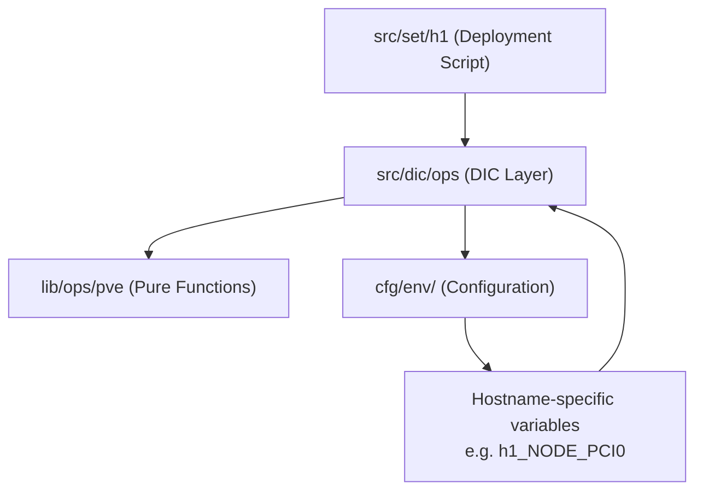

# Deployment Architecture

Architecture of the deployment layer: the `src/set/.menu` framework design, hostname-based script convention, and the DIC/pure-function integration pattern.

## Core Framework: `src/set/.menu`

All scripts within `src/set/` leverage the Environment-Aware Deployment Framework at `src/set/.menu`.

### Key Design Features

*   **Interactive Mode**: Menu-driven interface for selecting and executing specific deployment tasks
*   **Direct Execution Mode**: Command-line execution of specific tasks for automation and scripting
*   **Environment Context Management**: Automatic loading of base, environment, and node-specific configurations
*   **Hierarchical Configuration Loading**: Supports base → environment → node configuration overrides
*   **Usage Information**: Dynamic help generation based on script functions and configuration

### Internal Architecture

Each deployment script defines a `MENU_OPTIONS` associative array mapping letter keys (e.g., `a`, `b`) to task functions (named `a_xall`, `b_xall`, etc.). The framework provides:

- **Configuration hierarchy**: `cfg/env/site1` → `cfg/env/site1-dev` → `cfg/env/site1-w2`
- **Runtime constants integration** with automatic LAB_ROOT detection
- **Infrastructure and security utility loading** from `lib/ops/` and `lib/gen/`
- **Environment variable context** (`SITE`, `ENVIRONMENT`, `NODE`)

## Hostname-Based Script Convention

The `src/set/` directory uses a **hostname-based naming convention** where each script corresponds to a specific infrastructure node:

| Script | Hostname | Purpose | Infrastructure Role |
|--------|----------|---------|-------------------|
| **`h1`** | Hypervisor 1 | Proxmox VE cluster setup | Primary virtualization host |
| **`c1`** | Container 1 | NFS server deployment | Network file storage |
| **`c2`** | Container 2 | Samba/SMB services | Windows-compatible file sharing |
| **`c3`** | Container 3 | Proxmox Backup Server | Backup infrastructure |
| **`t1`** | Test Node 1 | Development environment | Developer workstation setup |
| **`t2`** | Test Node 2 | Utility operations | Testing and temporary operations |

This design allows for host-specific customization and simplified deployment execution.

## Function Architecture: Pure Functions vs DIC Wrappers

The deployment scripts integrate with a three-layer function separation pattern:



### Layer Responsibilities

| Layer | Location | Responsibility |
|-------|----------|---------------|
| Deployment scripts | `src/set/` | Orchestration, section sequencing, user interaction |
| DIC operations | `src/dic/ops` | Dependency injection, parameter resolution from environment |
| Pure functions | `lib/ops/` | Core operational logic, stateless, fully parameterized |

### Example: PVE Deployment Integration

```bash
# In deployment script (src/set/h1)
source src/dic/ops  # Load DIC operations

# Call DIC operation — it handles global variable extraction
ops pve vpt -j 100 on  # Enable passthrough for VM 100

# The DIC resolves: h1_NODE_PCI0, h1_NODE_PCI1, etc.
# Then calls the pure function with explicit parameters:
# pve_vpt "100" "on" "0000:0a:00.0" "0000:0a:00.1" "24" "8" "..." "/etc/pve/qemu-server"
```

### Parameter Resolution Hierarchy (DIC)

1. Explicit CLI arguments
2. Hostname-specific variables (e.g., `${hostname}_NODE_PCI0`)
3. Global configuration variables
4. Default values

## Related Documentation

- **[IaC Architecture Overview](iac-overview.md)** - Module inventory and directory layout
- **[Deployment Guide](../man/deployment.md)** - How to run deployment scripts operationally
- **[Operations Library Architecture](../arc/functions.md)** - Pure function design and module reference
- **[Infrastructure Design](infrastructure.md)** - Pure function and DIC design principles
