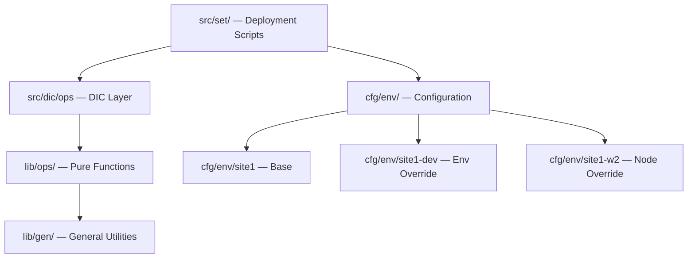

# Infrastructure as Code — Architecture Overview

Structural overview of the IaC layer: module inventory, directory layout, and environment configuration loading order.

## Deployment Module Inventory

Deployment scripts live under `src/set/`. Each subdirectory is a deployment target:

| Directory | Purpose |
|-----------|---------|
| `src/set/c1`, `c2`, `c3` | Container service deployments |
| `src/set/h1` | Hypervisor setup |
| `src/set/t1`, `t2` | Test environment provisioning |

## Operations Library Modules

Infrastructure library modules are in `lib/ops/`:

| Module | Purpose |
|--------|---------|
| `pve` | Proxmox VE cluster, VM, and container lifecycle |
| `gpu` | GPU passthrough management (`gpu_pts`, `gpu_ptd`, `gpu_pta`) |
| `sys` | System setup, package management, user provisioning |
| `net` | Network configuration and connectivity |
| `sto` | Storage pools and filesystem management |

## Environment Configuration Loading Order

Configuration files are under `cfg/env/`. The loading order is:

```
cfg/env/<site>          base site config
cfg/env/<site>-<env>    environment override (dev, prod, etc.)
cfg/env/<site>-<node>   node-specific override
```

Runtime variables (`SITE`, `ENVIRONMENT`, `NODE`) select which config files load.

### Tier Definitions

| Tier | Path pattern | Purpose |
|------|-------------|---------|
| Base | `cfg/env/site1` | Shared cluster-wide defaults |
| Environment | `cfg/env/site1-dev` | Override per lifecycle stage |
| Node | `cfg/env/site1-w2` | Override per physical host |

## Layer Relationships



## Related Documentation

- **[Deployment Guide](../man/deployment.md)** — How to run deployment scripts
- **[Environment Management](../man/environment.md)** — How to switch and validate environments
- **[Deployment Architecture](deployment.md)** — `.menu` framework design and DIC integration pattern
