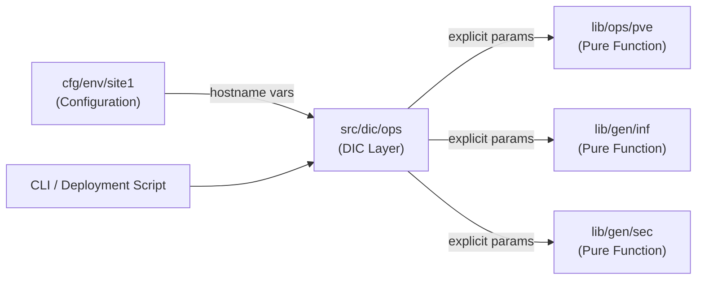

# Infrastructure Design

Architecture of the infrastructure utility layer: pure function design principles, the DIC separation pattern, and how `lib/gen/inf`, `lib/gen/sec`, and `lib/ops/` relate to deployment scripts.

## Pure Function Design

Library functions in `lib/ops/` and `lib/gen/` follow a pure function design pattern: they accept explicit parameters and never read global variables directly.

### Design Principles

- **Enhanced Testability**: Functions can be tested in isolation with known inputs
- **Explicit Dependencies**: All required data is passed as parameters, making dependencies clear
- **Reduced Coupling**: Functions don't depend on specific global variable configurations
- **Predictable Behaviour**: Same inputs always produce the same outputs

### Implementation Example

```bash
# Pure function (lib/ops/pve) — parameterized approach
pve_vpt() {
    local vm_id="$1"
    local action="$2"
    local pci0_id="$3"
    local pci1_id="$4"
    local core_count_on="$5"
    local core_count_off="$6"
    local usb_devices_str="$7"
    local pve_conf_path="$8"

    # Logic uses only explicit parameters — no global reads
    if [[ "$action" == "on" ]]; then
        # Enable passthrough with provided parameters
        :
    fi
}

# DIC layer (src/dic/ops) — handles dependency injection
# Resolves hostname-specific variables and calls the pure function:
ops pve vpt -j
```

## DIC Separation Pattern

The Dependency Injection Container (`src/dic/ops`) bridges the gap between environment-specific configuration and stateless pure functions.



### Resolution Hierarchy

1. Explicit CLI arguments (highest priority)
2. Hostname-specific variables (e.g., `h1_NODE_PCI0`)
3. Global configuration variables
4. Default values (lowest priority)

## Library Module Responsibilities

| Module | Location | Role |
|--------|----------|------|
| Container/VM definition | `lib/gen/inf` | `define_container`, `define_containers`, `set_container_defaults` |
| Security / credentials | `lib/gen/sec` | `sec_generate_secure_password`, `sec_init_password_management` |
| PVE operations | `lib/ops/pve` | `pve_ctc`, `pve_vmc`, `pve_vpt`, `pve_cbm` |
| Storage operations | `lib/ops/sto` | `sto_zfs_cpo`, `sto_bfs_ra1`, `sto_nfs` |
| General analysis | `lib/gen/ana` | `ana_laf`, `ana_lad`, `ana_acu` |

## Related Documentation

- **[Configuration Management](../man/configuration.md)** - IP allocation, naming conventions, and operational usage
- **[Deployment Architecture](deployment.md)** - `.menu` framework and DIC integration in deployment scripts
- **[Functions Reference](functions.md)** - Complete function inventory with metadata
- **[IaC Architecture Overview](iac-overview.md)** - Directory layout and module inventory
