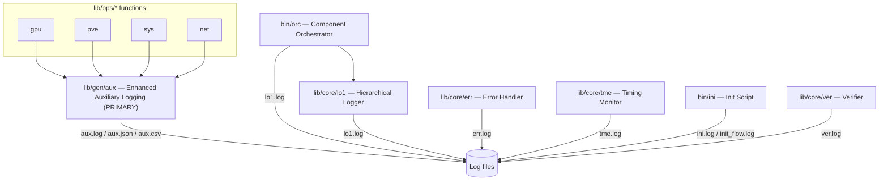
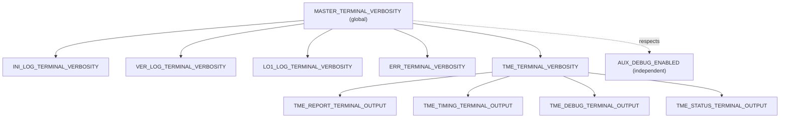

# Logging Architecture

Design of the lab logging system: layer hierarchy, component responsibilities, and verbosity control model. For file locations, state files, and usage patterns, see [Logging System](../man/logging.md).

## System Overview

The lab implements a multi-layered logging architecture with three distinct but integrated subsystems:

1. **Enhanced Auxiliary Logging** (`lib/gen/aux`) — PRIMARY system for all `lib/ops` functions and structured logging
2. **Core Module Logging** (`lib/core/lo1`, `lib/core/err`, `lib/core/tme`) — infrastructure orchestration logging
3. **Initialization Logging** (`bin/ini`, `lib/core/ver`) — bootstrap and verification logging

## Logging System Hierarchy



### ASCII Layer View

```text
┌─────────────────────────────────────────────────────────────────┐
│ Enhanced Auxiliary Logging (lib/gen/aux) - PRIMARY SYSTEM      │
│ ├─ All lib/ops functions use structured logging                 │
│ ├─ Supports JSON, CSV, key-value, and human formats            │
│ └─ Files: aux.log, aux.json, aux.csv                           │
├─────────────────────────────────────────────────────────────────┤
│ Component Orchestrator (bin/orc) - Uses lo1 Logging            │
│ └─ File: lo1.log                                               │
├─────────────────────────────────────────────────────────────────┤
│ Core Infrastructure Logging (lib/core/*)                       │
│ ├─ lo1.log - Advanced hierarchical logging with colours        │
│ ├─ err.log - Centralized error handling                        │
│ ├─ tme.log - Timing and performance data                       │
│ └─ State files in .tmp/ for runtime configuration              │
├─────────────────────────────────────────────────────────────────┤
│ Initialization & Bootstrap (bin/ini, lib/core/ver)             │
│ ├─ ini.log  - Startup sequence and module loading              │
│ ├─ ver.log  - System verification and validation               │
│ └─ init_flow.log - High-precision initialization timing        │
└─────────────────────────────────────────────────────────────────┘
```

## Verbosity Control Model

The system uses a hierarchical master-switch pattern. Lower levels only produce terminal output when all levels above are `"on"`.



### Control Hierarchy Summary

| Level | Variable | Scope |
|-------|----------|-------|
| Master | `MASTER_TERMINAL_VERBOSITY` | All terminal output |
| Module | `INI_LOG_TERMINAL_VERBOSITY` | Init messages |
| Module | `VER_LOG_TERMINAL_VERBOSITY` | Verification messages |
| Module | `LO1_LOG_TERMINAL_VERBOSITY` | Advanced logging output |
| Module | `ERR_TERMINAL_VERBOSITY` | Error messages |
| Module | `TME_TERMINAL_VERBOSITY` | Timing reports |
| TME sub | `TME_REPORT_TERMINAL_OUTPUT` | Report summaries |
| TME sub | `TME_TIMING_TERMINAL_OUTPUT` | Real-time timing |
| TME sub | `TME_DEBUG_TERMINAL_OUTPUT` | TME debug info |
| TME sub | `TME_STATUS_TERMINAL_OUTPUT` | Status updates |
| Auxiliary | `AUX_DEBUG_ENABLED` | aux debug output (independent) |

## Design Decisions

- **Two parallel systems** (`aux` for ops functions, `lo1` for core/orchestration) exist because `lib/gen/aux` was introduced as a structured replacement for raw `echo/printf` in `lib/ops`, while `lib/core/lo1` remains for the orchestration layer (`bin/orc`). Both respect `MASTER_TERMINAL_VERBOSITY`.
- **Stateless aux system**: `lib/gen/aux` requires no persistent state files — controlled entirely via environment variables, making it safe to use in subshells and parallel processes.
- **Persistent state for lo1/tme**: `lib/core/lo1` and `lib/core/tme` write state to `.tmp/` files so settings survive across shell function calls within the same session.

## Related Documentation

- **[Logging System](../man/logging.md)** - Log file locations, state files, env vars, and usage patterns
- **[Verbosity Controls](../man/verbosity.md)** - User guide for managing terminal output
- **[Functions Reference](functions.md)** - `aux_*`, `lo1_*`, `tme_*` function inventory
- **[Initialization Guide](../man/initiation.md)** - How verbosity variables are set before `bin/ini`
