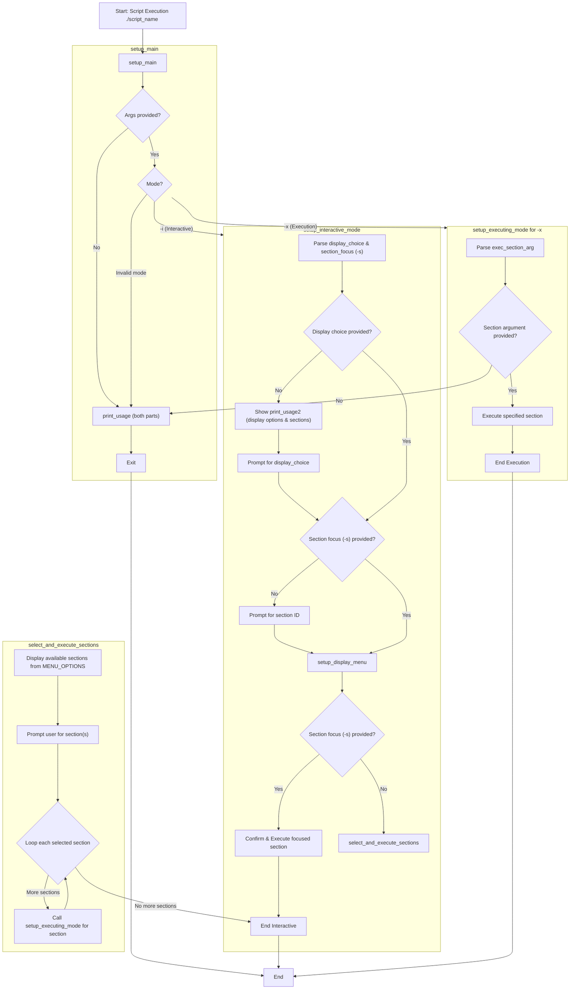

```mermaid
flowchart TD
    A["Start: Script Execution ./script_name <args>"] --> B["setup_main"]

    subgraph main_logic ["setup_main"]
        direction LR
        B --> B1{"Args provided?"}
        B1 -- No --> B_Usage["print_usage (both parts)"]
        B_Usage --> B_Exit["Exit"]
        B1 -- Yes --> B2{"Mode?"}
    end

    B2 -- "-i (Interactive)" --> I_Mode["Interactive Mode Logic"]
    B2 -- "-x (Execution)" --> E_Mode["Execution Mode Logic"]
    B2 -- "Invalid mode" --> B_Usage

    subgraph I_Mode ["setup_interactive_mode"]
        direction TB
        IM1["Parse display_choice & section_focus (-s)"]
        IM2{"Display choice provided?"}
        IM3a["Show print_usage2 (display options & sections)"]
        IM3b["Prompt for display_choice"]
        IM4{"Section focus (-s) provided?"}
        IM5a["Prompt for section ID"]
        IM5b["setup_display_menu"]
        IM6{"Section focus (-s) provided?"}
        IM7["Confirm & Execute focused section"]
        IM8["select_and_execute_sections"]
        
        IM1 --> IM2
        IM2 -- No --> IM3a
        IM3a --> IM3b
        IM3b --> IM4
        IM2 -- Yes --> IM4
        IM4 -- No --> IM5a
        IM5a --> IM5b
        IM4 -- Yes --> IM5b
        IM5b --> IM6
        IM6 -- Yes --> IM7
        IM7 --> I_Exit["End Interactive"]
        IM6 -- No --> IM8
    end

    subgraph select_and_execute_sections ["select_and_execute_sections"]
        direction TB
        SES1["Display available sections from MENU_OPTIONS"]
        SES2["Prompt user for section(s)"]
        SES3{"Loop each selected section"}
        SES4["Call setup_executing_mode for section"]
        
        SES1 --> SES2
        SES2 --> SES3
        SES3 -- "More sections" --> SES4
        SES4 --> SES3
        SES3 -- "No more sections" --> I_Exit
    end

    subgraph E_Mode ["setup_executing_mode for -x"]
        direction TB
        EM1["Parse exec_section_arg"]
        EM2{"Section argument provided?"}
        EM3["Execute specified section"]
        
        EM1 --> EM2
        EM2 -- No --> B_Usage
        EM2 -- Yes --> EM3
        EM3 --> E_Exit["End Execution"]
    end

    B_Exit --> End["End"]
    I_Exit --> End
    E_Exit --> End
```
