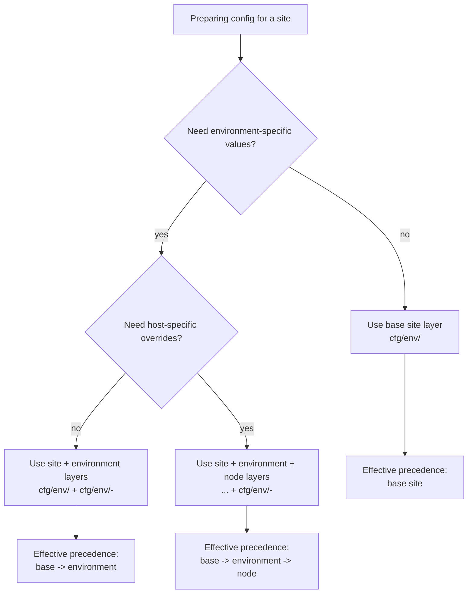
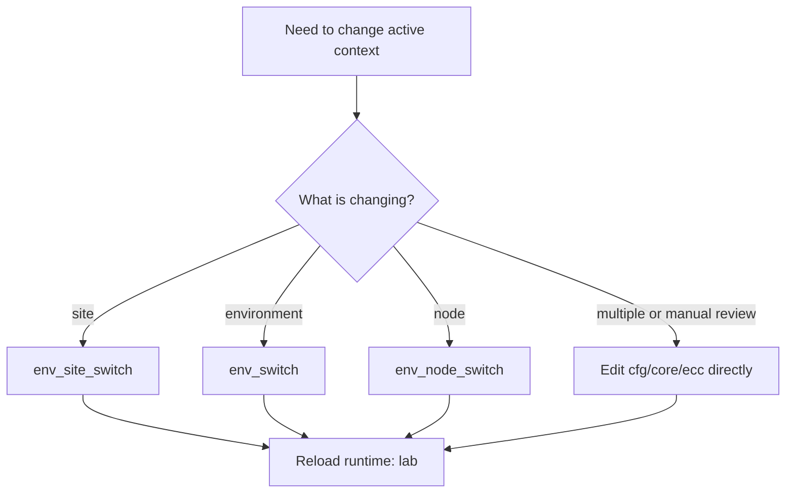

# 02 - Environment and Configuration

This guide explains how runtime context and infrastructure values are defined in `cfg/`.
The DIC (`ops`) and deployment scripts consume these values at execution time.

## Command Decision Flow

Use these decision maps to choose the right configuration layering and context
switch method.

### Configuration layer composition



| Method/layer | When to use | Scope of effect |
|--------------|-------------|-----------------|
| Base site file (`cfg/env/<site>`) | Single environment or shared defaults only | Applies to all contexts for the site |
| Site + environment override (`cfg/env/<site>-<env>`) | Distinct values per environment (dev/stage/prod) | Overrides base values for one environment |
| Site + environment + node override (`cfg/env/<site>-<node>`) | Host-specific tuning is required | Overrides base/environment for one node |

### Context switching method



| Method/layer | When to use | Scope of effect |
|--------------|-------------|-----------------|
| `env_site_switch <site>` | Switching site baseline quickly | Updates `SITE_NAME` in `cfg/core/ecc` |
| `env_switch <env>` | Moving between env tiers | Updates `ENVIRONMENT_NAME` in `cfg/core/ecc` |
| `env_node_switch <node>` | Targeting a different host context | Updates `NODE_NAME` in `cfg/core/ecc` |
| Manual edit (`cfg/core/ecc`) | Coordinated multi-field changes or explicit review | Full control over active context fields |

## 1. Configuration Model and Precedence

The active runtime context is a combination of one controller file and layered env files:

1. `cfg/core/ecc` - selected `SITE_NAME`, `ENVIRONMENT_NAME`, `NODE_NAME`
2. `cfg/env/<site>` - required base site configuration
3. `cfg/env/<site>-<environment>` - optional environment override
4. `cfg/env/<site>-<node>` - optional node override

Effective precedence is:

`base site -> environment override -> node override`

The runtime constants file `cfg/core/ric` also exports path variables used by orchestrator and DIC, including:
- `SITE_CONFIG_FILE`
- `ENV_OVERRIDE_FILE`
- `NODE_OVERRIDE_FILE`

## 2. Set the Active Context

Edit `cfg/core/ecc`:

```bash
export SITE_NAME="site1"
export ENVIRONMENT_NAME="dev"
export NODE_NAME="$(hostname)"
```

Then reload the runtime in your shell:

```bash
lab
```

If `lib/gen/env` is loaded, these helpers are available:
- `env_status` - show current context and expected config files
- `env_switch <env>` - update environment in `cfg/core/ecc`
- `env_site_switch <site>` - update active site
- `env_node_switch <node>` - update active node

## 3. Define Infrastructure Values in `cfg/env/*`

Environment files are executable Bash files (not static YAML/JSON), so keep them syntax-valid and deterministic.

Example pattern:

```bash
# cfg/env/site1

# host h1
h1_NODE_PCI0="0000:01:00.0"
h1_NODE_PCI1="0000:01:00.1"
h1_USB_DEVICES=("1234:5678" "abcd:ef01")

# host w2
w2_NODE_PCI0="0000:3b:00.0"
w2_CORE_COUNT_ON=10
```

The DIC resolves many values by naming convention, including hostname-prefixed values
like `<hostname>_NODE_PCI0`, `<hostname>_USB_DEVICES`, and related keys.

## 4. Create a New Site or Environment Layer

### New site baseline

```bash
cp cfg/env/site1 cfg/env/site2
```

### Optional environment override

```bash
cp cfg/env/site1-dev cfg/env/site2-dev
```

### Optional node override

```bash
cp cfg/env/site1-w2 cfg/env/site2-node1
```

Update `cfg/core/ecc`, then reload:

```bash
lab
```

## 5. Validate Configuration Changes

Syntax-check edited files:

```bash
bash -n cfg/core/ecc
bash -n cfg/env/site1
```

Run config-focused validation:

```bash
./val/core/config/cfg_test.sh
```

Optional runtime view:

```bash
env_status
env_validate
```

## 6. Troubleshooting and Recovery

### Base site file missing

`cfg/env/<site>` is required by orchestrator loading. Create/copy it first, then reload with `lab`.

### Values not being picked up

- Confirm hostname prefix matches `hostname -s` when using node-scoped variables.
- Confirm you reloaded the runtime in the current shell (`lab`).
- Use `ops <module> <function>` (no args) to inspect injection preview.

### Syntax errors in env files

Run `bash -n cfg/env/<file>` and fix before running deployment flows.

## 7. Related Docs

- Next: [03 - CLI Usage and the DIC](03-cli-usage.md)
- Deployment/runbooks: [04 - Deployments and Runbooks](04-deployments.md)
- Architecture context: [doc/arc/05-deployment-and-config.md](../arc/05-deployment-and-config.md)
