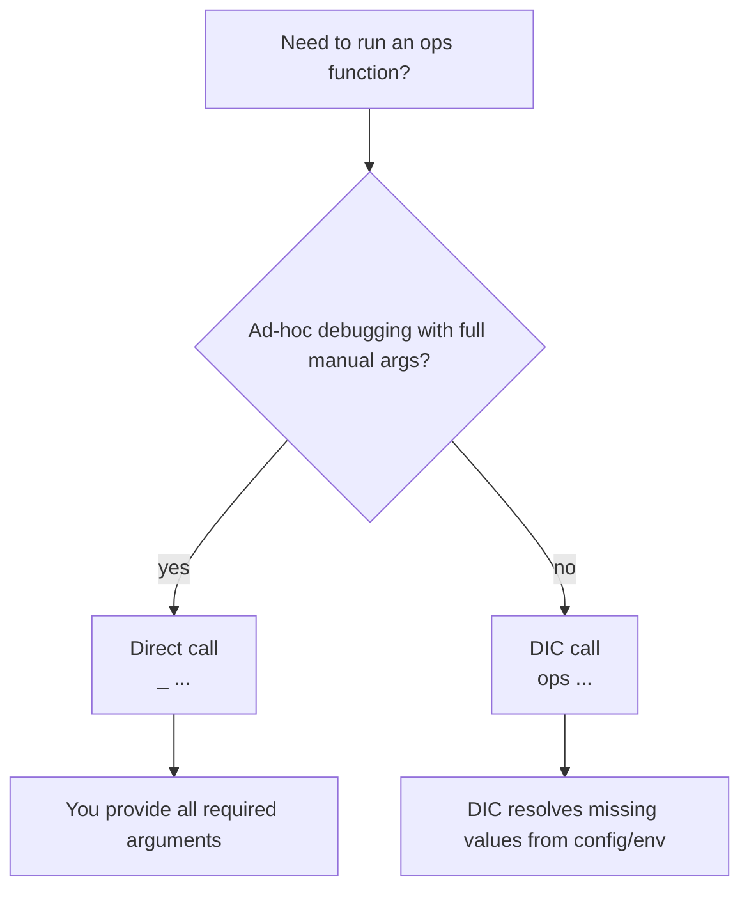
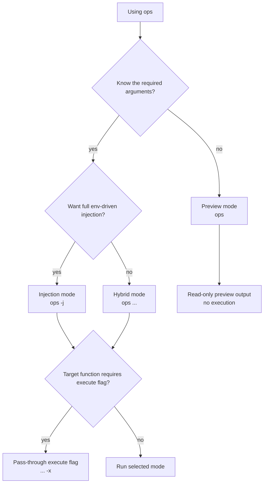

# 03 - CLI Usage and the DIC

This guide covers the operator CLI flow for `lib/ops/*` functions.
The primary interface is the DIC command: `ops` (`src/dic/ops`).

## Command Decision Flow

Use these decision maps to select the right invocation pattern before running
state-changing commands.

### Direct call vs DIC call



| Command/mode | When to use | Side effects |
|--------------|-------------|--------------|
| Direct shell call (`gpu_ptd ...`) | Debugging or function-level testing when you want full manual control | Depends on target function; often state-changing |
| DIC call (`ops gpu ptd ...`) | Day-to-day operation and runbooks where injection reduces argument errors | Depends on target function; often state-changing |

### DIC execution mode selection



| Command/mode | When to use | Side effects |
|--------------|-------------|--------------|
| Preview (`ops <module> <function>`) | Inspect what DIC can inject before execution | Read-only preview |
| Hybrid (`ops <module> <function> <args...>`) | Provide known leading args and let DIC fill the rest | Executes target function; commonly state-changing |
| Injection (`ops <module> <function> -j`) | Full environment/config-driven execution (common in runbooks) | Executes target function; commonly state-changing |
| Pass-through (`... -x`) | Required when target function contract needs explicit execute flag | Enables execution path in target function |

### Dev session attribution decision flow

For attribution command selection (`osv`, `oae`, `orr`, `otr`), use the full
decision flow in [07 - Dev Session Attribution Workflow](07-dev-session-attribution-workflow.md)
instead of duplicating it here.

## 1. Prerequisites and Safety

Load the runtime first in your current shell:

```bash
lab
```

If you skip this, `ops` usually fails with missing runtime variables (for example `LIB_OPS_DIR`).

Safety note:
- `ops --list`, `ops <module> --list`, and `ops <module> <function> --help` are read-only discovery.
- Many `ops` executions are state-changing infrastructure actions. Validate context before execution.

## 2. Quick Discovery Commands

```bash
ops --list
ops pve --list
ops pve vpt --help
```

Use these first when exploring available modules/functions.

## 3. Direct Function Calls vs `ops`

Two interfaces exist:

1. **Direct call** in shell (e.g., `gpu_ptd ...`): full argument handling is on you.
2. **DIC call** (e.g., `ops gpu ptd ...`): resolves and injects missing values from environment/config conventions.

For day-to-day operations and deployment scripts, prefer `ops`.

## 4. DIC Execution Modes

### Preview mode (no arguments)

```bash
ops gpu ptd
```

Shows a usage preview with parameter placeholders:
- `<param:value>` means auto-injection value is available.
- `<param>` means manual input is still required.

### Hybrid mode (default when args are provided)

```bash
ops pve vpt 100 on
```

Provided arguments fill early parameters, and DIC resolves remaining parameters.

### Injection mode (`-j`)

```bash
ops pve vpt -j
```

Executes with full environment-driven injection (common in `src/set/*` runbooks).

### Explicit pass-through flag (`-x`)

```bash
ops gpu pts -x
```

`-x` is passed to the target function for contracts that require explicit execute flags.

## 5. Resolution Behavior (Practical View)

In normal operation, resolution follows this pattern:
1. user-supplied CLI arguments,
2. hostname-scoped variables (for example `<hostname>_NODE_PCI0`),
3. broader globals (for example `VM_ID`),
4. function defaults (when defined).

Array-like values are converted into callable argument forms when needed.

## 6. Debugging and Validation

Enable DIC debug tracing:

```bash
OPS_DEBUG=1 ops pve vpt -j
```

Optional behavior controls:

```bash
OPS_VALIDATE=strict OPS_CACHE=1 OPS_METHOD=auto ops pve vpt -j
```

## 7. Return Codes and Troubleshooting

Standard return code contract used by the framework:
- `0` success
- `1` usage/validation error
- `2` runtime/dependency failure
- `127` required command missing

Common issues:

### `Environment not initialized. Please run 'source bin/ini' first.`

Run:

```bash
lab
```

### `Module '<name>' not found`

- Verify module exists under `lib/ops/`.
- Use `ops --list` to confirm available module names.

### Injection not resolving expected values

- Check `cfg/env/*` variable names and hostname prefixes.
- Run preview mode (`ops <module> <function>`) to inspect what DIC sees.
- Retry with `OPS_DEBUG=1` for detailed resolution logs.

## 8. Dev Session Attribution Overview

The `dev` module supports auditable session attribution with strict defaults.

When `lab` is loaded, `cfg/ali/sta` defines an `opencode()` shell wrapper that
automatically emits `account_selected` events before launching OpenCode.
Those automatic rows appear with `SRC=shell_wrapper` in `ops dev osv`.

For OpenAI provider sessions, wrapper identity resolution is local/offline and
deterministic:
1. `LAB_DEV_OPENAI_ACCOUNT_KEY_OVERRIDE` / `LAB_DEV_OPENAI_ACCOUNT_LABEL_OVERRIDE`
2. `OPENCODE_ATTR_*` runtime vars when `OPENCODE_ATTR_PROVIDER_ID` normalizes to `openai`
3. `LAB_DEV_OPENAI_AUTH_FILE` (default `~/.local/share/opencode/auth.json`)

Synthetic runtime labels (for example `audit-session@example.com` and other
`@example.*` placeholders) are ignored so wrapper attribution can fall back to
real local auth-state identity.

Only non-secret identity fields are persisted in attribution events.

### View sessions with attribution confidence

```bash
ops dev osv -x
ops dev osv -x --best-effort
```

- Strict default (`ops dev osv -x`) prefers event-backed `CONF=high` identities and can emit explicit stale OpenAI fallback identities at `CONF=low` when no in-window candidate exists.
- Best-effort mode (`--best-effort`) can surface additional `CONF=low` fallbacks and keeps provenance in `SRC`.
- OpenAI provider-wide fallback events are freshness-gated (default 60 minutes from first prompt) to prevent stale cross-session attribution bleed. Antigravity provider timeline behavior is unchanged. Tune OpenAI gating with `LAB_DEV_ATTR_PROVIDER_MAX_AGE_MS` (`0` disables the gate).
- OpenAI sessions can fall back to local auth-state identity (`SRC=auth_state`) when event matching is unavailable but auth-state timing is near first prompt (default 6 hours, before or shortly after prompt to tolerate token refresh). Tune with `LAB_DEV_ATTR_OPENAI_AUTH_MAX_AGE_MS` (`0` disables the gate).
- If OpenAI freshness windows exclude all in-window candidates but a non-synthetic stale identity exists, resolver reports `CONF=low` with explicit stale provenance (`SRC=auth_state_stale` or `SRC=provider_stale`) before unresolved `unk`.

Common `SRC` values:
- `shell_wrapper`: automatic event emitted by the `opencode()` shell wrapper
- `opencode_runtime`: runtime/manual event emitted by `dev_oae`/`dev_orr`
- `connector_event`: connector token refresh event emitted by `dev_otr`
- `manual_switch`: account switch event emitted by `dev_oas`
- `auth_state_stale`: stale OpenAI local auth-state fallback used as low-confidence identity
- `provider_stale`: stale OpenAI provider timeline fallback used as low-confidence identity

### Emit runtime attribution events directly

```bash
ops dev oae -x
ops dev oae openai user@example.com account_selected opencode_runtime user@example.com
```

For `-x` mode, set:
- `OPENCODE_ATTR_PROVIDER_ID`
- `OPENCODE_ATTR_ACCOUNT_KEY`
- optional `OPENCODE_ATTR_ACCOUNT_LABEL`, `OPENCODE_ATTR_EVENT_TYPE`, `OPENCODE_ATTR_SOURCE`, `OPENCODE_ATTR_TRACE_ID`, `OPENCODE_ATTR_SESSION_ID`

### Wrapper-based request/refresh integration

Automatic default (with `lab` loaded):

```bash
opencode
oc
```

Manual helpers remain available when wrapper context is unavailable or explicit
provider/account overrides are needed:

```bash
ops dev orr openai user@example.com -- "summarize changes"
ops dev orr openai user@example.com --dry-run -- "summarize changes"
ops dev otr openai user@example.com user@example.com connector_event
```

- `dev_orr` emits `event_type=account_selected` immediately before `opencode run`.
- `dev_orr --dry-run` emits the same attribution event without executing `opencode run`.
- `dev_otr` emits `event_type=token_refreshed` for identity refresh transitions.

### Account switching

```bash
ops dev oas claude 2
ops dev oas gemini 1
ops dev oaa 2
```

- `dev_oas` modifies `antigravity-accounts.json` to route a model family to the
  selected account (1-based), creates a backup, and emits an `account_selected`
  event with `source=manual_switch`.
- `dev_oaa` sets the global default `activeIndex` (1-based input), preserves
  existing `activeIndexByFamily` mappings, creates a backup, and emits an
  `account_selected` event with `source=manual_switch`.

For full procedure, validation matrix, and troubleshooting, see:
- [07 - Dev Session Attribution Workflow](07-dev-session-attribution-workflow.md)

## 9. Related Docs

- Next: [04 - Deployments and Runbooks](04-deployments.md)
- DIC internals: [src/dic/README.md](../../src/dic/README.md)
- Architecture context: [doc/arc/04-dependency-injection.md](../arc/04-dependency-injection.md)
