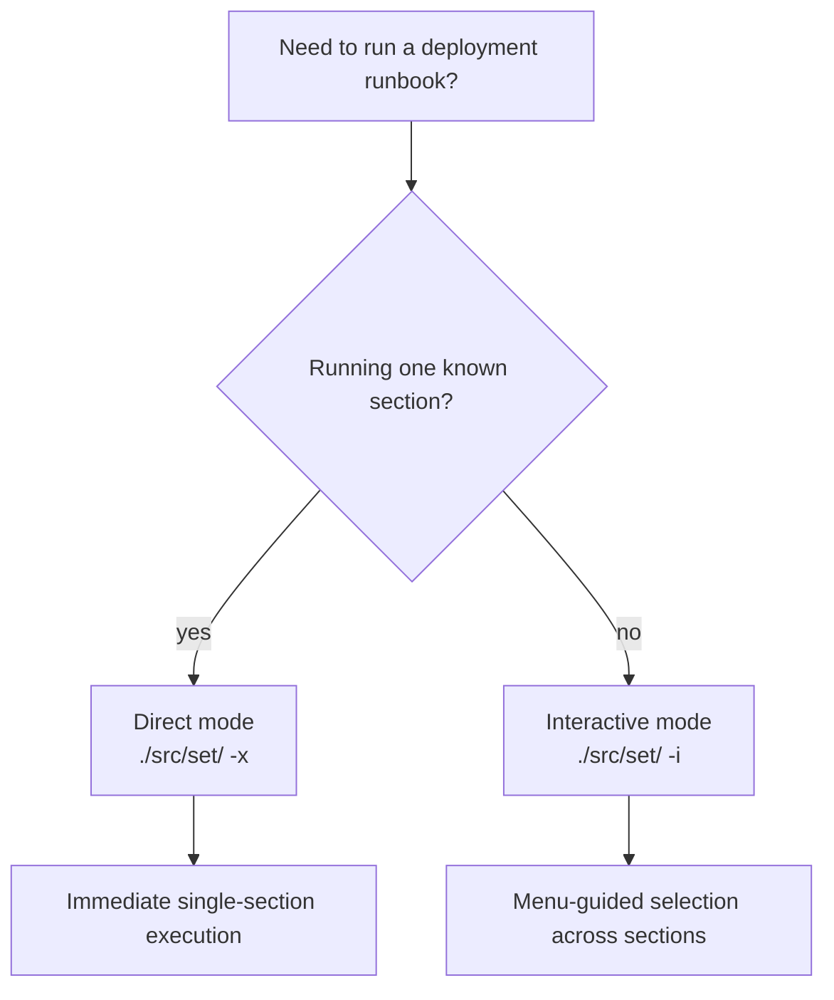
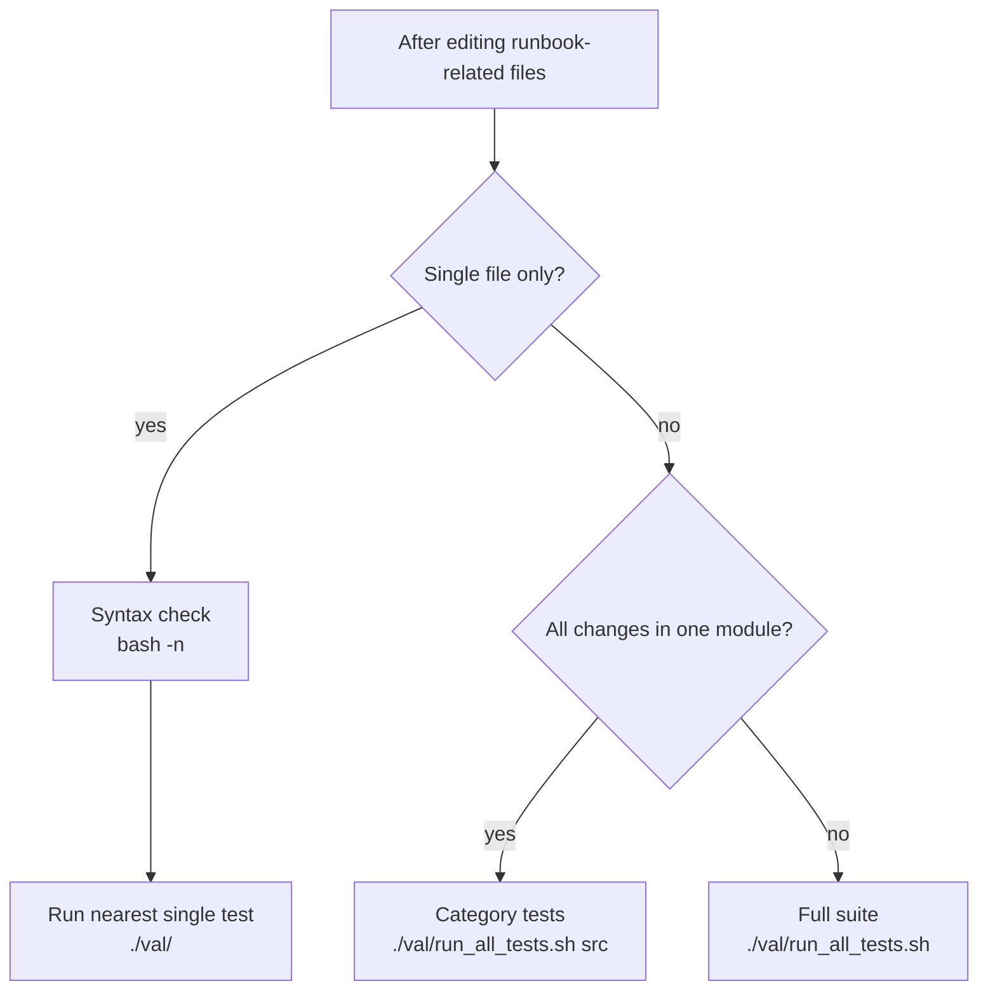

# 04 - Deployments and Runbooks

This guide explains how deployment runbooks in `src/set/` are structured and executed.
These scripts orchestrate multi-step infrastructure actions by calling `ops` functions.

## Command Decision Flow

Use these decision maps to choose execution mode and validation scope before
running a runbook.

### Runbook execution mode



| Mode/scope | When to use | Side effects |
|------------|-------------|--------------|
| Direct mode (`-x <section>`) | Known bounded task or automation path | Executes selected section immediately; state-changing |
| Interactive mode (`-i`) | Exploring options or running multiple sections manually | Executes selected sections from menu; state-changing |

### Validation scope after changes



| Mode/scope | When to use | Side effects |
|------------|-------------|--------------|
| `bash -n <file>` + nearest test | Single-file edit | Read-only syntax check, then targeted test run |
| `./val/run_all_tests.sh src` | Multiple files in one module (e.g., runbook + helper) | Runs `src` test category |
| `./val/run_all_tests.sh` | Cross-module or structural change | Runs complete suite; highest confidence and runtime |

## 1. Prerequisites and Safety

- Load runtime first in the current shell (`lab`) before using runbooks.
- Verify configuration context (`SITE_NAME`, `ENVIRONMENT_NAME`, `NODE_NAME`) before execution.
- Treat runbook execution as state-changing: many sections modify real infrastructure.

Recommended pre-checks:

```bash
./go status
env_status
```

## 2. Runbook Structure (`src/set/*`)

Each runbook (for example `src/set/h1`) usually follows this pattern:

1. define script-local path helpers (`DIR_SH`, `FILE_SH`),
2. export `LAB_REC_TARGET` from runbook identity,
3. source `src/set/.menu`,
4. source `src/dic/ops`,
5. declare `MENU_OPTIONS` (`section_id -> section_function`),
6. implement section functions (typically `*_xall`) that call `ops ... -j`,
7. delegate argument handling to `setup_main "$@"`.

Example section style:

```bash
a_xall() {
    ops pve dsr -j
    ops usr adr -j
    ops pve rsn -j
}
```

## 3. Execution Modes

### Interactive mode (`-i`)

```bash
./src/set/h1 -i
```

Interactive mode uses `src/set/.menu` for guided section selection and display options.

### Direct mode (`-x <section>`)

```bash
./src/set/h1 -x a
```

Direct mode executes one section immediately (for example `a_xall`) and is the common automation path.

## 4. Migration Bridge (Optional)

Runbooks currently delegate through `src/run/dispatch` during migration.

- Default path keeps legacy ergonomics with compatibility wrappers.
- Optional bridge path (`LAB_USE_DIC_RUN_BRIDGE=1`) routes through
  `src/dic/run` to compile reconciliation artifacts before dispatch.

Examples:

```bash
# Legacy-compatible path (default)
./src/set/h1 -x a

# Opt-in reconcile bridge for trial runs
LAB_USE_DIC_RUN_BRIDGE=1 ./src/set/h1 -x a

# Direct dispatch with strict dependency checks
src/run/dispatch t2 --plan .tmp/rec/site1.plan --enforce-deps \
  --completed-target h1 --completed-target c1 --completed-target c2 \
  --completed-target c3 --completed-target t1

# Direct dispatch with strict policy gate checks
src/run/dispatch h1 --plan .tmp/rec/site1.plan --enforce-policy-gates \
  --allow-gate gate_network --allow-gate gate_storage

# Strict dispatch with gate evidence artifact (non-interactive)
src/run/dispatch h1 --plan .tmp/rec/site1.plan --enforcement-stage strict \
  --gate-evidence .tmp/rec/h1.gates

# Stage-based strict defaults
src/run/dispatch h1 --plan .tmp/rec/site1.plan --enforcement-stage strict \
  --allow-gate gate_network --allow-gate gate_storage
```

When using strict enforcement flags, `--plan` is required. Environment
equivalents are available for automation wrappers:

- `LAB_RUN_ENFORCEMENT_STAGE=compat|guarded|strict`
- `LAB_RUN_COMPLETED_TARGETS="h1 c1 c2"`
- `LAB_RUN_ALLOWED_POLICY_GATES="gate_network gate_storage"`
- `LAB_RUN_GATE_EVIDENCE_FILE=/path/to/gate-evidence`

Gate evidence artifact contract (`--gate-evidence` / `LAB_RUN_GATE_EVIDENCE_FILE`):

- `format=gate-evidence-v0`
- `target=<dispatch-target>`
- approved gates via `approved_gates="gate_a gate_b"` or repeatable
  `approved_gate=<gate>` keys

Enforcement stage precedence at runtime:

1. `--enforcement-stage` (explicit CLI override)
2. `LAB_RUN_ENFORCEMENT_STAGE`
3. plan target override (`target_*_enforcement_stage`)
4. plan default (`enforcement_stage_default`)
5. fallback `compat`

Current rollout guardrails in `cfg/dcl/site1`:

- `h1`, `c1`, `c2`, `c3`: `compat` (legacy behavior preserved)
- `t1`, `t2`: `guarded` (dependency + order checks required)

Recommended rollout sequence:

1. Move non-critical targets from `compat` to `guarded`.
2. Stabilize dependency completion reporting in automation wrappers.
3. Move selected targets to `strict` only after this checklist is satisfied:
   - target has deterministic `DCL_TARGET_ORDER` metadata,
   - target has non-empty `DCL_TARGET_DEPENDS_ON` metadata,
   - target has non-empty `DCL_TARGET_POLICY_GATES` metadata,
   - automation can supply gate evidence via `--gate-evidence` or
     `LAB_RUN_GATE_EVIDENCE_FILE`.

## 5. Operational Workflow (Recommended)

1. Validate context and config (`env_status`, `bash -n` on edited files).
2. Start with one bounded section (`-x <section>`) before wider runs.
3. Use DIC preview/help for unfamiliar calls (`ops <module> <function>`, `--help`).
4. Move to interactive mode when selecting multiple sections manually.

## 6. Authoring a New Runbook

Create a new file in `src/set/` and follow existing runbooks (`h1`, `c1`, `t1`) as reference.

Minimal pattern:

```bash
#!/bin/bash
DIR_SH="$( cd "$( dirname "${BASH_SOURCE[0]}" )" >/dev/null 2>&1 && pwd )"
FILE_SH="$(basename "${BASH_SOURCE[0]}")"

source "${DIR_SH}/.menu"
source "${DIR_SH}/../dic/ops"

declare -A MENU_OPTIONS
MENU_OPTIONS[a]="a_xall"

a_xall() {
    ops sys ipa -j
}

if [ $# -eq 0 ]; then
    print_usage
else
    setup_main "$@"
fi
```

## 7. Validate Runbook Changes

Syntax-check changed runbooks:

```bash
bash -n src/set/h1
```

Then validate with increasing scope:

```bash
./val/run_all_tests.sh src
./val/run_all_tests.sh integration
```

Run full suite for broad refactors:

```bash
./val/run_all_tests.sh
```

## 8. Troubleshooting and Recovery

### `Invalid section` or section not found

- Confirm section ID exists in `MENU_OPTIONS`.
- Confirm mapped function exists and name matches exactly.

### `ops` commands fail inside a runbook

- Ensure runtime is loaded (`lab`).
- Validate module/function names with `ops --list` and `ops <module> --list`.
- Check config variables required by target functions.

### Runbook behavior differs by host

- Confirm hostname-prefixed values in `cfg/env/*` match `hostname -s`.
- Confirm active node context in `cfg/core/ecc` and `env_status` output.

## 9. Related Docs

- Next: [05 - Writing Modules](05-writing-modules.md)
- DIC usage details: [03 - CLI Usage and the DIC](03-cli-usage.md)
- Architecture context: [doc/arc/05-deployment-and-config.md](../arc/05-deployment-and-config.md)
