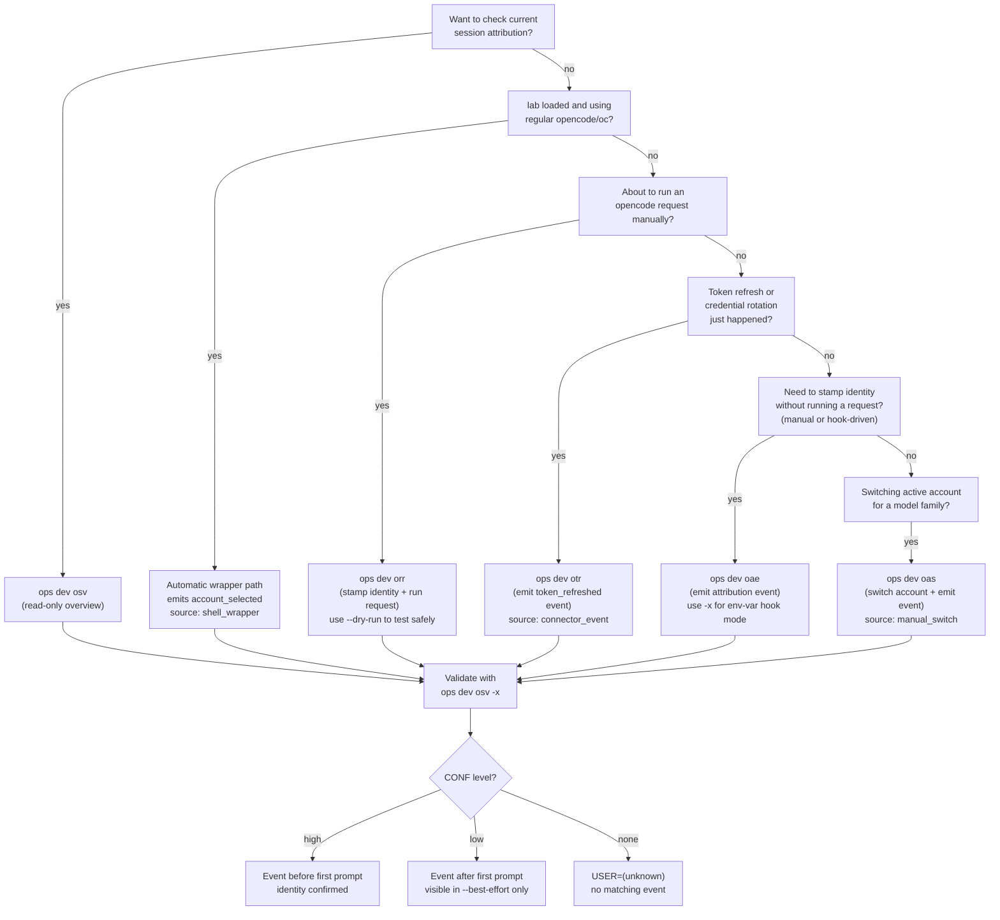

# 07 - Dev Session Attribution Workflow

OpenCode records sessions in a local SQLite database. With `lab` loaded, this
repo now installs an `opencode()` shell wrapper that emits attribution events
automatically before launching OpenCode, so normal `opencode` usage is
attributed by default.

Without `lab` loaded (or in non-wrapper environments), sessions still show
`USER=(unknown)` unless an attribution event is emitted before the first
prompt. This workflow covers both the automatic path and manual recovery
commands in the `dev` module.

Historical sessions without a pre-first-prompt event generally remain
`(unknown)` -- the goal is to wire attribution correctly for sessions going
forward.

This guide covers how to emit attribution events safely, validate strict vs
best-effort reporting, and troubleshoot common issues.

## Command Decision Flow

Attribution is automatic in the common `lab` path. Use this diagram to decide
when manual commands are still needed:



### Summary

| Command | When to use | Side effects |
|---------|-------------|--------------|
| `osv` | Check which sessions are attributed | Read-only |
| `opencode` / `oc` (with `lab`) | Default path; wrapper emits pre-session event automatically | Writes `account_selected` event (`source=shell_wrapper`) then launches OpenCode |
| `orr` | About to send a request to OpenCode | Writes event + runs `opencode run` |
| `otr` | Provider token was just refreshed or rotated | Writes `token_refreshed` event |
| `oae` | Stamp identity without running a request (manual or hook) | Writes attribution event |
| `oas` | Switch active account for a model family | Modifies `antigravity-accounts.json`, writes `account_selected` event (`source=manual_switch`) |

## 1. Prerequisites and Safety

Load runtime in the current shell:

```bash
lab
```

Verify required commands:

```bash
ops --list
opencode --help
```

Safety boundaries:
- `ops dev osv ...` is read-only reporting.
- `opencode`/`oc` with `lab` loaded now writes automatic pre-session attribution events (`source=shell_wrapper`).
- `ops dev oae ...` and `ops dev otr ...` write local attribution events in the local OpenCode DB.
- `ops dev orr ...` writes an attribution event and then executes `opencode run`.
- `ops dev orr ... --dry-run -- ...` is the safest way to validate event wiring without running a real `opencode run` request.

## 2. Procedure

### Step 1: Capture strict baseline

```bash
ops dev osv -x -l 10
```

Expected baseline for older sessions is often:
- `USER=(unknown)`
- `SRC=none`
- `CONF=none`

This is expected when no pre-first-prompt attribution event exists.

### Step 2: Use automatic path (default) or emit request-time event manually

Default with `lab` loaded:

```bash
opencode
```

Fallback/manual path:

```bash
ops dev orr openai user@example.com --dry-run -- "healthcheck"
```

This writes an `account_selected` event without running a live `opencode run` request.

### Step 3: Validate overview again

```bash
ops dev osv -x -l 10
ops dev osv -x -l 10 --best-effort
```

Interpretation:
- strict (`ops dev osv -x`) only displays event-backed `CONF=high` identities.
- best-effort (`--best-effort`) can show `CONF=low` when only post-first-prompt matching events exist.

### Step 4: Run attributed requests for future sessions

```bash
ops dev orr openai user@example.com -- "summarize current git diff"
```

For provider refresh transitions:

```bash
ops dev otr openai user@example.com user@example.com connector_event
```

### Optional: Switch active account for a model family

```bash
ops dev oas claude 2
ops dev oas gemini 1
```

This modifies `antigravity-accounts.json` to route the given family to the
selected account (1-based), creates a timestamped backup, and emits an
`account_selected` event with `source=manual_switch`. Subsequent sessions
using that family will be attributed to the new account.

### Optional: Emit events from runtime hook environment

```bash
export OPENCODE_ATTR_PROVIDER_ID="openai"
export OPENCODE_ATTR_ACCOUNT_KEY="user@example.com"
export OPENCODE_ATTR_ACCOUNT_LABEL="user@example.com"
export OPENCODE_ATTR_EVENT_TYPE="account_selected"
export OPENCODE_ATTR_SOURCE="opencode_runtime"
ops dev oae -x
```

## 3. Expected Outcomes and Validation

Use this confidence model:
- `CONF=high`: matching provider event exists at or before session first prompt time.
- `CONF=low`: only post-first-prompt event match exists (best-effort mode only).
- `CONF=none`: no qualifying event for that provider/session.

### Provider normalization

Session provider IDs are normalized before matching against attribution events.
Antigravity sessions may report `providerID=google` (or other Google-prefixed
values); these are normalized to `antigravity` so they match events emitted by
the shell wrapper and `dev_oas`. Similarly, OpenAI-prefixed IDs normalize to
`openai`. This happens automatically in both the event emitter
(`_dev_normalize_provider_id`) and the session resolver (`_dev_osv_render`).

Quick DB validation:

```bash
sqlite3 "$HOME/.local/share/opencode/opencode.db" "SELECT datetime(time_ms/1000,'unixepoch','localtime') AS event_time, provider_id, account_key, event_type, source FROM opencode_account_event ORDER BY time_ms DESC LIMIT 20;"
```

## 4. Troubleshooting and Recovery

### `USER` still `(unknown)` in strict mode

Likely causes:
- shell wrapper not active (`lab` not loaded in current shell)
- no event exists before first prompt for that session
- event provider does not match session provider family
- event was emitted after the session already started

Safe recovery:
1. confirm session provider in `ops dev osv -x --best-effort`
2. emit event with matching provider using `ops dev orr ... --dry-run -- ...` or `ops dev oae ...`
3. validate new sessions moving forward (historical rows may remain unknown)

### Wrapper active but no events emitted (lazy-load)

The `dev` module is lazy-loaded by default. The `opencode()` wrapper in
`cfg/ali/sta` handles this with a fallback path through `_orc_lazy_dispatch`.
If lazy dispatch is not available (e.g. a minimal `lab` load or a custom
sourcing chain), `_dev_auto_attribute` may silently not fire.

To verify:

```bash
declare -f _dev_auto_attribute   # should show function body
declare -f _orc_lazy_dispatch    # fallback dispatcher
```

If neither is available, force-load the dev module:

```bash
source "${LIB_OPS_DIR}/dev"
```

### Event emit command succeeds but no rows appear

Likely causes:
- runtime environment is not initialized (`lab` not loaded)
- `opencode` is not available in `PATH` for current shell
- local DB path is unavailable to the current user session

Safe recovery:

```bash
lab
opencode debug paths
ops dev oae openai user@example.com account_selected opencode_runtime user@example.com
```

Then rerun the sqlite query in section 3.

## 5. Related Docs

- Previous: [06 - Security and Logging](06-security-and-logging.md)
- CLI overview: [03 - CLI Usage and the DIC](03-cli-usage.md) (section 8)
- Architecture context: [doc/arc/04-dependency-injection.md](../arc/04-dependency-injection.md)
- Logging and errors: [doc/arc/07-logging-and-error-handling.md](../arc/07-logging-and-error-handling.md)
