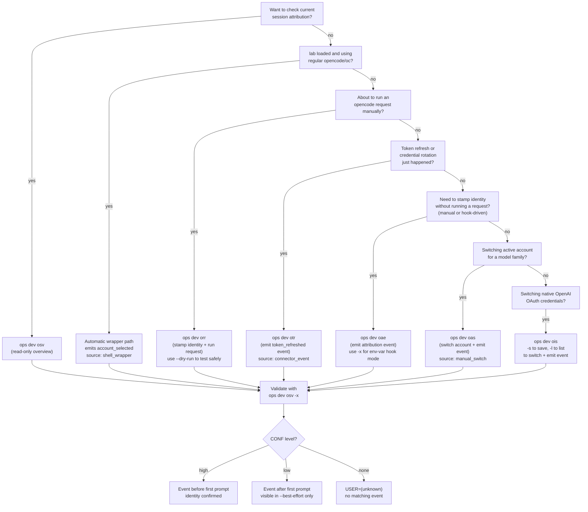

# 07 - Dev Session Attribution Workflow

OpenCode records sessions in a local SQLite database. With `lab` loaded, this
repo now installs an `opencode()` shell wrapper that emits attribution events
automatically before launching OpenCode, so normal `opencode` usage is
attributed by default.

For OpenAI sessions, the wrapper resolves identity locally (no network) from:
1) explicit `LAB_DEV_OPENAI_ACCOUNT_*_OVERRIDE` env vars,
2) runtime `OPENCODE_ATTR_*` env vars (when provider is OpenAI),
3) `~/.local/share/opencode/auth.json` (or `LAB_DEV_OPENAI_AUTH_FILE`).

Without `lab` loaded (or in non-wrapper environments), sessions still show
`USER=(unknown)` unless an attribution event is emitted before the first
prompt. This workflow covers both the automatic path and manual recovery
commands in the `dev` module.

Historical sessions without a pre-first-prompt event generally remain
`(unknown)` -- the goal is to wire attribution correctly for sessions going
forward.

This guide covers how to emit attribution events safely, validate strict vs
best-effort reporting, and troubleshoot common issues.

## Command Decision Flow

Attribution is automatic in the common `lab` path. Use this diagram to decide
when manual commands are still needed:



### Summary

| Command | When to use | Side effects |
|---------|-------------|--------------|
| `osv` | Check which sessions are attributed | Read-only |
| `opencode` / `oc` (with `lab`) | Default path; wrapper emits pre-session event automatically | Writes `account_selected` event (`source=shell_wrapper`) then launches OpenCode |
| `orr` | About to send a request to OpenCode | Writes event + runs `opencode run` |
| `otr` | Provider token was just refreshed or rotated | Writes `token_refreshed` event |
| `oae` | Stamp identity without running a request (manual or hook) | Writes attribution event |
| `oas` | Switch active account for a model family | Modifies `antigravity-accounts.json`, writes `account_selected` event (`source=manual_switch`) |
| `oaa` | Set global default active account | Modifies `activeIndex` in `antigravity-accounts.json`, writes `account_selected` event (`source=manual_switch`) |
| `ois` | Save / list / switch native OpenAI OAuth credentials | Reads/writes `openai-accounts.json` sidecar, replaces `openai` key in `auth.json`, writes `account_selected` event (`source=manual_switch`) |

## 1. Prerequisites and Safety

Load runtime in the current shell:

```bash
lab
```

Verify required commands:

```bash
ops --list
opencode --help
```

Safety boundaries:
- `ops dev osv ...` is read-only reporting.
- `opencode`/`oc` with `lab` loaded now writes automatic pre-session attribution events (`source=shell_wrapper`).
- OpenAI wrapper attribution persists only non-secret identity fields (account key/label); tokens are never persisted.
- `ops dev oae ...` and `ops dev otr ...` write local attribution events in the local OpenCode DB.
- `ops dev orr ...` writes an attribution event and then executes `opencode run`.
- `ops dev orr ... --dry-run -- ...` is the safest way to validate event wiring without running a real `opencode run` request.
- `ops dev ois -s/-l` is read-safe (save snapshots credentials; list is read-only). `ops dev ois <N>` modifies `auth.json` -- always creates a timestamped backup first.

## 2. Procedure

### Step 1: Capture strict baseline

```bash
ops dev osv -x -l 10
```

Expected baseline for older sessions is often:
- `USER=(unknown)`
- `SRC=none`
- `CONF=none`

This is expected when no pre-first-prompt attribution event exists.

### Step 2: Use automatic path (default) or emit request-time event manually

Default with `lab` loaded:

```bash
opencode
```

Fallback/manual path:

```bash
ops dev orr openai user@example.com --dry-run -- "healthcheck"
```

This writes an `account_selected` event without running a live `opencode run` request.

### Step 3: Validate overview again

```bash
ops dev osv -x -l 10
ops dev osv -x -l 10 --best-effort
```

Interpretation:
- strict (`ops dev osv -x`) only displays event-backed `CONF=high` identities.
- best-effort (`--best-effort`) can show `CONF=low` when only post-first-prompt matching events exist.

### Step 4: Run attributed requests for future sessions

```bash
ops dev orr openai user@example.com -- "summarize current git diff"
```

For provider refresh transitions:

```bash
ops dev otr openai user@example.com user@example.com connector_event
```

### Optional: Switch active account for a model family

```bash
ops dev oas claude 2
ops dev oas gemini 1
```

This modifies `antigravity-accounts.json` to route the given family to the
selected account (1-based), creates a timestamped backup, and emits an
`account_selected` event with `source=manual_switch`. Subsequent sessions
using that family will be attributed to the new account.

### Optional: Set global default active account

```bash
ops dev oaa 2
```

This updates the global `activeIndex` in `antigravity-accounts.json` using
1-based account selection, creates a timestamped backup, and emits an
`account_selected` event with `source=manual_switch`. Existing
`activeIndexByFamily` mappings are preserved.

### Optional: Switch active OpenAI account (native OAuth credentials)

`dev_ois` manages OpenAI native OAuth credentials stored in an external sidecar
(`~/.config/opencode/openai-accounts.json`) that this codebase fully owns.
Switching replaces the `openai` key in `~/.local/share/opencode/auth.json` with
the target snapshot's credentials. Override path with `LAB_DEV_OPENAI_ACCOUNTS_FILE`.

Save the current OpenAI credentials from `auth.json` into the sidecar:

```bash
ops dev ois -s                       # auto-detect label from JWT email claim
ops dev ois -s work@example.com      # override label
```

List all saved OpenAI accounts with index numbers (active account marked with `*`):

```bash
ops dev ois -l
```

Switch to a saved OpenAI account by 1-based index:

```bash
ops dev ois 1
ops dev ois 2
```

The switch mode:
- Creates a timestamped backup of `auth.json` before modifying it.
- Replaces the `openai` key in `auth.json` with the target snapshot.
- Updates `activeIndex` in the sidecar file.
- Records an `account_selected` attribution event via `_dev_record_account_event`.

After switching, `_dev_get_openai_account_identity` and the shell wrapper will
reflect the newly active account on the next `opencode` invocation.

**Note**: OpenAI OAuth tokens are time-bound. If a saved credential set has
expired, re-authenticate through OpenCode and save the refreshed credentials
with `ops dev ois -s` again.

### Optional: Emit events from runtime hook environment

```bash
export OPENCODE_ATTR_PROVIDER_ID="openai"
export OPENCODE_ATTR_ACCOUNT_KEY="user@example.com"
export OPENCODE_ATTR_ACCOUNT_LABEL="user@example.com"
export OPENCODE_ATTR_EVENT_TYPE="account_selected"
export OPENCODE_ATTR_SOURCE="opencode_runtime"
export OPENCODE_ATTR_SESSION_ID="ses_example123"
ops dev oae -x
```

`OPENCODE_ATTR_SESSION_ID` is optional but recommended when available so
`dev_osv` can prefer deterministic session-bound attribution over
provider-wide timeline fallback.

## 3. Expected Outcomes and Validation

Use this confidence model:
- `CONF=high`: matching provider event exists at or before session first prompt time and passes freshness gating for provider-wide fallback.
- `CONF=low`: post-first-prompt match (best-effort mode) or explicit stale OpenAI fallback (`SRC=auth_state_stale` or `SRC=provider_stale`) when no in-window OpenAI identity is available.
- `CONF=none`: no qualifying event for that provider/session.

Provider-wide fallback freshness window:
- By default, OpenAI provider-wide/legacy timeline events older than 60 minutes from first prompt are ignored to reduce stale cross-session bleed.
- Antigravity fallback now applies an account-inventory guard for real-domain identities: provider-wide/legacy candidates not present in `antigravity-accounts.json` are skipped.
- Override with `LAB_DEV_ATTR_PROVIDER_MAX_AGE_MS` (milliseconds). Set `0` to disable the freshness gate.

Antigravity inventory source:
- Default file: `$HOME/.config/opencode/antigravity-accounts.json`.
- Optional override for diagnostics/tests: `LAB_DEV_ANTIGRAVITY_ACCOUNTS_FILE=/path/to/antigravity-accounts.json`.

OpenAI auth-state fallback window:
- When no eligible event path resolves an OpenAI session, resolver can use local auth-state identity (`SRC=auth_state`) if auth-state file timing is near first prompt (before or shortly after prompt).
- Default window is 6 hours; override with `LAB_DEV_ATTR_OPENAI_AUTH_MAX_AGE_MS` (milliseconds). Set `0` to disable the freshness gate.
- If in-window OpenAI identity resolution still fails, resolver attempts explicit stale non-synthetic OpenAI fallbacks with low confidence before unresolved output:
  - `SRC=auth_state_stale` from local auth-state identity outside freshness window
  - `SRC=provider_stale` from stale provider timeline identity

### Provider normalization

Session provider IDs are normalized before matching against attribution events.
Antigravity sessions may report `providerID=google` (or other Google-prefixed
values); these are normalized to `antigravity` so they match events emitted by
the shell wrapper and `dev_oas`. Similarly, OpenAI-prefixed IDs normalize to
`openai`. This happens automatically in both the event emitter
(`_dev_normalize_provider_id`) and the session resolver (`_dev_osv_render`).

Quick DB validation:

```bash
sqlite3 "$HOME/.local/share/opencode/opencode.db" "SELECT datetime(time_ms/1000,'unixepoch','localtime') AS event_time, provider_id, account_key, event_type, source FROM opencode_account_event ORDER BY time_ms DESC LIMIT 20;"
```

## 4. Troubleshooting and Recovery

### `USER` still `(unknown)` in strict mode

Likely causes:
- shell wrapper not active (`lab` not loaded in current shell)
- no event exists before first prompt for that session
- event provider does not match session provider family
- event was emitted after the session already started
- available provider-wide event is older than freshness window and was intentionally ignored
- Antigravity candidate account is not present in current account inventory file
- local auth-state timestamp is outside OpenAI auth fallback window
- no non-synthetic stale OpenAI identity is available for stale fallback paths

Safe recovery:
1. confirm session provider in `ops dev osv -x --best-effort`
2. emit event with matching provider using `ops dev orr ... --dry-run -- ...` or `ops dev oae ...`
3. validate new sessions moving forward (historical rows may remain unknown)

### OpenAI identity resolved to unexpected account label

The wrapper uses local state first and does not call OpenAI APIs at launch.
If local auth state is stale or intentionally overridden, labels can differ.
Synthetic runtime placeholders (for example `audit-session@example.com`) are
ignored by the wrapper resolver so they do not override real local identity.

Force a temporary local override for wrapper-attributed sessions:

```bash
export LAB_DEV_OPENAI_ACCOUNT_KEY_OVERRIDE="acct-your-openai-account-id"
export LAB_DEV_OPENAI_ACCOUNT_LABEL_OVERRIDE="you@example.com"
opencode
```

Reset overrides after validation:

```bash
unset LAB_DEV_OPENAI_ACCOUNT_KEY_OVERRIDE
unset LAB_DEV_OPENAI_ACCOUNT_LABEL_OVERRIDE
```

### Wrapper active but no events emitted (lazy-load)

The `dev` module is lazy-loaded by default. The `opencode()` wrapper in
`cfg/ali/sta` handles this with a fallback path through `_orc_lazy_dispatch`.
If lazy dispatch is not available (e.g. a minimal `lab` load or a custom
sourcing chain), `_dev_auto_attribute` may silently not fire.

To verify:

```bash
declare -f _dev_auto_attribute   # should show function body
declare -f _orc_lazy_dispatch    # fallback dispatcher
```

If neither is available, force-load the dev module:

```bash
source "${LIB_OPS_DIR}/dev"
```

### Event emit command succeeds but no rows appear

Likely causes:
- runtime environment is not initialized (`lab` not loaded)
- `opencode` is not available in `PATH` for current shell
- local DB path is unavailable to the current user session

Safe recovery:

```bash
lab
opencode debug paths
ops dev oae openai user@example.com account_selected opencode_runtime user@example.com
```

Then rerun the sqlite query in section 3.

## 5. Related Docs

- Previous: [06 - Security and Logging](06-security-and-logging.md)
- CLI overview: [03 - CLI Usage and the DIC](03-cli-usage.md) (section 8)
- Architecture context: [doc/arc/04-dependency-injection.md](../arc/04-dependency-injection.md)
- Logging and errors: [doc/arc/07-logging-and-error-handling.md](../arc/07-logging-and-error-handling.md)
