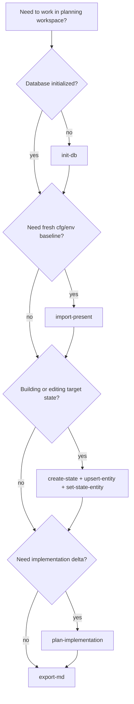

# 08 - Planning Workspace

This guide is for operators and contributors who need a local planning loop before making infrastructure changes. It explains how to use `utl/pla` to snapshot `cfg/env`, model target states, generate implementation deltas, and export reviewable planning artifacts.

## Command Decision Flow

Use this map to choose the right command for the current planning stage.



| Command | When to use | Side effects |
|---------|-------------|--------------|
| `init-db` | First run or workspace reset | Creates or updates local SQLite schema/seed at `utl/pla/data/ply.db` (or custom path) |
| `import-present` | Capture current `cfg/env` as a present-state snapshot | Reads `cfg/env/*`, writes `plg_cfg_snapshot` and `plg_state` rows |
| `create-state` | Create `prototype`/`desired`/`inventory` state records | Writes to `plg_state` |
| `upsert-entity` + `set-state-entity` | Define entities and include/exclude them in a state | Writes to `plg_entity` and `plg_state_entity` |
| `plan-implementation` | Compute present-vs-desired entity delta | Writes `plg_impl_plan` and ordered `plg_impl_step` rows |
| `export-md` | Produce human-readable review artifact | Writes markdown report under `utl/pla/export/` (or custom path) |

## 1. Prerequisites and Safety

- Run commands from repository root (for example `/home/es/lab`).
- `python3` is required; no external `sqlite3` binary is needed.
- `utl/pla` is local-first: commands modify local planning artifacts only.
- `import-present` reads `cfg/env/` content but does not modify `cfg/env/`.
- This workflow does not call `lib/ops/*` infrastructure functions.

Set reusable paths for examples:

```bash
DB=./utl/pla/data/ply.db
ENV_ROOT=./cfg/env
REPORT=./utl/pla/export/summary-default.md
```

## 2. Procedure

### Step 1: Initialize the workspace database

```bash
./utl/pla/cli init-db "$DB"
```

Expected result: schema and reference seed data are ensured in `"$DB"`.

### Step 2: Import present state from `cfg/env`

```bash
./utl/pla/cli import-present "$DB" "$ENV_ROOT" present-site1
```

Expected result: one `present` state (`present-site1`) and one config snapshot are recorded.

### Step 3: Model a desired state

```bash
./utl/pla/cli create-state "$DB" desired desired-site1 present-site1 candidate
./utl/pla/cli upsert-entity "$DB" service svc-traefik "Traefik"
./utl/pla/cli set-state-entity "$DB" desired-site1 svc-traefik included
```

Expected result: desired state exists and includes the modeled entity.

### Step 4: Generate implementation plan

```bash
./utl/pla/cli plan-implementation "$DB" present-site1 desired-site1
```

Expected result: a new draft plan with ordered steps is created in the database.

### Step 5: Export markdown snapshot for review

```bash
./utl/pla/cli export-md "$DB" "$REPORT"
```

Expected result: markdown snapshot is written and ready for git diff/review.

## 3. Expected Outcomes and Validation

Validate that database and report artifacts exist:

```bash
test -s ./utl/pla/data/ply.db
test -s ./utl/pla/export/summary-default.md
```

Validate core planning records:

```bash
python3 - <<'PY'
import sqlite3

conn = sqlite3.connect("./utl/pla/data/ply.db")
cur = conn.cursor()

print("states", cur.execute("SELECT COUNT(*) FROM plg_state").fetchone()[0])
print("plans", cur.execute("SELECT COUNT(*) FROM plg_impl_plan").fetchone()[0])

for row in cur.execute(
    "SELECT plan_id, status, generated_at FROM plg_impl_plan ORDER BY plan_id DESC LIMIT 3"
):
    print("plan", row[0], row[1], row[2])

conn.close()
PY
```

## 4. Troubleshooting and Recovery

### `missing required command: python3`

Install Python 3 and retry the same command.

### `env root not found: ...`

Pass a valid environment path:

```bash
./utl/pla/cli import-present ./utl/pla/data/ply.db ./cfg/env present-site1
```

### `baseline state not found: ...`

List available states and retry with an existing baseline name:

```bash
python3 - <<'PY'
import sqlite3

conn = sqlite3.connect("./utl/pla/data/ply.db")
for row in conn.execute(
    "SELECT state_id, kind, name, status FROM plg_state ORDER BY state_id DESC"
):
    print(row)
conn.close()
PY
```

### `state not found` / `entity not found`

Create missing records first (`create-state`, `upsert-entity`), then run `set-state-entity` or `plan-implementation` again.

### Reset the local planning workspace

If you need a clean local workspace, remove only planning artifacts and reinitialize:

```bash
rm -f ./utl/pla/data/ply.db ./utl/pla/export/summary-default.md ./utl/pla/export/inventory-summary.md
./utl/pla/cli init-db
```

Transition note: default `export-md` now writes `summary-default.md` and mirrors the same content to legacy `inventory-summary.md` for compatibility.

## 5. Related Docs

- Previous: [07 - Dev Session Attribution Workflow](07-dev-session-attribution-workflow.md)
- Next: [09 - doc/pro Workflow Board](09-doc-pro-workflow-board.md)
- Architecture context: [09 - Planning Subsystem Architecture](../arc/09-planning-subsystem.md)
- Local module reference: [utl/pla/README.md](../../utl/pla/README.md)
- Utility overview: [utl/README.md](../../utl/README.md)
