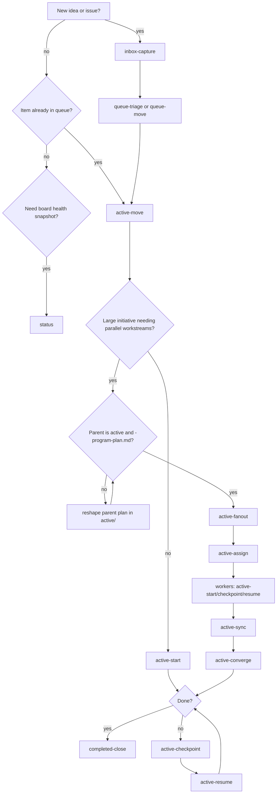

# 09 - wow Workflow Board

This guide is for operators and contributors who use `wow/` to plan and
execute multi-session work. It explains the manual, filesystem-native workflow
for moving items across states, running parallel orchestration for large
initiatives, and validating board integrity.

`wow/` is manual-by-invocation. Items do not auto-triage, auto-split, or
auto-fanout. State changes happen only when you run the matching workflow task.

## Command Decision Flow

Use this map to choose the right workflow task.



| Task | When to use | Side effects |
|------|-------------|--------------|
| `inbox-capture` | Capture a new idea, issue, or follow-up | Creates one file in `wow/inbox/` |
| `queue-triage` / `queue-move` | Move one inbox item to queue and classify design need | Moves one file to `wow/queue/`, updates triage section |
| `active-move` | Commit one queued item to execution | Moves file to `wow/active/`, adds execution/verification/exit sections |
| `active-start` | Begin execution for one active item | Updates active file progress sections |
| `active-artifacts` | Create/update supporting artifacts for one active item | Creates or updates artifact docs in `wow/active/` based on the plan contract |
| `active-checkpoint` / `active-resume` | Hand off work across context windows | Updates checkpoint and resumes execution state |
| `active-fanout` | Split one active program parent into child workstreams | Creates child plans in `wow/active/`, updates parent workstream table |
| `active-assign` | Bind child workstreams to owners/branches/worktrees | Updates parent + child orchestration metadata |
| `active-sync` | Roll up child status into parent | Updates parent workstream states and sync snapshot |
| `active-converge` | Converge a wave and decide next release gate | Updates parent convergence log; may create follow-up inbox item (or direct queue item when mandatory and priority-locked) |
| `completed-close` / `dismissed-close` | Close active work as accepted or rejected | Moves files to `completed/` or `dismissed/`; follow-ups default to inbox, with direct queue allowed for mandatory priority-locked items |
| `status` | Read-only board overview | No file changes |
| `maintenance` | Weekly structural hygiene pass | May fix checker-detected structure only (no state moves without approval) |

## 1. Prerequisites and Safety

- Work from repository root (for example `/home/es/lab`).
- Use `wow/task/*` templates as the first prompt input, followed by the
  target file path (or free-form capture text where required).
- Run structural validation with `bash wow/check-workflow.sh` before and
  after workflow transitions.
- Safety boundaries:
  - `wow/check-workflow.sh` is read-only validation.
  - Workflow task execution edits workflow docs and can move files across
    workflow states.
  - `wow/` operations do not execute `lib/ops/*` infrastructure actions.
  - Parallel orchestration is explicit and manual. There is no background
    process that auto-creates workstreams.

## 2. Procedure

### Step 1: Validate board baseline

```bash
bash wow/check-workflow.sh
```

Optional read-only status review:

```text
wow/task/status
```

Expected result: checker passes, or reports concrete structural failures you can
fix before continuing.

### Step 2: Capture and triage work (`inbox` -> `queue`)

Create a new item:

```text
wow/task/inbox-capture
Add account rotation health checks for dev session attribution
```

Prioritize one item into queue:

```text
wow/task/queue-triage
```

Or move a specific inbox file:

```text
wow/task/queue-move
wow/inbox/20260307-1000_account-rotation-healthcheck-plan.md
```

Expected result: exactly one queued file with `## Triage Decision` and canonical
design token (`Design: required` or `Design: not needed`).

### Step 3: Start active execution (`queue` -> `active`)

```text
wow/task/active-move
wow/queue/20260307-1000_account-rotation-healthcheck-plan.md
```

Then start execution:

```text
wow/task/active-start
wow/active/20260307-1000_account-rotation-healthcheck-plan.md
```

Optional: materialize review/support artifacts defined by the active plan:

```text
wow/task/active-artifacts
wow/active/20260307-1000_account-rotation-healthcheck-plan.md
```

Expected result: active item has `## Execution Plan`, `## Verification Plan`,
and `## Exit Criteria`; execution begins immediately.

### Step 4: Trigger parallel mode manually when needed (`active` only)

Use this only for large initiatives. Preconditions:

1. Parent item is already in `wow/active/`.
2. Parent filename ends with `-program-plan.md`.
3. Parent includes `## Workstreams` and required program sections.

Fan out child workstreams:

```text
wow/task/active-fanout
wow/active/20260307-1015_identity-migration-program-plan.md
```

Assign owners/branches/worktrees:

```text
wow/task/active-assign
wow/active/20260307-1015_identity-migration-program-plan.md
```

Expected result: one parent program file plus child workstream files in
`wow/active/`, with complete `## Orchestration Metadata` per child.

### Step 5: Run worker cycles and parent convergence

Workers execute child plans with normal active tasks:

```text
wow/task/active-start
wow/active/20260307-1020_identity-migration-ws-01-plan.md
```

Coordinator synchronizes and converges waves:

```text
wow/task/active-sync
wow/active/20260307-1015_identity-migration-program-plan.md

wow/task/active-converge
wow/active/20260307-1015_identity-migration-program-plan.md
```

Expected result: parent `## Workstreams`, `## Sync Snapshot`, and
`## Convergence Log` reflect current dependency/gate status.

### Step 6: Close work

Single-plan close:

```text
wow/task/completed-close
wow/active/20260307-1000_account-rotation-healthcheck-plan.md
```

Program close follows the same close task once parent and children meet exit
criteria.

Expected result: completed artifacts live under
`wow/completed/yyyymmdd-hhmm_<topic>/` with timestamp-correct structure.

Follow-up routing on close:

- Default: create follow-up items in `wow/inbox/`.
- Direct `wow/queue/` creation is allowed only when the follow-up is
  mandatory, scope is already clear, and priority is already locked.
- For direct queue routing, record in `## What remains`:
  `Routing: queue (mandatory follow-up)` with a one-line rationale.

## 3. Expected Outcomes and Validation

After any transition set:

```bash
bash wow/check-workflow.sh
```

Success indicators:

- Checker returns `Workflow check passed.`
- Folder location matches each file `- Status:` header.
- Queue/active docs have exactly one `## Triage Decision` section with canonical
  design token.
- Program docs include required sections (`Program Scope`, `Global Invariants`,
  `Workstreams`, `Integration Cadence`).
- Child docs with `## Orchestration Metadata` include all required keys and
  valid dependency tokens.

For architecture-sensitive `lib/` changes, run the confidence gate before close:

```bash
./val/lib/confidence_gate.sh --risk medium lib/ops/pve lib/gen/aux
```

Use `--risk low|medium|high` per change impact, and `--dry-run` to preview the
required verification commands.

## 4. Troubleshooting and Recovery

### "Big item did not split automatically"

This is expected. Run `active-fanout` explicitly from an active
`*-program-plan.md` parent.

### `active-fanout` cannot proceed

Fix parent preconditions first:

- move item to `active/` if still in `queue/`
- ensure filename ends with `-program-plan.md`
- ensure parent has `## Workstreams`

Then rerun `active-fanout`.

### Checker fails orchestration metadata

Open the reported child file and correct missing/invalid keys in
`## Orchestration Metadata`, then rerun checker.

### Checker reports dependency missing or cycle

- Ensure `Depends-On` references existing sibling `Workstream-ID` values under
  the same `Program`.
- Remove self-dependencies and cycles.
- Rerun `bash wow/check-workflow.sh`.

### Session handoff needs pause/resume

Use `active-checkpoint` before closing context and `active-resume` in the next
context so blockers and next actions stay explicit.

## 5. Related Docs

- Previous: [08 - Planning Workspace](08-planning-workspace.md)
- Workflow rules: [wow/README.md](../../wow/README.md)
- Task contracts: [wow/task/README.md](../../wow/task/README.md)
- Shared task rules: [wow/task/RULES.md](../../wow/task/RULES.md)
- Architecture rationale: [08 - Workflow Architecture](../arc/08-workflow-architecture.md)
