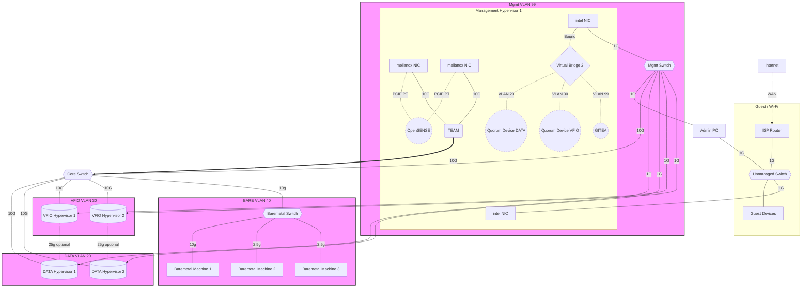
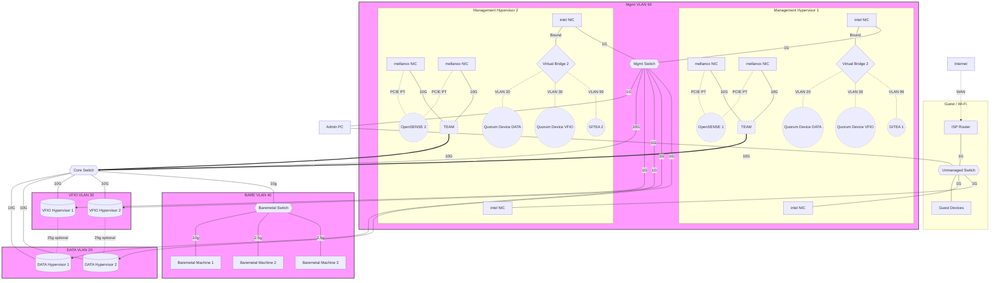
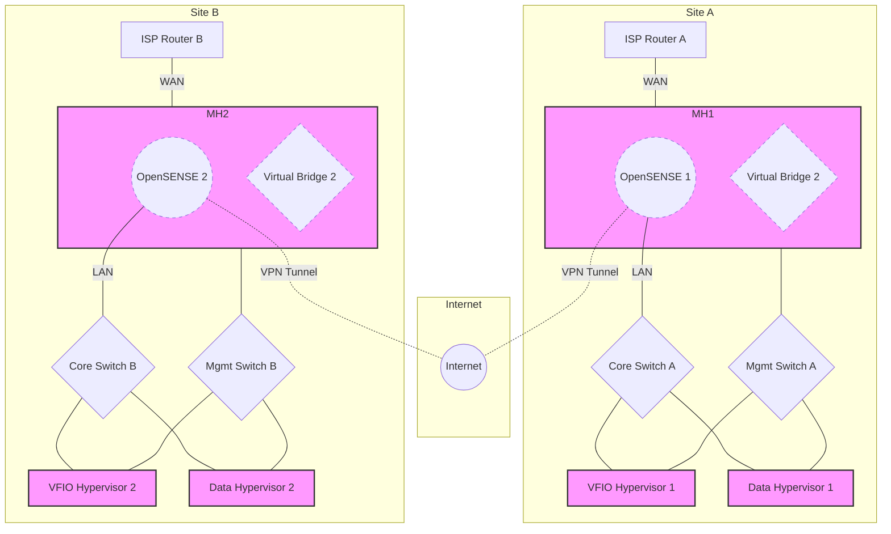
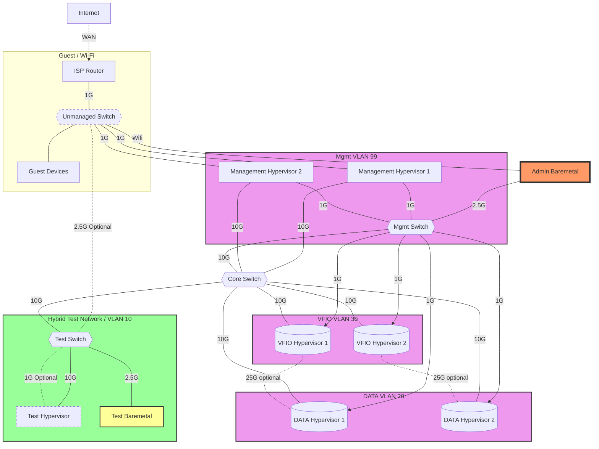
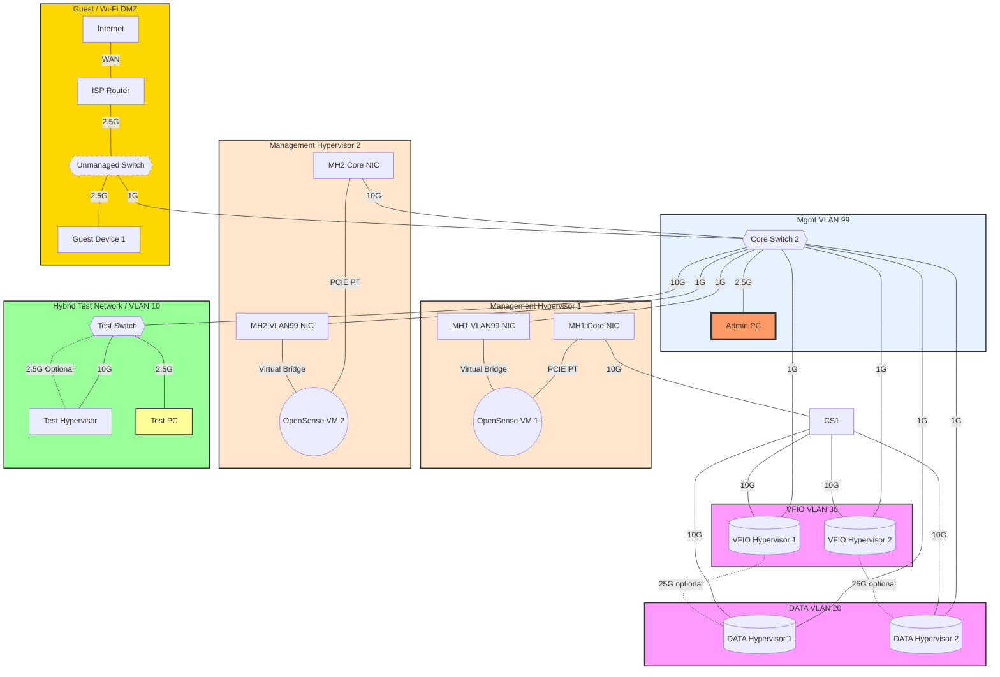
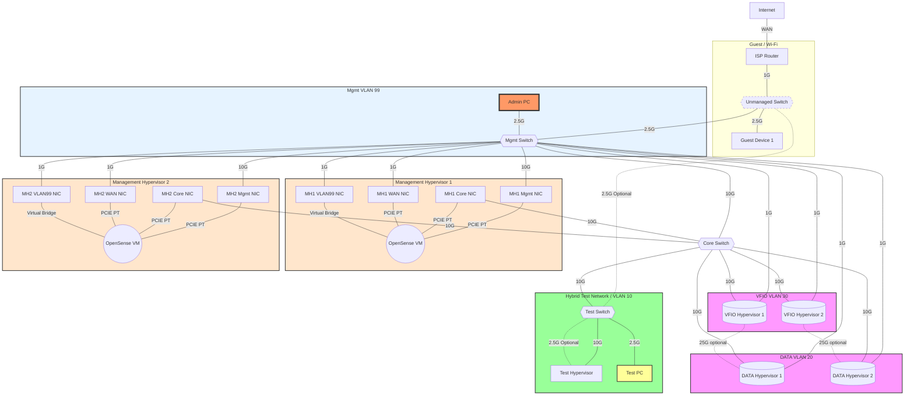

<!--
#######################################################################
# Network Topology Documentation - Collection 1
#######################################################################
# File: /home/es/lab/doc/net/ntcoll-1.md
# Description: Comprehensive network topology visualization and
#              documentation using Mermaid diagrams for lab environment
#              infrastructure mapping and connectivity analysis.
#
# Author: Network Architecture Team
# Created: 2025-05-28
# Updated: 2025-05-28
# Version: 1.0.0
# Category: Technical Documentation - Network
#
# Document Purpose:
#   Provides detailed network topology diagrams and connectivity
#   documentation for understanding infrastructure layout, device
#   relationships, and network flow within the lab environment.
#
# Technical Scope:
#   - Management hypervisor network configurations
#   - PCIe passthrough networking setups
#   - Inter-device connectivity mapping
#   - Network interface card assignments
#
# Target Audience:
#   Network engineers, infrastructure architects, and system
#   administrators responsible for network planning, troubleshooting,
#   and infrastructure maintenance in virtualized environments.
#
# Dependencies:
#   - Mermaid diagram rendering support
#   - Network infrastructure components
#   - Hypervisor platform configurations
#######################################################################
-->

# Network Topology Graphs











```mermaid
graph TD
    INT[Internet] --- |WAN| ISPR[ISP Router]
    ISPR --- |"1G"| CS{{Core Switch}}
    ISPR ---|"2.5G"| US{{Unmanaged Switch}}
    US ---|"2.5G"| GD[Guest Device 1]
    CS ---|"10G"| MS{{Mgmt Switch}}
    AP[Admin PC] ---|"2.5G"| MS
    MS ---|"1G"| MH1NIC3[MH1 VLAN99 NIC]
    MS ---|"1G"| MH2NIC3[MH2 VLAN99 NIC]
    MS ---|"1G"| DH1
    MS ---|"1G"| DH2
    MS ---|"1G"| VH1
    MS ---|"1G"| VH2
    MH1NIC2[MH1 Core NIC] ---|"10G"| CS
    MH2NIC2[MH2 Core NIC] ---|"10G"| CS
    CS ---|"10G"| DH1[(DATA Hypervisor 1)]
    DH1 ---|"25G"| DH2[(DATA Hypervisor 2)]
    CS ---|"10G"| VH1[(VFIO Hypervisor 1)]
    CS ---|"10G"| VH2[(VFIO Hypervisor 2)]
    VH1 -.-|"25G optional"| DH1
    VH2 -.-|"25G optional"| DH2
    CS ---|"10G"| TS{{Test Switch}}
    TS ---|"10G"| TH[Test Hypervisor]
    TS -.-|"2.5G Optional"| TH
    TS ---|"2.5G"| TM[Test PC]
    subgraph MH1[Management Hypervisor 1]
        MH1NIC2 ---|"PCIE PT"| OPN1((OpenSense VM))
        MH1NIC3 ---|"Virtual Bridge"| OPN1
    end
    subgraph MH2[Management Hypervisor 2]
        MH2NIC2 ---|"PCIE PT"| OPN2((OpenSense VM))
        MH2NIC3 ---|"Virtual Bridge"| OPN2
    end
    subgraph VLAN20 [DATA VLAN 20]
        DH1
        DH2
    end
    subgraph VLAN30 [VFIO VLAN 30]
        VH1
        VH2
    end
    subgraph VLAN10 [Hybrid Test Network / VLAN 10]
        TS
        TH
        TM
    end
    subgraph VLAN99 [Mgmt VLAN 99]
        MS
        AP
        MH1NIC3
        MH2NIC3
    end
    subgraph Guest [Guest / Wi-Fi DMZ]
        US
        GD
        ISPR
    end
    classDef vlan fill:#f9f,stroke:#333,stroke-width:2px;
    class VLAN20,VLAN30 vlan;
    classDef vlan99 fill:#e6f3ff,stroke:#333,stroke-width:2px;
    class VLAN99 vlan99;
    classDef hybridtestnet fill:#9f9,stroke:#333,stroke-width:2px;
    class VLAN10 hybridtestnet;
    classDef mghypervisor fill:#ffe6cc,stroke:#333,stroke-width:2px;
    class MH1,MH2 mghypervisor;
    classDef optional stroke-dasharray: 5 5;
    class US optional;
    classDef adminpc fill:#f96,stroke:#333,stroke-width:4px;
    class AP adminpc;
    classDef testmachine fill:#ff9,stroke:#333,stroke-width:2px;
    class TM testmachine;
    classDef dmz fill:#ffd700,stroke:#333,stroke-width:2px;
    class Guest dmz;
 ```
```mermaid
graph TD
    INT[Internet] --- |WAN| ISPR[ISP Router]
    US --- |"2.5G"| CS{{Core Switch}}
    ISPR ---|"2.5G"| US{{Unmanaged Switch}}
    US ---|"2.5G"| GD[Guest Device 1]
    CS ---|"10G"| MS{{Mgmt Switch}}
    AP[Admin PC] ---|"2.5G"| MS
    MS ---|"1G"| MH1NIC3[MH1 VLAN99 NIC]
    MS ---|"1G"| MH2NIC3[MH2 VLAN99 NIC]
    MS ---|"1G"| DH1
    MS ---|"1G"| DH2
    MS ---|"1G"| VH1
    MS ---|"1G"| VH2
    MH1NIC2[MH1 Core NIC] ---|"10G"| CS
    MH2NIC2[MH2 Core NIC] ---|"10G"| CS
    CS ---|"10G"| DH1[(DATA Hypervisor 1)]
    DH1 ---|"25G"| DH2[(DATA Hypervisor 2<br>Cold Standby)]
    DH2 ---|"10G"| MS
    CS ---|"10G"| VH1[(VFIO Hypervisor 1)]
    CS ---|"10G"| VH2[(VFIO Hypervisor 2)]
    CS ---|"10G"| TS{{Test Switch}}
    TS ---|"10G"| TH[Test Hypervisor]
    TS -.-|"2.5G Optional"| TH
    TS ---|"2.5G"| TM[Test PC]
    VBA{Virtual Bridge A} -..- QDD((QDev Data))
    VBA{Virtual Bridge A} -..- QDV((QDev VFIO))

    subgraph MH1[Meta Hypervisor 1]
        MH1NIC2 ---|"PCIE PT"| OPN1((OpenSense VM 1))
        MH1NIC3
    end
        MH1NIC3 --- VBA

    subgraph MH2[Meta Hypervisor 2]
        MH2NIC2 ---|"PCIE PT"| OPN2((OpenSense VM 2))
        MH2NIC3
    end
        MH2NIC3 --- VBA

    subgraph VLAN20 [DATA VLAN 20]
        DH1
    end

    subgraph VLAN30 [VFIO VLAN 30]
        VH1
        VH2
    end

    subgraph VLAN10 [Hybrid Test Network / VLAN 10]
        TS
        TH
        TM
    end

    subgraph VLAN99 [Mgmt VLAN 99]
        MS
        AP
        MH1NIC3
        MH2NIC3
        DH2
        QDD
        QDV
    end

    subgraph Guest [Guest / Wi-Fi DMZ]
        US
        GD
        ISPR
    end
    classDef vlan fill:#f9f,stroke:#333,stroke-width:2px;
    class VLAN20,VLAN30 vlan;

    classDef vlan99 fill:#e6f3ff,stroke:#333,stroke-width:2px;
    class VLAN99 vlan99;

    classDef hybridtestnet fill:#9f9,stroke:#333,stroke-width:2px;
    class VLAN10 hybridtestnet;

    classDef metahypervisor fill:#ffe6cc,stroke:#333,stroke-width:2px;
    class MH1,MH2,VBA metahypervisor;

    classDef optional stroke-dasharray: 5 5;
    class US optional;

    classDef adminpc fill:#f96,stroke:#333,stroke-width:4px;
    class AP adminpc;

    classDef testmachine fill:#ff9,stroke:#333,stroke-width:2px;
    class TM testmachine;

    classDef dmz fill:#ffd700,stroke:#333,stroke-width:2px;
    class Guest dmz;

    classDef quorum fill:#ff7f50,stroke:#333,stroke-width:2px;
    class QDD quorum;

    classDef coldstandby fill:#c0c0c0,stroke:#333,stroke-width:2px;
    class DH2 coldstandby;
 ```

