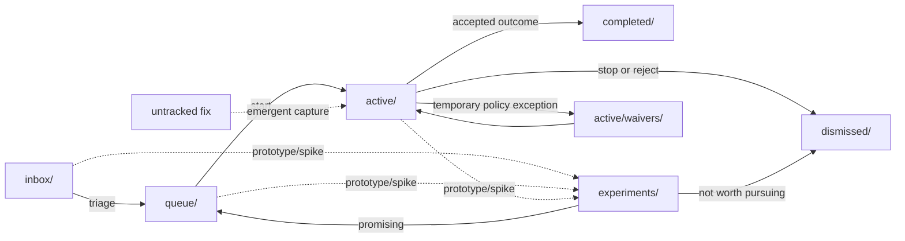

# Project Workflow (`doc/pro`)

This folder is your lightweight project board.

Use it to move work through clear states:

`inbox` -> `queue` -> `active` -> `completed` (or `dismissed`)

## Workflow diagram



## Folder meanings

- `inbox/`: ideas, issues, plans, and tasks you might do later
- `queue/`: prioritized items ready to start next
- `active/`: work currently in progress
  - `active/waivers/`: temporary policy waivers tied to active items
- `completed/`: finished work with final outcome documented
- `dismissed/`: ideas you decided not to do (with a short reason)
- `experiments/`: alternative approaches/prototypes

## Filename timestamp rule (required)

Workflow item markdown files in these folders must use this prefix format:

- `inbox/`, `queue/`, `active/`, `completed/`, `dismissed/`, `experiments/`

- `yyyymmdd-hhmm_filename`

Where `yyyymmdd-hhmm` is the file creation time for that work item.

Keep this prefix stable after creation to avoid noisy rename churn.

Root meta/support files directly under `doc/pro/` (for example checklist and
checker helpers) do not require timestamp prefixes.

When you update a file in this folder tree:

1. Keep the existing filename prefix unchanged.
2. Update the `- Updated:` field in the document header.
3. Rename only if the topic slug or folder state changes.

Examples:

- `20260228-0940_inbox-item-plan.md`

## Recommended flow (best practice)

1. Capture in `inbox/`
   - Add new ideas quickly.
   - Keep one file per idea/issue/plan.

2. Prioritize -> move to `queue/`
   - Move files from `inbox/` to `queue/` once they are triaged and prioritized.
   - During triage, classify design need (see `agentic-workflow-prompts.md`
     templates 2-3). Answer two questions:
     1. Are there meaningful alternatives for how to solve this?
     2. Will other code or users depend on the shape of the output?
   - If either is yes: mark `Design: required` in the `## Triage Decision`.
   - If both are no: mark `Design: not needed`.
   - Use exactly one canonical token line: `Design: required` or
     `Design: not needed`.
   - Do not use legacy wording such as `Design required: Yes/No`.
   - This classification determines how the Execution Plan is structured when
     the item moves to `active/`.

3. Start work -> move to `active/`
   - Move the file from `queue/` to `active/` when you commit to doing it.
   - If helpful, prefix with sequence number (`0-`, `1-`, `2-`) to show execution order.
   - **Planned work** must pass through `queue/` first. Triage is where the
     design question gets answered; skipping it means starting work without
     knowing what kind of work it is.
   - **Emergent work** (a quick fix that grew beyond a single-session scope)
     may enter `active/` directly via retroactive capture (`active-capture`
     task). The capture document must include escalation rationale, the two
     triage design questions answered inline, and a progress checkpoint.
     This is not a shortcut for skipping triage — it is recognition that
     triage happened implicitly when you decided the work was worth
     continuing.

4. Execute and review in `active/`
   - Yes: review notes can stay in `active/` while work is still open.
   - Keep review files tied to the same topic slug (example: `ana-...-review.md`).

5. Finish -> move to `completed/`
   - When implementation + review are accepted, move related files to `completed/`.
   - Add a short final section: what changed, what was verified, what remains.

6. Reject -> move to `dismissed/`
   - If you decide not to continue, move the file to `dismissed/`.
   - Add one or two lines explaining why (obsolete, too risky, low value, duplicate, etc.).

## State entry/exit criteria

| State | Enter when | Exit when |
|---|---|---|
| `inbox/` | idea captured, not yet prioritized | triaged and priority decided |
| `queue/` | ready to execute, waiting for capacity | work starts (`active/`) or cancelled (`dismissed/`) |
| `active/` | owner is actively executing now | accepted outcome (`completed/`) or stopped (`dismissed/`) |
| `experiments/` | spike/prototype is needed before commitment | promote to `queue/` or close in `dismissed/` |
| `completed/` | implementation/review accepted with evidence | no further state transition; follow-up becomes a new item |
| `dismissed/` | item explicitly not pursued | no further state transition; revisit as a new item |

## Important rule

If something is in `active/`, it is not done yet.

- Review notes in `active/` are normal while work is ongoing.
- Once the result is acceptable, move both the plan and review notes to `completed/`.

## Keep `completed/` organized

Use one subfolder per finished topic, **prefixed with the completion timestamp**:

- Format: `completed/yyyymmdd-hhmm_<topic>/<files>.md`
- The **folder timestamp** is the completion date (when the topic moved to `completed/`).
- The **file timestamps** inside are creation dates (when the artifact was first written).
- The folder timestamp must be the same as or later than every file timestamp in that folder.
- This gives two independent timelines: `ls completed/` shows when work finished;
  `ls completed/<topic>/` shows how it evolved.

Example:

```
completed/20260301-1500_ana-module-expansion/
    20260227-0310_plan.md          # created early
    20260227-0310_result.md        # created early
```

`ls completed/` sorts chronologically by completion date without needing an index.

## Minimal document template

Use this header at the top of each work file:

```md
# <Title>

- Status: inbox | queue | active | experiment | completed | dismissed
- Owner: <name>
- Started: YYYY-MM-DD
- Updated: YYYY-MM-DD
- Links: related files/PRs/tests
```
## Validation helpers

- Checklist (quick pre-commit review):
  - File names follow folder naming rules (`inbox`, `dismissed`).
  - Workflow item files use `yyyymmdd-hhmm_filename` prefix.
  - Filename timestamp prefix is creation time and stays stable after creation.
  - On content edits, update the `Updated` header field instead of renaming.
  - Root meta/support files under `doc/pro/` do not need timestamp prefixes.
  - Every workflow doc has header fields: `Status`, `Owner`, `Started`, `Updated`, `Links`.
  - Dismissed docs include `## Dismissal Reason`.
  - `active/` contains only in-progress items.
  - `active/waivers/*_waiver-register.md` entries include owner, expiry date, and removal criteria.
  - Completed topics live under `completed/yyyymmdd-hhmm_<topic>/` (folder timestamp = completion date).
- Checker script: `bash doc/pro/check-workflow.sh`

## Checker behavior

`bash doc/pro/check-workflow.sh` currently enforces:

- Timestamp prefix format for workflow docs: `yyyymmdd-hhmm_filename`
- Required header fields in workflow-header docs across workflow folders: `Status`, `Owner`, `Started`, `Updated`, `Links`
- Status must match destination folder (`inbox`, `queue`, `active`, `experiment`, `completed`, `dismissed`)
- Queue/active docs contain exactly one `## Triage Decision` section
- Queue/active docs include exactly one canonical design token in triage:
  `Design: required` or `Design: not needed`
- Queue/active docs do not use legacy triage token form: `Design required: Yes/No`
- Inbox naming pattern (`-plan`, `-issue`, `-review`, `-followup`)
- Dismissed naming pattern (`-plan`) and required `## Dismissal Reason`
- Completed structure: `completed/yyyymmdd-hhmm_<topic>/<file>.md`
- Completed topic folders: direct children of `completed/` must match `yyyymmdd-hhmm_<topic>`
- Completed topic folders are non-empty (must contain at least one markdown artifact)
- Completed chronology: folder completion timestamp is not older than file creation timestamp prefixes

It does not currently enforce:

- Stale-item age checks for `active/`
- Verification depth/quality in completed outcomes
- Queue prioritization quality

Common fixes when it fails:

- `FAIL timestamp prefix`: rename file to `yyyymmdd-hhmm_filename`
- `FAIL header`: add missing header fields near the top of the document
- `FAIL completed structure`: move file to `completed/<yyyymmdd-hhmm_topic>/`
- `FAIL completed folder timestamp`: rename folder to `yyyymmdd-hhmm_<topic>`
- `FAIL completed topic folder`: rename topic folder to `yyyymmdd-hhmm_<topic>`
- `FAIL completed topic folder empty`: remove empty folder or move related completed docs into it
- `FAIL completed folder chronology`: rename completed folder timestamp to the actual close time (must be >= file timestamps)
- `FAIL dismissal reason`: add `## Dismissal Reason` section in dismissed item
- `FAIL triage decision missing`/`duplicate`: add one `## Triage Decision` section
- `FAIL triage design token`/`legacy token`: use exactly one canonical token,
  `Design: required` or `Design: not needed`

Recommended habit: run the checker before and after any workflow move.

---

Keep this README focused on workflow rules and checker behavior.
Track actionable improvements as work items under `doc/pro/inbox/`.
