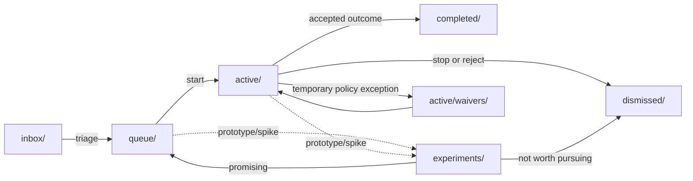

# Project Workflow (`doc/pro`)

This folder is your lightweight project board.

Use it to move work through clear states:

`inbox` -> `queue` -> `active` -> `completed` (or `dismissed`)

## Workflow diagram



## Folder meanings

- `inbox/`: ideas, plans, and tasks you might do later
- `queue/`: prioritized items ready to start next
- `active/`: work currently in progress
  - `active/waivers/`: temporary policy waivers tied to active items
- `completed/`: finished work with final outcome documented
- `dismissed/`: ideas you decided not to do (with a short reason)
- `experiments/`: alternative approaches/prototypes

## Filename timestamp rule (required)

Workflow item markdown files in these folders must use this prefix format:

- `inbox/`, `queue/`, `active/`, `completed/`, `dismissed/`, `experiments/`

- `yyyymmdd-hhmm_filename`

Where `yyyymmdd-hhmm` is the last touch time from git history for that file.

Root meta/support files directly under `doc/pro/` (for example checklist and
checker helpers) do not require timestamp prefixes.

When you update a file in this folder tree:

1. Get the latest touch time from git for that file.
2. Rename the file so the prefix matches that time.
3. Keep the original filename after the underscore.

Examples:

- `20260228-0940_inbox-item-plan.md`

## Recommended flow (best practice)

1. Capture in `inbox/`
   - Add new ideas quickly.
   - Keep one file per idea/plan.

2. Prioritize -> move to `queue/`
   - Move files from `inbox/` to `queue/` once they are triaged and prioritized.

3. Start work -> move to `active/`
   - Move the file from `queue/` to `active/` when you commit to doing it.
   - If helpful, prefix with sequence number (`0-`, `1-`, `2-`) to show execution order.

4. Execute and review in `active/`
   - Yes: review notes can stay in `active/` while work is still open.
   - Keep review files tied to the same topic slug (example: `ana-...-review.md`).

5. Finish -> move to `completed/`
   - When implementation + review are accepted, move related files to `completed/`.
   - Add a short final section: what changed, what was verified, what remains.

6. Reject -> move to `dismissed/`
   - If you decide not to continue, move the file to `dismissed/`.
   - Add one or two lines explaining why (obsolete, too risky, low value, duplicate, etc.).

## Important rule for your question

If something is in `active/`, it is not done yet.

- Review notes in `active/` are normal while work is ongoing.
- Once the result is acceptable, move both the plan and review notes to `completed/`.

## Keep `completed/` organized

Use one subfolder per finished topic.

- Example: `completed/ana-module-expansion/20260227-0310_plan.md`, `20260227-0310_result.md`
- This keeps all plan/review/result artifacts together and matches checklist expectations.

## Minimal document template

Use this header at the top of each work file:

```md
# <Title>

- Status: inbox | active | completed | dismissed
- Owner: <name>
- Started: YYYY-MM-DD
- Updated: YYYY-MM-DD
- Links: related files/PRs/tests
```

## WIP limit (recommended)

To avoid overload as a solo developer:

- Keep at most 1-3 items in `active/`.
- Finish or dismiss before starting many new ones.

## Validation helpers

- Checklist: `doc/pro/workflow-checklist.md`
- Checker script: `bash doc/pro/check-workflow.sh`

## Room for improvement

1. Define explicit entry/exit criteria per state in one small table (for faster triage).
2. Enforce `completed/<topic>/` structure in `check-workflow.sh` so docs and automation stay aligned.
3. Add a stale-item rule (for example, review any `active/` item with no update in 7 days).
4. Require each completed topic to include a short `result` section with verification evidence.

---

This workflow is already strong. The next gains come from tightening acceptance criteria and aligning documentation conventions with automated checks.
