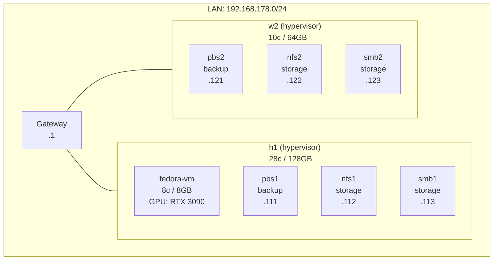

# Homelab Environment Planner -- utl/lab Module Design

- Status: inbox
- Owner: es
- Started: n/a
- Updated: 2026-03-02
- Links: utl/README.md, cfg/env/site1, doc/arc/00-architecture-overview.md

## Goal

Design a standalone utility module (`utl/lab/`) that lets users maintain a
structured inventory of their entire homelab -- from network layer through
physical machines, hypervisors, VMs/containers, storage, and services -- then
use that data to generate LLM context for infrastructure advice and produce
Mermaid diagrams automatically.

## Problem

Planning homelab infrastructure currently lives in people's heads, scattered
spreadsheets, or ad-hoc notes. There is no structured, versionable dataset
that captures the full picture (hardware, topology, allocations, services)
in a way that is both human-editable and machine-readable. Without that
foundation, you cannot:

- Ask an LLM meaningful questions about your infrastructure layout
- Auto-generate topology or resource-allocation diagrams
- Detect over-provisioning, gaps, or optimization opportunities
- Compare planned vs. current state

## Design Decisions

### Data format: JSON (primary) + CSV (import/export bridge)

**Why not SQLite:** Not installed on the system. Adds a binary dependency for
what is fundamentally a document-shaped dataset. The relationships are shallow
(host has VMs, VM has services) -- not deeply relational.

**Why not LibreOffice-only:** Opaque binary format, poor diffing in git,
fragile conversion tooling. But the spreadsheet use case is real -- people
want to edit tabular data visually.

**Chosen approach:**

- **JSON is the source of truth** -- one file per environment
  (`utl/lab/data/<env>.json`). Human-readable, git-diffable, queryable with
  `jq` (already available on the system).
- **CSV is the import/export bridge** -- `utl/lab/csv` script converts
  JSON <-> CSV per entity type so users can edit in LibreOffice/Excel, then
  re-import. Each entity type maps to one CSV file (hosts.csv, vms.csv, etc.).
- **Future option:** if SQLite becomes available, a `utl/lab/db` script could
  materialize the JSON into SQLite for complex queries. Not in scope now.

### LLM integration: three-tier approach

**Tier 1 -- Context export (immediate, no dependencies):**
A `utl/lab/ctx` script reads the JSON dataset and produces a structured
plain-text summary optimized for LLM context windows. The user pastes this
into any LLM chat. This works today with zero API keys or tooling.

Output format is a compact Markdown document with sections per layer
(network, hosts, compute, storage, services) including resource totals and
a natural-language summary. Designed to fit in ~2-4K tokens for a typical
homelab.

**Tier 2 -- CLI pipe (requires API key):**
A `utl/lab/ask` script wraps context export + a user question, pipes it to
an LLM API (OpenAI-compatible endpoint, configurable). Returns structured
advice. Uses `curl` -- no Python/Node dependency.

```
utl/lab/ask "Should I move the PBS container to w2 given its lower core count?"
```

**Tier 3 -- MCP server (most advanced, future scope):**
Model Context Protocol lets LLM tools (Claude Desktop, OpenCode, etc.) pull
live homelab data on demand. An MCP server would expose the JSON dataset as
resources and offer tools like `get_host`, `list_vms`, `suggest_placement`.

MCP is the most powerful option but requires a server process (likely
TypeScript or Python). Marked as future scope -- the JSON dataset and
context export are prerequisites regardless.

### Mermaid generation: template-based with LLM enhancement

**Phase 1 -- Deterministic generation:**
A `utl/lab/dia` script reads the JSON and produces Mermaid diagram code
for standard views using `jq` transformations + bash templates:

- Network topology (nodes, connections, VLANs, subnets)
- Architecture/deployment (hosts -> VMs -> services)
- Resource allocation (CPU/RAM/GPU distribution as annotations)

This produces correct but basic diagrams every time, no LLM needed.

**Phase 2 -- LLM-enhanced diagrams:**
The `utl/lab/ask` script can accept `--diagram` flag, which sends the
dataset to the LLM with instructions to produce optimized Mermaid code
with better layout, grouping, and visual hierarchy than templates can
achieve. The LLM output is validated (basic syntax check) before saving.

**Output location:** `utl/lab/out/` directory, timestamped files:
`<env>-<view>-<timestamp>.mmd`

## Data Model

### Entity types and their attributes

The schema covers 8 entity types arranged in a containment hierarchy:

```
site
  └── network (vlans, subnets, gateways)
  └── host (physical machines)
        ├── gpu (PCI devices)
        ├── storage (disks, pools, datasets, mounts)
        ├── vm (virtual machines)
        │     └── service
        └── container (LXC)
              └── service
```

### JSON schema overview

```json
{
  "schema_version": "1.0",
  "environment": "site1",
  "description": "Production homelab",
  "updated": "2026-03-02",

  "network": {
    "subnets": [
      {
        "name": "lan",
        "cidr": "192.168.178.0/24",
        "gateway": "192.168.178.1",
        "vlan": null,
        "description": "Main LAN"
      }
    ],
    "dns": {
      "nameserver": "192.168.178.1",
      "searchdomain": "lan.local"
    }
  },

  "hosts": [
    {
      "id": "h1",
      "role": "hypervisor",
      "description": "Primary Proxmox node",
      "hardware": {
        "cpu": { "model": "Xeon W-2175", "cores": 28, "sockets": 1 },
        "memory_gb": 128,
        "nics": [
          { "name": "enp0s31f6", "mac": null, "ip": "192.168.178.110", "subnet": "lan" }
        ]
      },
      "gpus": [
        {
          "id": "gpu0",
          "model": "NVIDIA RTX 3090",
          "pci": "0000:3b:00.0",
          "pci_audio": "0000:3b:00.1",
          "driver": "nvidia",
          "passthrough_to": "vm:211"
        }
      ],
      "storage": [
        {
          "id": "btrfs-sto",
          "type": "btrfs",
          "devices": ["nvme0n1", "nvme2n1"],
          "raid": "raid1",
          "mountpoint": "/sto",
          "subvolumes": ["/sto/pbs", "/sto/nfs", "/sto/smb"]
        },
        {
          "id": "zfs-rpool",
          "type": "zfs",
          "pool": "rpool",
          "datasets": [
            { "name": "pbs", "mountpoint": "/sto/pbs" },
            { "name": "nfs", "mountpoint": "/sto/nfs" },
            { "name": "smb", "mountpoint": "/sto/smb" }
          ]
        }
      ],
      "vms": [
        {
          "id": 211,
          "name": "fedora-vm",
          "os": "l26",
          "cores": 8,
          "memory_gb": 8,
          "disk_gb": 64,
          "net": { "bridge": "vmbr0", "ip": null },
          "gpu_passthrough": "gpu0",
          "services": []
        }
      ],
      "containers": [
        {
          "id": 111,
          "hostname": "pbs1",
          "role": "backup",
          "ip": "192.168.178.111",
          "cores": 4,
          "memory_gb": 8,
          "rootfs_gb": 16,
          "mounts": [
            { "host_path": "/sto/pbs", "ct_path": "/home" }
          ],
          "services": [
            {
              "name": "proxmox-backup-server",
              "type": "backup",
              "port": 8007,
              "protocol": "https"
            }
          ]
        }
      ]
    }
  ],

  "resource_summary": {
    "_note": "auto-calculated by utl/lab/ctx, not manually maintained",
    "total_cores": 38,
    "total_memory_gb": 192,
    "allocated_cores": 24,
    "allocated_memory_gb": 48,
    "gpu_count": 2,
    "vm_count": 2,
    "container_count": 6,
    "service_count": 6
  }
}
```

### Design notes on the schema

- **Flat-ish hierarchy**: hosts own VMs, containers, GPUs, and storage
  directly. No deeply nested ownership chains. This maps naturally to both
  JSON traversal and CSV row-per-entity export.
- **String cross-references**: GPU passthrough uses `"passthrough_to": "vm:211"`
  style references instead of nested objects. Keeps things denormalized and
  queryable.
- **resource_summary is computed**: the `ctx` script calculates it from the
  entity data. Users never edit it directly.
- **Extensible**: adding a new entity type (e.g., `switches`, `ups`,
  `cameras`) means adding a new top-level array or a new array inside `hosts`.
  No schema migration needed.

## Module Structure

```
utl/lab/
├── README.md           Documentation and usage examples
├── config/
│   └── settings        Default settings (output paths, API endpoint, model)
├── data/
│   ├── site1.json      Environment dataset (the source of truth)
│   └── .gitkeep
├── out/
│   └── .gitkeep        Generated diagrams land here
├── templates/
│   ├── network.mmd     Mermaid template for network topology view
│   ├── deploy.mmd      Mermaid template for deployment/architecture view
│   └── resource.mmd    Mermaid template for resource allocation view
├── schema/
│   └── lab.schema.json JSON Schema for validation (optional, future)
├── ctx                 Context export -- JSON to LLM-ready text
├── csv                 CSV import/export bridge
├── dia                 Diagram generator -- JSON to Mermaid
├── ask                 LLM query pipe -- context + question to API
├── val                 Validate dataset -- structural checks via jq
└── init                Scaffold a new empty environment dataset
```

### Script responsibilities

**`utl/lab/init`** -- Scaffold a new environment dataset.
```
utl/lab/init site2
# Creates utl/lab/data/site2.json with empty skeleton
```

**`utl/lab/val`** -- Validate a dataset for structural correctness.
```
utl/lab/val site1
# Checks: required fields present, IPs valid, no duplicate IDs,
#          cross-references resolve, resource_summary matches data
```

**`utl/lab/csv`** -- Import/export CSV bridge.
```
utl/lab/csv export site1              # -> utl/lab/out/site1-hosts.csv,
                                      #    utl/lab/out/site1-vms.csv, etc.
utl/lab/csv import site1 hosts.csv    # Merge CSV back into JSON
```

LibreOffice workflow: export -> edit in Calc -> save as CSV -> import.

**`utl/lab/ctx`** -- Generate LLM context document.
```
utl/lab/ctx site1                     # -> stdout (paste into LLM)
utl/lab/ctx site1 --file              # -> utl/lab/out/site1-context.md
utl/lab/ctx site1 --compact           # Minimal token usage
utl/lab/ctx site1 --section network   # Only network layer
```

Output is a structured Markdown document designed for LLM consumption:
```markdown
# Homelab Infrastructure: site1
## Overview
2 physical hosts, 2 VMs, 6 containers, 2 GPUs
Total: 38 cores, 192 GB RAM | Allocated: 24 cores (63%), 48 GB RAM (25%)

## Network
- Subnet: 192.168.178.0/24 (gateway .1)
- DNS: 192.168.178.1

## Host: h1 (hypervisor)
- CPU: Xeon W-2175, 28 cores | RAM: 128 GB
- GPU: RTX 3090 (0000:3b:00.0) -> passthrough to fedora-vm (211)
- Storage: btrfs raid1 (nvme0n1+nvme2n1) at /sto
  ...
### VMs on h1
| ID  | Name       | Cores | RAM  | Disk | GPU        |
|-----|------------|-------|------|------|------------|
| 211 | fedora-vm  | 8     | 8 GB | 64 GB| RTX 3090   |
### Containers on h1
| ID  | Hostname | Role   | IP              | Cores | RAM  |
|-----|----------|--------|-----------------|-------|------|
| 111 | pbs1     | backup | 192.168.178.111 | 4     | 8 GB |
  ...
```

**`utl/lab/dia`** -- Generate Mermaid diagrams.
```
utl/lab/dia site1                     # All three views
utl/lab/dia site1 --view network      # Network topology only
utl/lab/dia site1 --view deploy       # Architecture/deployment
utl/lab/dia site1 --view resource     # Resource allocation
utl/lab/dia site1 --stdout            # Print to terminal instead of file
```

Example network topology output:


**`utl/lab/ask`** -- LLM query interface.
```
utl/lab/ask site1 "Is my GPU passthrough setup optimal?"
utl/lab/ask site1 "Suggest a better container placement" --model gpt-4o
utl/lab/ask site1 --diagram "Create a detailed network diagram"
```

Configuration via `utl/lab/config/settings`:
```bash
LAB_LLM_ENDPOINT="https://api.openai.com/v1/chat/completions"
LAB_LLM_MODEL="gpt-4o"
LAB_LLM_API_KEY_VAR="OPENAI_API_KEY"   # name of env var holding the key
LAB_LLM_MAX_TOKENS=4096
```

The script constructs a system prompt with the context export, appends the
user question, and calls the API with `curl`. No Python/Node dependency.

## Implementation Phases

### Phase 1 -- Data foundation (do first)

| Script   | Effort | Dependency |
|----------|--------|------------|
| `init`   | Small  | None       |
| `val`    | Medium | `jq`       |
| `ctx`    | Medium | `jq`       |

Deliverables: users can create a dataset, validate it, and export a
context document to paste into any LLM.

### Phase 2 -- Visualization

| Script   | Effort | Dependency |
|----------|--------|------------|
| `dia`    | Medium | `jq`       |
| templates| Medium | None       |

Deliverables: automatic Mermaid diagram generation from dataset.

### Phase 3 -- Data interchange

| Script   | Effort | Dependency |
|----------|--------|------------|
| `csv`    | Medium | `jq`       |

Deliverables: LibreOffice round-trip workflow.

### Phase 4 -- LLM automation

| Script   | Effort | Dependency       |
|----------|--------|------------------|
| `ask`    | Medium | `curl`, API key  |

Deliverables: direct LLM querying from CLI.

### Phase 5 -- Advanced (future)

- MCP server for live tool integration
- `cfg/env/` sync (import/export between planner and live config)
- JSON Schema validation (`utl/lab/schema/lab.schema.json`)
- Multi-site comparison views
- Change tracking / diff between dataset versions

## Conventions

- Scripts follow `utl/` patterns: extensionless bash, `set -e`, simple
  `cat <<EOF` help text, `[INFO]`/`[ERROR]` prefix logging (not `aux_*`).
- Arg parsing via `while [[ $# -gt 0 ]] / case / shift`.
- Source guard: `if [[ "${BASH_SOURCE[0]}" == "${0}" ]]; then main "$@"; fi`
- All scripts resolve `LAB_DIR` from `BASH_SOURCE[0]` (no dependency on
  initialization chain).
- `jq` is the only hard dependency (already installed).
- `curl` required only for `ask` script.
- No secrets stored in repo -- API keys via environment variables only.

## Done Criteria

- `utl/lab/` directory exists with at least Phase 1 scripts (`init`, `val`,
  `ctx`) functional.
- A sample dataset (`data/site1.json`) populated from current `cfg/env/site1`
  values demonstrates the schema.
- `utl/lab/ctx site1` produces clean LLM-ready output.
- `utl/lab/dia site1` produces valid Mermaid code for at least one view.
- README documents usage and the LibreOffice workflow.
- All scripts pass `bash -n` syntax check.

## Open Questions

1. Should `utl/lab/data/` be gitignored (treat as user-local data) or
   tracked (treat as versionable infrastructure-as-code)?
   Recommendation: track it -- the whole point is versionable planning.

2. Should the schema support multiple sites in one file or one file per site?
   Recommendation: one file per site, compare across files when needed.

3. For MCP integration (Phase 5): TypeScript (ecosystem standard) or Python
   (simpler for this team)? Deferred until Phase 4 proves the LLM workflow.

4. Should `dia` output embed in existing `doc/arc/` files or stay standalone
   in `utl/lab/out/`? Recommendation: standalone first, optional `--embed`
   flag later.
